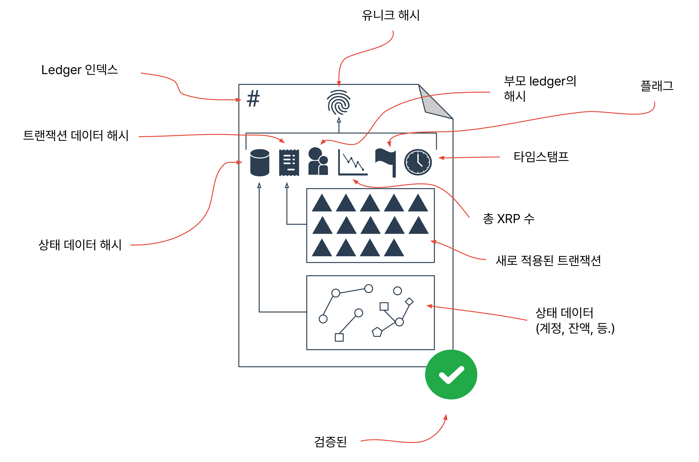
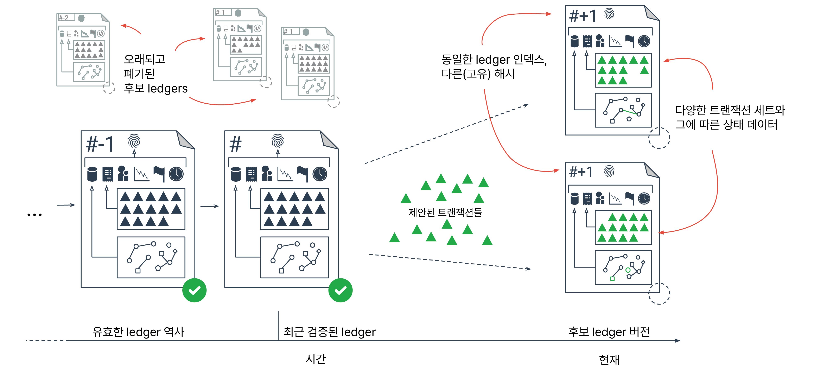
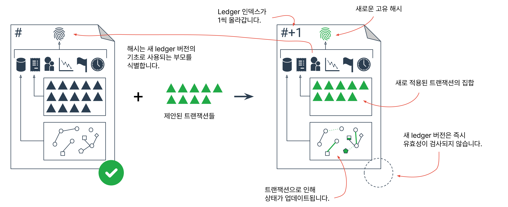
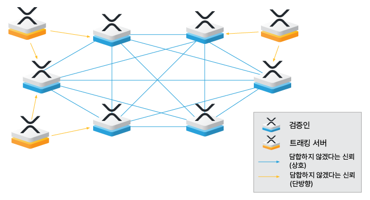
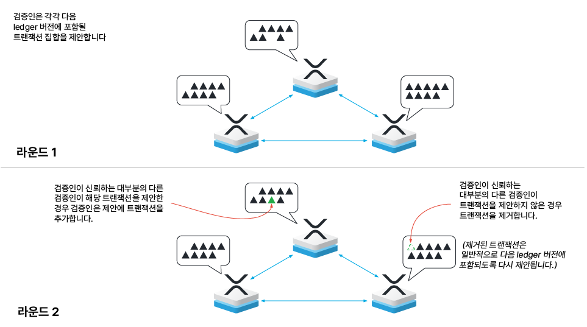
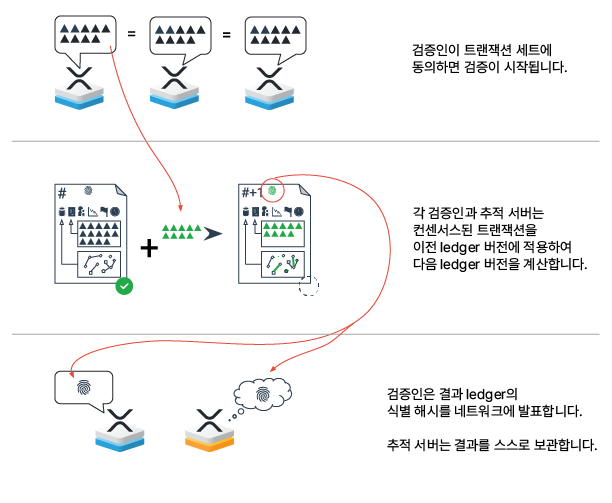
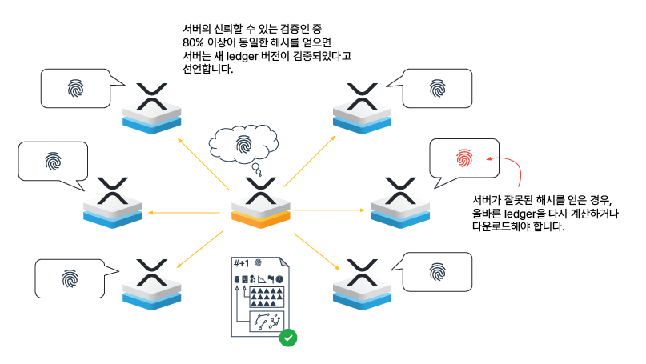

# 컨센서스 구조(Consensus Structure)

_Dave Cohen, David Schwartz 및 Arthur Britto가 작성한 글입니다._

이 글은 XRP Ledger의 고수준 개요와 정보 저장 방식, 그리고 거래가 ledger에 변경 사항을 가져오는 방식에 대해 제공합니다.

XRP Ledger 위에 애플리케이션을 구축할 때는 이 프로세스를 이해하는 것이 중요합니다. 이를 통해 XRP Ledger API의 동작과 그 효과에 대해 예기치 않게 놀라지 않도록 할 수 있습니다.

## 소개(Introduction)

P2P XRP Ledger 네트워크는 애플리케이션에 ledger의 상태에 대한 권위있는 정보를 제공하는 전 세계적인 공유 ledger 제공합니다. 이 상태 정보에는 다음과 같은 내용이 포함됩니다:

* 각 [계정](../undefined-2/)의 설정.&#x20;
* XRP 및 [토큰](../tokens/)의 잔액.&#x20;
* 분산 거래소의 거래 요청.&#x20;
* [트랜잭션 비용](../transactions/transaction-cost.md) 및 [reserve](../undefined-2/reserves.md) 금액과 같은 네트워크 설정.&#x20;
* 타임스탬프.

Ledger 버전에서 포함되는 데이터에 대한 자세한 기술적 설명은 [ledger 형식 참조](../../references/xrp-ledger-xrp-ledger-protocol-reference/ledger-ledger-data-formats/) 문서를 참조하십시오.

<figure><figcaption></figcaption></figure>

_Figure 1: XRP Ledger Elements_

XRP Ledger는 몇 초마다 새로운 ledger 버전을 갖습니다. 네트워크가 ledger 버전의 내용에 동의하면 해당 ledger 버전이 _유효화_되고 그 내용은 결코 변경되지 않습니다. 그 전에 유효화된 ledger 버전들이 ledger 기록을 형성합니다. 가장 최근의 유효화된 ledger도 기록의 일부이며, 이는 짧은 시간 전의 네트워크 상태를 나타냅니다. 현재는 평가 중인 거래들이 있으며, 이들은 다음 ledger 버전에서 적용 및 완료될 수 있습니다. 이 평가가 진행되는 동안에는 아직 유효화되지 않은 후보 ledger 버전들이 있습니다.

<figure><figcaption></figcaption></figure>

_Figure 2: XRP Ledger History_

ledger 버전은 두 가지 식별자를 갖습니다. 하나는 _ledger 인덱스_입니다. ledger 버전은 순차적으로 번호가 매겨집니다. 예를 들어, 현재 ledger 버전의 ledger 인덱스가 100이면 이전 ledger 버전의 ledger 인덱스는 99이고 다음 ledger 버전의 ledger 인덱스는 101입니다. 다른 식별자는 _ledger 해시_로, 이는 ledger 내용의 디지털 지문입니다.

서버는 거래를 적용하기 위해 제안서로 거래를 제안할 때, 서로 다른 내용을 갖는 여러 후보 ledger 버전을 생성할 수 있습니다. 이 후보 ledger 버전들은 동일한 ledger 인덱스를 갖지만 다른 ledger 해시를 갖습니다. 후보 ledger 버전들 중에서는 하나만 유효화될 수 있습니다. 다른 모든 후보 ledger 버전들은 폐기됩니다. 따라서 기록 인덱스마다 정확히 하나의 유효화된 ledger 해시가 있습니다.

ledger에 대한 사용자 수준의 변경 사항은 거래의 결과입니다. 거래의 예시로는 지불, 계정 설정 또는 trust line 등의 변경, 거래를 위한 제안 등이 있습니다. 각 거래는 ledger에 대한 하나 이상의 변경을 승인하고, 계정 소유자에 의해 암호화 서명됩니다. 거래는 계정의 변경 사항을 승인하거나 ledger의 다른 내용을 변경하는 유일한 방법입니다.

각 ledger 버전은 또한 해당 거래와 해당 거래에 대한 메타데이터를 포함합니다. 포함되는 거래는 이전 ledger 버전에 적용된 거래만 포함됩니다. 메타데이터는 거래가 ledger의 상태 데이터에 미치는 정확한 영향을 기록합니다.

<figure><figcaption></figcaption></figure>

_Figure 3: Transactions Applied to Ledger Version_

ledger 인스턴스에 포함된 거래 세트는 해당 ledger에 기록되며, XRP Ledger 기록의 검증을 가능하게 합니다. ledger N+1에서의 계정 잔액이 ledger N보다 다른 경우, ledger N+1에는 그 변경을 유발하는 거래가 포함됩니다.

유효화된 ledger에 나타나는 거래는 ledger을 변경하는 데 성공했을 수도 있고, 요청된 작업을 수행하지 않고 처리되었을 수도 있습니다. 성공적인 거래는 요청된 변경 사항이 ledger에 적용되었음을 나타내는 <mark style="background-color:yellow;">tesSUCCESS</mark> 결과 코드를 갖습니다. ledger에 실패한 거래는 <mark style="background-color:yellow;">tec</mark> 클래스 결과 코드를 갖습니다.

ledger에 포함된 모든 거래는 <mark style="background-color:yellow;">tes</mark> 또는 <mark style="background-color:yellow;">tec</mark> 코드와 관계없이 거래 비용으로 일정량의 XRP를 소멸시킵니다. 정확한 XRP 소멸량은 서명된 거래 지시에 의해 정의됩니다.

tes와 tec 외의 다른 결과 코드 클래스도 있습니다. 다른 결과코드 클래스는 API 호출에서 임시 실패를 나타냅니다. ledger에는 tes와 tec 코드만 표시됩니다. ledger에 포함되지 않은 거래는 ledger 상태(포함된 XRP 잔액 포함)에 어떠한 영향도 미칠 수 없지만, 임시 실패한 트랜잭션은 여전히 성공할 가능성이 있습니다.

XRP Ledger API와 작업할 때, 애플리케이션은 후보 거래와 유효화된 거래를 구분해야 합니다. 유효화된 ledger에 포함된 거래 결과만이 불변합니다. 후보 거래는 나중에 유효화된 ledger에 포함될 수도 있고, 포함되지 않을 수도 있습니다.

중요: 일부 [<mark style="background-color:yellow;">rippled</mark> API](../../references/http-websocket-apis/)는 후보 결과를 제공할 수 있습니다. 애플리케이션은 결코 후보 결과에 의존하여 거래의 최종 결과를 판단해서는 안됩니다. 거래가 최종적으로 성공했음을 확신하기 위해서는 거래의 상태를 확인하여 유효화된 ledger에 포함되었고 <mark style="background-color:yellow;">tesSUCCESS</mark> 결과 코드를 갖는지 여부를 확인해야 합니다. 만약 거래가 유효화된 ledger에 다른 결과 코드와 함께 포함되어 있다면, 거래는 실패한 것입니다. 거래의 [<mark style="background-color:yellow;">LastLedgerSequence</mark>](../../references/xrp-ledger-xrp-ledger-protocol-reference/transaction-reference/transaction-common-fields.md)에 지정된 ledger이 유효화되었지만, 해당 거래가 해당 ledger이나 이전 ledger에 나타나지 않는다면 해당 거래는 실패한 것이며 어떠한 ledger에도 나타날 수 없습니다. 유효화된 ledger에 나타나거나 <mark style="background-color:yellow;">LastLedgerSequence</mark> 제한으로 인해 나타날 수 없는 거래에 대해서만 최종 결과를 알 수 있습니다. 이에 대한 자세한 내용은 이 문서의 이후 설명에서 설명됩니다.

## XRP Ledger 프로토콜 - 컨센서스와 유효화(The XRP Ledger Protocol – Consensus and Validation)

P2P XRP Ledger 네트워크는 XRP Ledger 서버(일반적으로 <mark style="background-color:yellow;">rippled</mark>를 실행하는 서버)로 구성됩니다. 클라이언트 애플리케이션은 거래를 서명하고 XRP Ledger 서버로 전송하여 네트워크에서 처리됩니다. 클라이언트 애플리케이션의 예시로는 모바일 및 웹 지갑, 금융 기관과의 게이트웨이, 전자 거래 플랫폼 등이 있습니다.

<figure><figcaption></figcaption></figure>

_Figure 4: Participants in the XRP Ledger Protocol_

거래를 수신,중계 및 처리하는 서버는 추적 서버(tracking server) 또는 검증인일 수 있습니다. 추적 서버의 주요 기능은 클라이언트로부터 거래를 분산하고 ledger에 대한 조회에 응답하는 것입니다. 검증자는 추적 서버와 동일한 기능을 수행하며 ledger 기록을 진전시키는 역할도 합니다.

클라이언트 애플리케이션이 제출한 거래를 수락하는 동안, 각 추적 서버는 마지막으로 유효화된 ledger를 시작점으로 사용합니다. 수락된 거래는 후보 거래입니다. 서버는 후보 거래를 동료들에게 전달하여 후보 거래가 전체 네트워크에 전파되도록 합니다. 이상적인 경우, 각 후보 거래는 모든 서버에 알려져 있어 각 서버가 마지막으로 유효화된 ledger에 적용할 동일한 거래 세트를 고려할 수 있습니다. 그러나 거래가 전파되는 데에는 시간이 걸리기 때문에 서버들은 항상 동일한 후보 거래 세트로 작업하지는 않습니다. 이를 고려하기 위해 XRP Ledger는 컨센서스라는 프로세스를 사용하여 P2P XRP Ledger 네트워크 전체에서 처리되는 동일한 거래를 보장합니다.

## 컨센서스(Consensus)

네트워크의 서버들은 후보 거래에 대한 정보를 공유합니다. 컨센서스 프로세스를 통해 검증인들은 다음 ledger을 고려할 특정 후보 거래의 하위 집합에 대해 동의합니다. 컨센서스는 서버들이 제안서(후보 거래 세트)를 전달하고 수정하여 서로 동의하는 검증인들의 과반수가 동일한 후보 거래 세트에 동의할 때까지 서버들이 의사소통하고 제안서를 업데이트하는 반복적인 과정입니다.

컨센서스 과정에서 각 서버는 특정 서버 집합인 신뢰하는 검증인들_(Uniqued Node List, UNL)_로부터 제안서를 평가합니다. 신뢰하는 검증인들은 해당 서버의 신뢰할 수 있는 부분 집합을 나타냅니다. 이 부분 집합은 개별적으로 신뢰할 수 있는 것은 아니지만 서로 협력하여 네트워크로 전달되는 데이터를 위조하지 않을 것으로 기대되는 서브넷을 대표합니다.

<figure><figcaption></figcaption></figure>

_Figure 5: Validators Propose and Revise Transaction Sets - 컨센서스 시작 시, 검증인들은 서로 다른 거래 세트를 갖고 있을 수 있습니다. 후속 라운드에서 서버들은 신뢰하는 검증인들이 제안한 내용과 일치하도록 제안서를 수정합니다. 이 과정은 현재 논의 중인 ledger 버전에 어떤 거래를 적용해야 하는지와 어떤 거래를 나중의 ledger 버전에 연기해야 하는지를 결정합니다._

동의되지 않은 제안서에 포함되지 않은 후보 거래는 여전히 후보 거래로 남게 됩니다. 이러한 거래는 다음 ledger 버전에서 다시 고려될 수 있습니다. 일반적으로 한 ledger 버전에서 제외된 거래는 다음 ledger 버전에 포함됩니다.

일부 경우에는 거래가 영원히 컨센서스를 달성하지 못할 수 있습니다. 예를 들어, 네트워크가 [트랜잭션 비용](../transactions/transaction-cost.md)을 거래가 제공하는 값보다 높게 설정하는 경우 거래가 영원히 실패할 수 있습니다. 이러한 거래는 수수료가 나중에 낮아지면 언젠가 성공할 수도 있습니다. 거래가 제한 시간 내에 성공하거나 실패하도록 하기 위해 거래는 특정 ledger 인덱스까지 처리되지 않으면 만료되도록 설정할 수 있습니다. 자세한 내용은 [Reliable Transaction Submission](../transactions/reliable-transaction-submission.md)을 참조하십시오.

## 유효화(Validation)

유효화는 전체 컨센서스 프로세스의 두 번째 단계로, 서버들이 동일한 결과를 얻었는지를 확인하고 ledger 버전을 최종으로 선언하는 작업입니다. 드물게 컨센서스 프로세스의 첫 번째 단계가 실패할 수 있으며, 유효화는 이를 확인하여 서버가 이를 인식하고 이에 따라 대응할 수 있도록 합니다.

유효화는 대략적으로 두 부분으로 나뉠 수 있습니다:

* 동의된 거래 세트로부터 결과 ledger 버전을 계산하는 작업.
* 결과를 비교하고 신뢰하는 검증인들이 충분히 동의할 경우 ledger 버전을 유효화로 선언하는 작업.

네트워크의 각 서버는 독립적으로 유효화를 수행하며 로컬에서 계산합니다.

## 유효화 계산 및 공유(**Calculate and Share Validations)**

컨센서스 프로세스가 완료되면, 각 서버는 독립적으로 합의된 거래 세트로부터 새로운 ledger을 계산합니다. 각 서버는 다음과 같은 규칙에 따라 결과를 계산합니다:

1. 이전에 유효화된 ledger으로 시작합니다.
2. 합의된 거래 세트를 정규화된 순서로 배치하여 각 서버가 동일한 방식으로 처리하도록 합니다. [정규화된 순서](https://github.com/XRPLF/rippled/blob/8429dd67e60ba360da591bfa905b58a35638fda1/src/ripple/app/misc/CanonicalTXSet.cpp#L25-L36)는 거래가 수신된 순서가 아니라, 서버가 동일한 순서로 거래를 수신할 수 있기 때문에 참가자들이 거래 순서를 경쟁하지 않도록 조작하기 어렵게 설계되었습니다.
3. 각 거래를 해당하는 지시사항에 따라 순서대로 처리하고 ledger의 상태 데이터를 업데이트합니다. 거래를 성공적으로 실행할 수 없는 경우 tec 클래스 결과 코드를 포함하여 거래를 포함합니다. 일부 "재시도 가능한(retriable)" 거래 실패의 경우, 해당 거래를 정규화된 순서의 끝으로 이동하여 동일한 ledger 버전의 다른 거래들이 실행된 후에 재시도합니다.
4. ledger 헤더를 적절한 메타데이터로 업데이트합니다. 이는 ledger 인덱스, 이전 유효화된 ledger의 식별 해시(이 ledger의 "부모"), 이 ledger 버전의 근사적인 마감 시간 및 이 ledger의 내용의 암호화 해시와 같은 데이터를 포함합니다.
5. 새로운 ledger 버전의 식별 해시를 계산합니다.

<figure><figcaption></figcaption></figure>

_Figure 7: An XRP Ledger Server Calculates a Ledger Validation - 각 서버는 합의된 거래를 이전 유효화된 ledger에 적용합니다. 유효화 결과를 검증자들에게 전송합니다._

## 결과 비교(**Compare Results)**

각 검증인은 계산한 ledger 버전의 해시를 포함한 서명된 메시지 형태로 결과를 전달합니다. 이러한 메시지인 유효화(validation)는 각 서버가 계산한 ledger와 피어들의 ledger과 비교할 수 있게 해줍니다.

<figure><figcaption></figcaption></figure>

_Figure 8: Ledger is Validated When Supermajority of Peers Calculate the Same Result - 각 서버는 자신의 계산한 ledger을 선택한 검증인들로부터 받은 해시와 비교합니다. 일치하지 않는 경우, 서버는 올바른 ledger을 다시 계산하거나 필요에 따라 올바른 ledger을 검색합니다._

네트워크에서 대부분의 서버가 동의한 유효화를 달성하는 경우, 서버는 해당 유효화 해시를 서명하고 전송한 피어들에 의해 ledger 인스턴스가 유효화되었다고 인식합니다. 이후에는 거래가이 업데이트된 유효화된 ledger(ledger 인덱스 N+1)에 적용됩니다.

서버가 소수인 경우, 해당 서버는 피어들과 다른 ledger을 계산했으므로 자신이 계산한 ledger을 무시합니다. 올바른 ledger을 다시 계산하거나 필요에 따라 올바른 ledger을 검색합니다.

유효화에 대한 과반수 합의를 달성하지 못하면, 이는 거래량이 너무 많거나 네트워크 지연이 컨센서스 프로세스가 일관된 제안을 생성하지 못할만큼 크다는 것을 의미합니다. 이 경우 서버들은 새로운 ledger 버전을 위해 컨센서스 프로세스를 반복합니다. 컨센서스가 시작된 이후 시간이 지남에 따라, 각 컨센서스 라운드는 불일치를 줄이므로 대다수의 서버가 동일한 후보 거래 세트를 수신한 것으로 판단됩니다. XRP Ledger는 이러한 상황에 대응하여 [트랜잭션 비용](../transactions/transaction-cost.md) 및 컨센서스 대기 시간을 동적으로 조정합니다.

검증인들이 유효화에 대한 과반수 합의에 도달하면, 서버들은 새로 유효화된 ledger(ledger 인덱스 N+1)과 함께 작업을 진행합니다. 컨센서스 및 유효화 프로세스는 반복되며, 이전 라운드에 포함되지 않았던 후보 거래와 그 동안에 제출된 새로운 거래를 고려합니다.

## 요약(Key Takeaways)

XRP Ledger에 제출된 거래는 즉시 처리되지 않습니다. 일정 기간 동안 각 거래는 후보 거래로 남아 있습니다.

단일 거래의 수명 주기는 다음과 같습니다:

* 거래가 소유자에 의해 생성되고 서명됩니다.&#x20;
* 거래가 네트워크에 제출됩니다.&#x20;
  * 잘못된 형식의 거래는 즉시 거부될 수 있습니다.&#x20;
  * 올바르게 구성된 거래는 임시로 성공할 수 있고 나중에 실패할 수도 있습니다.&#x20;
  * 올바르게 구성된 거래는 임시로 실패할 수도 있고 나중에 성공할 수도 있습니다.&#x20;
* 컨센서스 중에는 거래가 ledger에 포함됩니다.&#x20;
  * 성공적인 컨센서스 라운드의 결과는 유효화된 ledger입니다.&#x20;
  * 컨센서스 라운드가 실패하는 경우, 컨센서스 프로세스는 성공할 때까지 반복됩니다.&#x20;
* 유효화된 ledger에는 거래와 해당 거래가 ledger 상태에 미치는 영향이 포함됩니다.&#x20;

응용 프로그램은 후보 거래의 임시 결과가 아닌 유효화된 ledger의 정보에만 의존해야 합니다. 일부 [rippled API](../../references/http-websocket-apis/)는 초기에 거래에 대한 임시 결과를 반환할 수 있습니다. 거래의 결과는 해당 거래가 유효화된 ledger에 포함될 때만 변경할 수 있으며, 거래에 <mark style="background-color:yellow;">LastLedgerSequence</mark>가 포함되어 있고 해당 ledger 인덱스 이하의 어떤 유효화된 ledger에도 나타나지 않는 경우 변경할 수 없습니다.

거래를 제출하는 응용 프로그램의 모범 사례는 다음과 같습니다:

* 거래가 결정론적이고 신속하게 유효화되거나 실패하도록 <mark style="background-color:yellow;">LastLedgerSequence</mark> 매개변수를 사용합니다.&#x20;
* 유효화된 ledger의 거래 결과를 확인합니다.&#x20;
  * 거래가 유효화된 ledger에 포함될 때까지 또는 <mark style="background-color:yellow;">LastLedgerSequence</mark>가 지날 때까지 결과는 임시적입니다.&#x20;
  * result code가 <mark style="background-color:yellow;">**tesSUCCESS**</mark>이고 <mark style="background-color:yellow;">"validated": true</mark>인 거래는 불변적으로 성공한 것입니다.&#x20;
  * <mark style="background-color:yellow;">**tesSUCCESS**</mark> 이 아닌 result code "validated": true인 거래는 불변적으로 실패한 것입니다.&#x20;
  * 거래의 LastLedgerSequence로 지정된 유효화된 ledger를 포함하여 유효화된 ledger에 나타나지 않은 경우 거래는 불변적으로 실패한 것입니다.&#x20;
    * 이 경우를 감지하기 위해 연속적인 ledger 기록을 가진 서버를 사용하는 것이 중요합니다.&#x20;
  * <mark style="background-color:yellow;">LastLedgerSequence</mark>로 식별된 ledger가 유효화될 때까지 거래의 상태를 반복해서 확인해야 할 수 있습니다.

## 주석&#x20;

1 - tec 결과 코드가 있는 거래는 요청된 작업을 수행하지 않지만 ledger에 영향을 미칩니다. 네트워크의 남용을 방지하고 거래를 분배하는 비용을 지불하기 위해 XRP 거래 비용을 소멸시킵니다. 동일한 송신 계정에서 동일한 시간에 제출된 다른 거래를 차단하지 않기 위해 송신 계정의 시퀀스 번호를 증가시킵니다. tec 클래스 결과를 가진 거래는 만료된 개체를 삭제하거나 자금이 없는 거래 제안과 같은 유지 보수 작업을 수행하기도 합니다.

2 - 예를 들어, Alice가 $100을 가지고 있고 그 금액을 모두 Bob에게 보낸다고 가정해보겠습니다. 응용 프로그램이 먼저 해당 지불 거래를 제출하고, 바로 그 이후에 Alice의 잔액을 확인하면 API는 $0을 반환합니다. 이 값은 후보 거래의 임시 결과에 기반합니다. 지불이 실패하고 Alice의 잔액이 $100으로 유지되거나 (또는 다른 거래로 인해 다른 금액으로 변경될 수도 있음)하는 상황이 있습니다. Alice의 Bob에 대한 지불이 성공했는지 확신하려면 거래의 상태를 확인하여 유효화된 ledger에 포함되고 result code가 tesSUCCESS인지 확인해야 합니다. 다른 result code와 "validated": true를 가진 유효화된 ledger에 포함된 거래는 불변적으로 실패한 것입니다.

3 - 엄밀히 말하면, 검증인은 추적 서버의 하위 집합입니다. 그들은 동일한 기능을 제공하며 추가로 "검증" 메시지를 보냅니다. 추적 서버는 전체 또는 일부 ledger 기록을 유지하는지에 따라 더 구체적으로 분류될 수 있습니다.

4 - 거래가 컨센서스 라운드를 통과하지 못하는 경우는 해당 거래를 인식하는 피어의 비율이 임계값 미만으로 떨어질 때입니다. 각 라운드는 반복적인 과정입니다. 첫 번째 라운드에서는 최소한 50%의 피어가 동의해야 합니다. 컨센서스 라운드의 최종 임계값은 80% 동의입니다. 이 특정 값은 변경될 수 있습니다.

5 - 각 서버는 자체적으로 신뢰하는 검증인을 정의하지않습니다. 그러나 네트워크의 일관성은 서로 다른 서버가 서로 오버랩 비율이 높은 목록을 선택하도록 함에 따라 달려있습니다. 이를 위해 Ripple은 권장하는 검증인 목록을 게시합니다.

6 - 검증인이 데이터를 위조하는 공모를 시도하지 않을 것으로 기대하기 때문에 개별 선택된 검증인이 신뢰받는다고 가정합니다. 이 "신뢰"의 정의는 개별적으로 선택된 각 검증인이 신뢰받는다는 것을 요구하지 않습니다. 대신, 검증인은 데이터 조작을 조정한 공동 작업을 시도하지 않을 것으로 예상되는 기대치에 따라 선택됩니다. 검증인 목록은 Sybil 공격에 대한 방어 기능을 제공합니다.

7 - 2014년 11월 기준으로, ledger이 유효화되기 위해서는 최소한 80%의 피어가 동의해야 합니다. 이는 컨센서스 라운드에서 요구되는 동의 비율과 동일합니다. 이러한 임계값은 변경될 수 있으며 동일할 필요는 없습니다.

8 - 실제로 서버는 모든 피어로부터 유효화된 ledger에 대한 확인을 받기 전에 소수의 피어로부터 일치하지 않는 유효화를 받았음을 인식합니다. 20% 이상의 피어로부터 일치하지 않는 유효화를 받으면 자신의 유효화가 80% 임계값을 충족할 수 없음을 알 수 있습니다. 그 시점에서 올바른 ledger을 다시 계산할 수 있습니다.

9 - 실제로 XRP Ledger는 유효화가 완료되기 전에 새로운 컨센서스 라운드를 동시에 시작함으로써 더 효율적으로 작동합니다.

10 - rippled 서버는 완전한 ledger 기록이 없어도 API 요청에 응답할 수 있습니다. 서비스 중단이나 네트워크 연결이 끊어져서 렛저의 일부가 누락되는 경우가 발생할 수 있습니다. 시간이 지남에 따라, 설정에 따라 리플 서버는 기록의 누락된 부분을 채워넣습니다. 거래의 누락 여부를 테스트할 때는 거래가 제출된 시점부터 LastLedgerSequence까지 연속적인 완전한 렛저를 갖고 있는 서버와 비교하는 것이 중요합니다. server\_info 메소드를 사용하여 특정 서버에서 사용 가능한 ledger을확인할 수 있습니다.

&#x20;
