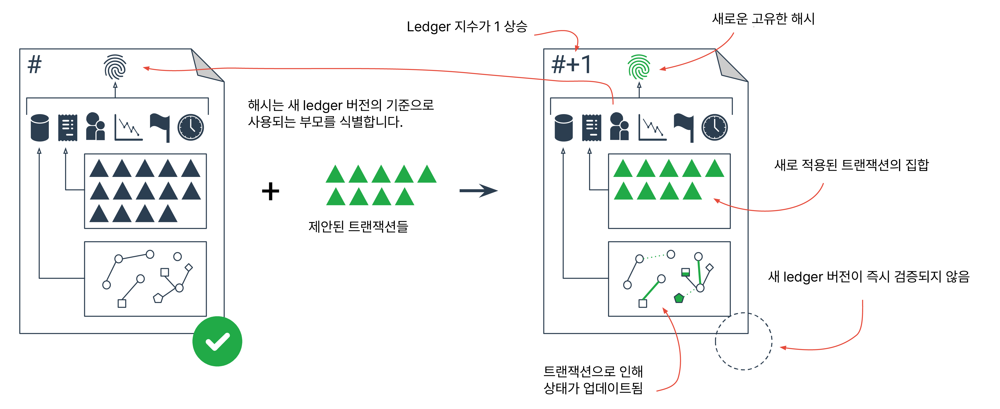
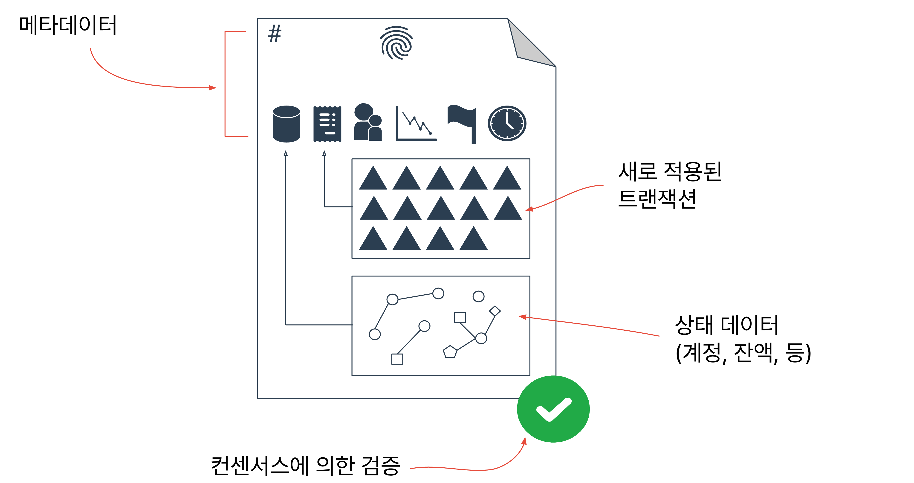

# Ledgers

목가XRP Ledger는 모든 사람에게 열려 있는 공유 전역 ledger입니다. 개별 참여자들은 단일 기관이 그것을 관리한다는 것을 신뢰하지 않고도 ledger의 무결성을 신뢰할 수 있습니다. <mark style="background-color:yellow;">rippled</mark> 서버 소프트웨어는 매우 특정한 규칙에 따라 업데이트할 수 있는 ledger 데이터베이스를 관리함으로써 이를 달성합니다. 각 <mark style="background-color:yellow;">rippled</mark> 인스턴스는 ledger의 전체 복사본을 보관하고, <mark style="background-color:yellow;">rippled</mark> 서버의 P2P 네트워크는 후보 트랜잭션들을 서로 분배합니다. 합의 과정은 어떤 트랜잭션이 각 새로운 ledger 버전에 적용되는지 결정합니다. 참조: [컨센서스 과정](../undefined-1/undefined.md).

<figure><figcaption></figcaption></figure>

공유 전역 ledger는 실제로 <mark style="background-color:yellow;">rippled</mark>가 내부 데이터베이스에 보관하는 개별 ledger들, 또는 ledger 버전들의 연속입니다. 모든 ledger 버전은 ledger가 발생하는 순서를 식별하는 [ledger 인덱스](../../references/xrp-ledger/undefined/)를 가지고 있습니다. 각 닫힌 ledger 버전은 또한 그 ledger의 내용을 고유하게 식별하는 해시 값을 가지고 있습니다. 주어진 시간에, <mark style="background-color:yellow;">rippled</mark> 인스턴스는 진행 중인 "현재" 개방 ledger을 가지고 있으며, 합의에 의해 아직 승인되지 않은 일부 닫힌 ledger들, 그리고 합의에 의해 검증된 어떤 수의 역사적 ledger들을 가지고 있습니다. 검증된 ledger들만이 정확하고 불변한 것으로 확실합니다.

단일 ledger 버전은 몇 부분으로 구성됩니다:

<figure><figcaption></figcaption></figure>

* **헤더** - [ledger 인덱스](../../references/xrp-ledger/undefined/), 기타 내용의 해시, 그리고 다른 메타데이터.
* **트랜잭션 트리** - 이 ledger를 만들기 위해 이전 ledger에 적용된 [트랜잭션](../../references/xrp-ledger/undefined-1/)입니다. 트랜잭션은 ledger 변경하는 유일한 방법입니다.
* **상태 트리** - 이 버전 기준으로 ledger의 설정, 잔액 및 개체를 포함하는 모든 [ledger 객체](../../references/xrp-ledger/ledger/ledger-1/)입니다.

## 트리 형식

그 이름에서 알 수 있듯이, ledger의 상태 트리는 트리 데이터 구조입니다. 상태 트리의 각 객체는 256비트 객체 ID로 식별됩니다. JSON에서, ledger 객체의 ID는 <mark style="background-color:yellow;">인덱스</mark> 필드로, <mark style="background-color:yellow;">"193C591BF62482468422313F9D3274B5927CA80B4DD3707E42015DD609E39C94"</mark>와 같은 64자리 16진수 문자열을 포함합니다. 상태 트리의 모든 객체는 그 객체를 찾기 위해 사용할 수 있는 ID를 가지고 있고, 모든 트랜잭션은 트랜잭션 트리에서 트랜잭션을 찾기 위해 사용할 수 있는 식별 해시를 가지고 있습니다. ledger 객체의 <mark style="background-color:yellow;">인덱스</mark>(ID)와 [ledger의 <mark style="background-color:yellow;">ledger\_index</mark>(일련 번호)](../../references/xrp-ledger/undefined/)를 혼동하지 마세요.


Tip:

가끔 ledger의 상태 트리에 있는 객체를 "ledger 노드"라고 부릅니다. 예를 들어, 트랜잭션 메타데이터는 <mark style="background-color:yellow;">AffectedNodes</mark>의 목록을 반환합니다. 이것을 P2P 네트워크의 "노드"(서버)와 혼동하지 마세요.


트랜잭션의 경우 식별 해시는 서명된 트랜잭션 지침을 기반으로 하지만, 조회할 때 트랜잭션 객체의 내용에는 해시 생성 시 고려되지 않은 트랜잭션의 결과와 메타데이터도 포함되어 있습니다.

## 열린, 닫힌, 그리고 검증된 ledger

<mark style="background-color:yellow;">rippled</mark> 서버는 열린, 닫힌, 그리고 검증된 ledger 버전을 구분합니다. 서버는 하나의 개방 ledger, 검증되지 않은 닫힌 ledger 수, 그리고 불변의 검증된 ledger 이력을 가지고 있습니다. 다음 표는 이 차이를 요약한 것입니다:

| Ledger Type:        | Open       | Closed                          | Validated                       |
| ------------------- | ---------- | ------------------------------- | ------------------------------- |
| **목적:**             | 임시 워크스페이스. | 제안된 다음 상태.                      | 이전 상태 확인.                       |
| **사용된 번호입니다:**      | 1          | 숫자는 상관없지만 일반적으로 0 또는 1.         | ledger 인덱스당 하나씩, 시간이 지남에 따라 증가. |
| **콘텐츠가 변경될 수 있나요?** | 그렇다.       | 아니요, 하지만 전체 ledger를 교체할 수 있습니다. | 절대 아니다.                         |
| **트랜잭션이 적용됩니다:**    | 접수된 주문.    | 정식 순서.                          | 정식 순서.                          |

비직관적으로, XRP Ledger는 오픈된 ledger을 닫은 ledger으로 변환하기 위해 오픈된 ledger을 "닫지" 않습니다. 대신, 서버는 오픈된 ledger을 버리고, 이전에 닫힌 ledger 위에 트랜잭션을 적용하여 새로운 닫힌 ledger을 만들고, 그 후 최신 닫힌 ledger을 기반으로 새로운 오픈 ledger을 만듭니다. 이것은 컨[센서가 이중 지불 문제를 해결하는 방식의 결과](../undefined-1/undefined-1.md)입니다.

오픈 ledger의 경우, 서버는 트랜잭션을 그 트랜잭션이 나타나는 순서대로 적용하지만, 다른 서버는 트랜잭션을 다른 순서로 볼 수 있습니다. 중앙 시간 관리자가 실제로 어떤 트랜잭션이 첫 번째였는지 결정할 수 없기 때문에, 서버는 대략 같은 시간에 전송된 트랜잭션의 정확한 순서에 대해 일치하지 않을 수 있습니다. 따라서, 검증 가능한 닫힌 ledger 버전을 계산하는 과정은 그들이 도착하는 순서대로 제안된 트랜잭션에서 오픈 ledger을 구축하는 과정과 다릅니다. "닫힌" ledger을 만들기 위해, 각 XRP Ledger 서버는 트랜잭션 집합과 이전, 또는 "부모", ledger 버전으로 시작합니다. 서버는 트랜잭션을 표준 순서에 넣은 다음, 그 순서대로 이전 ledger에 적용합니다. 표준 순서는 결정적이고 효율적이게 설계되었지만, 게임하기 어렵게 만들어져 [탈중앙화 거래소](../dex/)에서의 선점 오퍼 난이도를 증가시킵니다.

따라서, 오픈 ledger은 일시적인 작업 공간으로만 사용되며, 이것이 트랜잭션의 [잠정적인 결과가 최종 결과와 다를 수 있는](../transactions/finality-of-results/) 주요한 이유입니다.

## ledger 닫힘 시간&#x20;

ledger 버전이 닫힌 시간은 [ledger 헤더](../../references/xrp-ledger/ledger/ledger.md)의 <mark style="background-color:yellow;">close\_time</mark> 필드에 기록됩니다. 네트워크가 정확한 닫힘 시간에 대한 합의에 도달하는 것을 쉽게 만들기 위해, 이 값은 현재 10초를 기반으로 한 닫힘 시간 해상도에 따라 반올림 됩니다. 반올림이 ledger의 닫힘 시간을 부모 ledger의 것과 같게 만들거나 (또는 그 이전에 만들 경우), 자식 ledger은 닫힘 시간을 부모의 닫힘 시간보다 1초 늦게 설정합니다. 이는 검증된 ledger의 닫힘 시간이 엄격하게 증가하는 것을 보장합니다.

새로운 ledger 버전은 보통 약 3에서 5초마다 닫히기 때문에, 이런 규칙들은 ledger의 닫힘 시간이 :00, :01, :02, :10, :11, :20, :21 등으로 끝나는 느슨한 패턴을 만듭니다. 2로 끝나는 시간은 드물고 3으로 끝나는 시간은 매우 드물지만, 두 경우 모두 10초 창 내에서 더 많은 ledger이 무작위로 닫히게 될 때 무작위로 발생합니다.

일반적으로, ledger은 닫힘 시간 해상도보다 더 정밀한 시간 기반 측정을 할 수 없습니다. 예를 들어, 객체가 만료 날짜를 지났는지 확인하려면, 그것을 부모 ledger의 닫힘 시간과 비교하는 것이 규칙입니다. (ledger에 들어가는 트랜잭션을 실행할 때 ledger의 닫힘 시간은 아직 알려져 있지 않습니다.) 이는 예를 들어, [에스크로](../undefined-2/undefined-2.md)가 실제 세계 시간에서 대략 10초 이내로 만료된 시간을 지나서 성공적으로 완료될 수 있다는 것을 의미합니다.

## 예시

다음 예는 마감 시간이 **12:00:00**인 ledger에 대한 예제 검증자의 관점에서 원장 마감 시간의 반올림 동작을 보여줍니다:

**현재 컨센서스 라운드**

1. 검증자는 ledger가 닫혀서 합의에 들어갔을 때 **12:00:03**이었다는 것을 알아차립니다. 검증자는 이 닫힘 시간을 그의 제안에 포함합니다.
2. 검증자는 대부분의 다른 검증자들이(그의 UNL에 있는) 12:00:02의 닫힘 시간을 제안했고, 다른 한 사람이 12:00:03의 닫힘 시간을 제안했다는 것을 관찰합니다. 그는 컨센서스의 닫힘 시간 **12:00:02**에 맞추기 위해 제안한 닫힘 시간을 변경합니다.
3. 검증자는 이 값을 가장 가까운 닫힘 시간 간격에 반올림하여, **12:00:00**을 얻습니다.
4. 12:00:00은 이전 ledger의 닫힘 시간보다 크지 않기 때문에, 검증자는 닫힘 시간을 이전 ledger의 닫힘 시간보다 정확히 1초 늦게 조정합니다. 결과적으로 조정된 닫힘 시간은 **12:00:01**입니다.
5. 검증자는 이러한 세부 사항으로 ledger를 구축하고, 결과적인 해시를 계산하며, 다른 사람들도 같은 것을 확인했다는 것을 [검증 단계](../undefined-1/undefined.md)에서 확인합니다.

검증되지 않는 서버들도 모두 같은 단계를 수행합니다. 단, 그들은 기록된 닫힘 시간을 네트워크의 나머지 부분에 제안하지 않습니다.

**다음 컨센서스 라운드**

1. 다음 ledger은 대부분의 검증자들에 따르면 **12:00:04**에 **컨센서스**에 들어갑니다.
2. 이것은 다시 반올림되어, 닫힘 시간이 **12:00:00**이 됩니다.
3. 이것은 이전 ledger의 닫힘 시간인 12:00:01보다 크지 않기 때문에, 조정된 닫힘 시간은 **12:00:02**입니다.

**그 후의 다음 컨센서스 라운드**

1. 그 다음 ledger은 대부분의 검증자들에 따르면 **12:00:05**에 **컨센서스**에 들어갑니다.
2. 이것은 닫힘 시간 해상도에 따라 반올림되어, **12:00:10**이 됩니다.
3. 이 값은 이전 ledger의 닫힘 시간보다 크기 때문에 조정할 필요가 없습니다. **12:00:10**이 공식적인 닫힘 시간이 됩니다.
