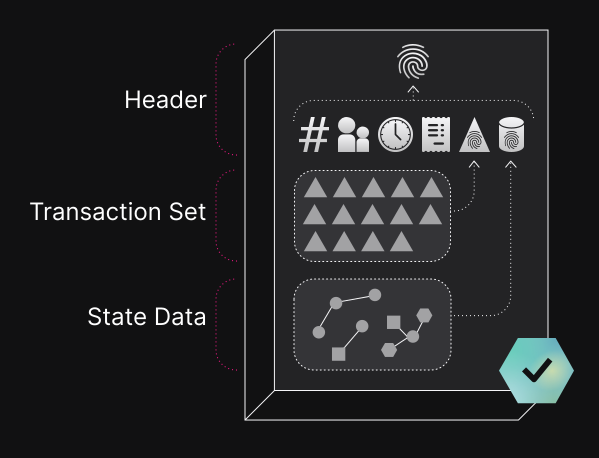

# Ledger 구조(Ledger Structure)

XRP 원장은 블록체인의 일종으로, 데이터 블록의 순차적인 기록으로 구성됩니다. XRP 레저 블록체인의 블록을 레저 버전 또는 줄여서 레저라고 합니다.

합의 프로토콜은 이전 원장 버전을 시작점으로 삼아 다음에 적용할 일련의 트랜잭션에 대해 검증자 간에 합의를 형성한 다음, 모든 사람이 해당 트랜잭션을 적용하여 동일한 결과를 얻었는지 확인합니다. 이 과정이 성공적으로 완료되면 새로운 검증 원장 버전이 생성됩니다. 거기서부터 다음 원장 버전을 구축하기 위해 프로세스가 반복됩니다.

각 원장 버전에는 상태 데이터, 트랜잭션 세트, 메타데이터가 포함된 헤더가 포함됩니다.

<figure><figcaption></figcaption></figure>

##

## Ledger Header

Ledger Header는 Ledger 버전을 요약하는 데이터 블록입니다. 보고서의 표지와 마찬가지로, Ledger 버전을 고유하게 식별하고, 내용을 나열하며, 다른 메모와 함께 생성된 시간을 표시합니다. Ledger Header에는 다음 정보가 포함됩니다:

&#x20;

*   **The ledger index**

    

    <figure><figcaption>
Ledger Index
</figcaption></figure>

    

    Ledger **index는** 체인에서 해당 원장 버전의 포지션을 식별합니다. 이것은 한 단계 낮은 인덱스를 가진 장부 위에 구축되며, 시작점인 "genesis ledger"라고 알려진 곳까지 거슬러 올라갑니다. 이는 모든 트랜잭션과 결과의 공개 기록을 형성합니다.

*   **The ledger hash**

    

    <figure><figcaption>
Ledger hash
</figcaption></figure>

    

    Ledger의 내용을 고유하게 식별하는 Ledger 해시입니다. 해시는 Ledger 버전의 세부 사항이 변경될 경우 해시가 완전히 달라지도록 계산되며, 이는 Ledger의 데이터가 손실, 수정 또는 손상되지 않았음을 보여주는 체크섬과도 같은 역할을 합니다.

*   **The parent ledger hash**

    

    <figure><figcaption>
P<em>arent ledger hash</em>
</figcaption></figure>

    

    부모 Ledger 해시입니다. Ledger 버전은 주로 그 이전의 상위 Ledgerd와의 차이에 의해 정의되므로 헤더에는 상위 Ledger의 고유 해시도 포함됩니다.

*   **The close time**

    

    <figure><figcaption>
Close time
</figcaption></figure>

    

    Ledger의 내용이 확정된 공식 타임스탬프인 마감 시간입니다. 이 숫자는 보통 10초 단위로 반올림됩니다.

*   **A state data hash**

    

    <figure><figcaption>
State data hash
</figcaption></figure>

    

    Ledger의 상태 데이터에 대한 체크섬 역할을 하는 상태 데이터 해시입니다.

*   **A transaction set hash**

    

    <figure><figcaption>
T<em>ransaction set hash</em> 
</figcaption></figure>

    

    이 Ledger의 트랜잭션 세트 데이터에 대한 체크섬 역할을 하는 트랜잭션 세트 해시입니다.

*   ETC

    

    <figure><figcaption></figcaption></figure>

    

    현존하는 총 XRP 수량과 마감 시간이 반올림된 금액과 같은 몇 가지 다른 참고 사항도 있습니다.

Ledger의 트랜잭션 세트와 상태 데이터는 크기에 제한이 없지만, Ledger 헤더는 항상 고정된 크기입니다. Ledger 헤더의 정확한 데이터와 바이너리 형식은  [Ledger Header](https://xrpl.org/ledger-header.html)를 참조하세요.

<figure><figcaption></figcaption></figure>

## 검증 상태(Validation Status)

<figure><figcaption></figcaption></figure>

서버의 고유 노드 목록에 있는 검증자 컨센서스가 Ledger 버전의 내용에 동의하면 해당 Ledger 버전은 검증이 완료되고 변경 불가능한 것으로 표시됩니다. Ledger의 내용은 후속 트랜잭션이 새로운 Ledger 버전을 만들어 체인을 계속 이어가야만 변경할 수 있습니다.

Ledger 버전이 처음 생성될 때는 아직 검증되지 않은 상태입니다. 후보 트랜잭션이 다른 서버에 도착하는 시점의 차이로 인해 네트워크는 체인의 다음 단계로 여러 개의 다른 원장 버전을 생성하고 제안할 수 있습니다. 합의 프로토콜([consensus protocol](https://xrpl.org/consensus.html))은 이 중 어느 것이 검증될지 결정합니다. (검증된 원장 버전에 포함되지 않은 후보 트랜잭션은 일반적으로 다음 원장 버전의 트랜잭션 세트에 대신 포함될 수 있습니다)

## Ledger Index or Ledger Hash?

Ledger 버전을 식별하는 방법에는 Ledger 인덱스와 Ledger 해시라는 두 가지가 있습니다. 이 두 필드는 모두 Ledger을 식별하지만, 사용 목적은 다릅니다. Ledger 인덱스는 체인에서 Ledger의 위치를 알려주며, Ledger 해시는 Ledger의 내용을 반영합니다.

서로 다른 체인의 Ledger은 Ledger 인덱스는 같지만 해시는 다를 수 있습니다. 또한, 검증되지 않은 Ledger 버전을 다룰 때, 인덱스는 같지만 내용이 다른 여러 후보 Ledger이 있을 수 있으며, 따라서 해시도 다를 수 있습니다.

동일한 Ledger 해시를 가진 두 Ledger은 항상 완전히 동일합니다.
