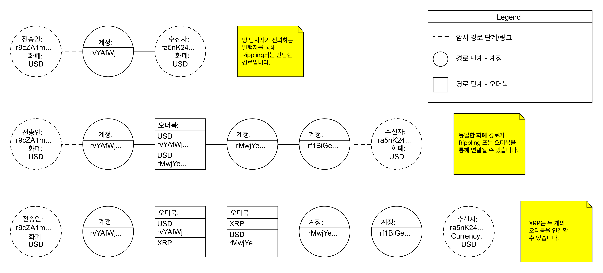
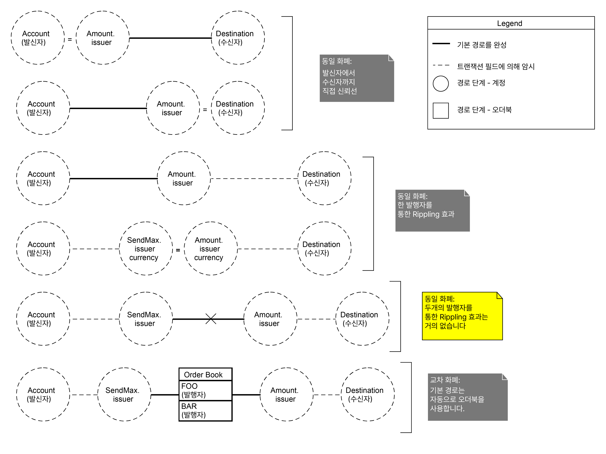

# 경로(Paths)

XRP Ledger에서 경로는 결제의 일부로 [토큰](./)이 중개 단계를 통과하는 방법을 정의합니다. 경로는 XRP Ledger의 [탈중앙화 거래소](decentralized-exchange/)에서 주문을 통해 송금인과 수취인을 연결하여 [교차 화폐 결제](../undefined-1/undefined.md)를 가능하게 합니다. 또한 경로는 상계 부채의 복잡한 정산을 가능하게 합니다.

XRP Ledger의 단일 결제 트랜잭션은 여러 경로를 사용하여 원하는 금액을 제공하기 위해 다양한 소스에서 유동성을 결합할 수 있습니다. 따라서 트랜잭션에는 경로 세트가 포함되는데, 이는 선택 가능한 경로의 모음입니다. 경로 세트의 모든 경로는 동일한 화폐로 시작해야 하며, 또한 서로 동일한 화폐로 끝나야 합니다.

XRP는 직접적으로 모든 주소로 보낼 수 있으므로, [XRP에서 XRP로의 거래](../undefined-1/xrp.md)는 어떤 경로도 사용하지 않습니다.

## 경로 단계(Path Steps)

경로는 결제의 송신자와 수신자를 연결하는 단계로 구성됩니다. 모든 단계는 다음 중 하나 입니다:

* 동일한 화폐로 다른 주소를 통해 Rippling.
* 주문 도서를 사용하여 토큰 또는 XRP 거래.

[Rippling](rippling.md)은 동일한 화폐 코드를 사용하여 동등한 토큰을 교환하는 과정입니다. 일반적인 경우, 발행자를 통해 Ripple은 한 당사자에게 발행된 토큰을 줄이고 다른 당사자에게 동일한 금액의 토큰을 늘리는 것을 포함합니다. 경로 단계는 어떤 계정을 통해 Ripple할지를 명시합니다.

[토큰 및 가능한 경우 XRP](decentralized-exchange/) 거래는 오더북으로 이동하고, 보내는 금액에 대해 자산 간의 최적의 환율을 찾는 것을 포함합니다. 경로 단계는 어떤 화폐로 바꿀지를 명시하지만, 주문 도서의 제안 상태는 기록하지 않습니다. 거래의 캐노니컬 순서는 ledger가 검증될 때까지 확정되지 않으므로, 트랜잭션이 검증된 후에야 어떤 제안을 거래가 받을지를 확실히 알 수 있습니다. (거래가 최종 ledger에서 실행될 때 가장 좋은 제안을 받기 때문에, 합리적인 추측을 할 수 있습니다.)

두 종류의 단계 모두에서, 각 중간 주소는 대략적으로 동등한 가치를 얻고 잃습니다: 신뢰선에서 같은 화폐의 또 다른 신뢰선으로 잔액이 Ripple으로되거나, 이전에 배치된 주문에 따라 화폐를 교환합니다. 경우에 따라, 얻고 잃는 금액은 정확하게 동등하지 않을 수 있습니다. 이는 [이체 수수료](transfer-fees.md), 신뢰선 품질 설정, 또는 반올림 때문입니다.

<figure><figcaption></figcaption></figure>

## 세부 기술(Technical Details)

### 정보 경로 탐색(Pathfinding)

<mark style="background-color:yellow;">rippled API</mark>는 경로 탐색에 사용될 수 있는 두 가지 메소드를 가지고 있습니다. [ripple\_path\_find](../../references/http-websocket-apis/api-1/undefined-2/ripple\_path\_find.md) 메소드는 가능한 경로 세트를 한 번만 찾아냅니다. [path\_find 메소드](../../references/http-websocket-apis/api-1/undefined-2/path\_find.md) (WebSocket 전용)는 ledger가 닫히거나 서버가 더 나은 경로를 찾을 때마다 후속 응답으로 검색을 확장합니다.

[sign 메소드](../../references/http-websocket-apis/api-2/undefined-3/sign.md) 또는 submit 명령에 대한 요청에 <mark style="background-color:yellow;">build\_path</mark> 필드를 포함하여, 이를 서명할 때 자동으로 경로를 채울 수 있도록 <mark style="background-color:yellow;">rippled</mark>를 설정할 수 있습니다 (sign-and-submit 모드). 그러나, 우리는 경로를 별도로 찾고 결과를 확인한 후에 서명하는 것을 추천합니다, 이는 뜻하지 않는 놀라움을 피하기 위해서 입니다.


Caution:

<mark style="background-color:yellow;">rippled</mark>는 가능한 가장 저렴한 경로를 찾도록 설계되어 있지만, 항상 그러한 경로를 찾을 수 있는 것은 아닙니다. 신뢰할 수 없는 <mark style="background-color:yellow;">rippled</mark> 인스턴스는 이런 행동을 이익을 위해 변경할 수 있습니다. 경로를 따라 결제를 실행하는 데 필요한 실제 비용은 제출과 트랜잭션 실행 사이에 변경될 수 있습니다.


경로를 찾는 것은 매우 어려운 문제로, 새로운 ledger가 검증될 때마다 약간씩 변하므로, <mark style="background-color:yellow;">rippled</mark>는 절대적으로 최적의 경로를 찾는 것으로 설계되지 않았습니다. 그래도, 여러 가능한 경로를 찾아 특정 금액을 전달하는 비용을 추정할 수 있습니다.

## 암시된 단계(Implied Steps)

관례적으로, 결제 트랜잭션의 필드에 의해 암시적으로 여러 단계가 나타납니다. 특히, <mark style="background-color:yellow;">Account</mark>(송신자), <mark style="background-color:yellow;">Destination</mark>(수신자), <mark style="background-color:yellow;">Amount</mark>(전송될 화폐 및 금액) 및 <mark style="background-color:yellow;">SendMax</mark>(지정된 경우 전송할 화폐 및 금액)의 필드를 통해 암시된 단계는 다음과 같습니다:

* 경로의 첫 번째 단계는 항상 트랜잭션의 <mark style="background-color:yellow;">Account</mark> 필드에 정의된 송신자로 암시됩니다.&#x20;
* 만약 트랜잭션에 <mark style="background-color:yellow;">SendMax</mark> 필드가 있고 해당 <mark style="background-color:yellow;">발행자</mark>가 트랜잭션의 송신자가 아닌 경우, 해당 발행자가 경로의 두 번째 단계로 암시됩니다.&#x20;
  * <mark style="background-color:yellow;">SendMax</mark>의 <mark style="background-color:yellow;">발행자</mark>가 송신 주소인 경우, 경로는 송신 주소에서 시작되며, 해당 주소의 해당 화폐 코드에 대한 신뢰 중 어느 것이든 사용할 수 있습니다. 자세한 내용은 <mark style="background-color:yellow;">SendMax</mark> 및 <mark style="background-color:yellow;">금액</mark>의 특수 값을 참조하세요.
* 트랜잭션의 <mark style="background-color:yellow;">Amount</mark> 필드에 트랜잭션의 목적지와 동일하지 않은 <mark style="background-color:yellow;">발급자</mark>가 포함된 경우 해당 발급자는 경로의 두 번째에서 마지막 단계로 암시됩니다.&#x20;
* 마지막으로, 경로의 마지막 단계는 항상 트랜잭션의 <mark style="background-color:yellow;">대상</mark> 필드에 정의된 대로 트랜잭션의 수신자로 암시됩니다.

## 기본 경로(Default Paths)

명시적으로 지정된 경로 외에도 트랜잭션은 기본 경로를 따라 실행될 수 있습니다. 기본 경로는 트랜잭션의 암시적 단계를 연결하는 가장 간단한 방법입니다.

기본 경로는 다음 중 어느 하나일 수 있습니다:

* 트랜잭션이 하나의 토큰만 사용하는 경우 (발행자에 상관없이), 기본 경로는 결제가 관련 주소를 통해 Ripple되어야 한다고 가정합니다. 이 경로는 해당 주소가  신뢰선에 의해 연결되어 있는 경우에만 작동합니다.&#x20;
  * <mark style="background-color:yellow;">SendMax</mark>가 생략되었거나, <mark style="background-color:yellow;">SendMax</mark>의 발행자가 발신자인 경우, 기본 경로는 송금 <mark style="background-color:yellow;">Account</mark>에서 목적지 Amount의 <mark style="background-color:yellow;">발행자</mark>로의 신뢰선이 필요합니다.&#x20;
  * <mark style="background-color:yellow;">SendMax</mark>와 <mark style="background-color:yellow;">Amount</mark>가 다른 <mark style="background-color:yellow;">발행자</mark> 값을 가지고 있고, 그 중 어느 것도 발신자나 수신자가 아닌 경우, 기본 경로는 아마도 유용하지 않을 것입니다. 왜냐하면 그것은 두 발행자 간의 신뢰선을 통해 Ripple해야 하기 때문입니다. Ripple (회사)은 일반적으로 발행자가 서로를 직접 신뢰하는 것을 권장하지 않습니다.&#x20;
* 교차 화폐 거래의 경우, 기본 경로는 소스 화폐 (<mark style="background-color:yellow;">SendMax</mark> 필드에 명시된)와 목적지 화폐(<mark style="background-color:yellow;">Amount</mark> 필드에 명시된) 사이의 오더북을을 사용합니다.&#x20;

다음 다이어그램은 모든 가능한 기본 경로를 열거합니다:

<figure><figcaption></figcaption></figure>

[<mark style="background-color:yellow;">tfNoDirectRipple</mark> 플래그](../../references/xrp-ledger/undefined/undefined-1/payment.md)를 사용하여 기본 경로를 비활성화할 수 있습니다. 이 경우, 트랜잭션은 트랜잭션에 명시적으로 포함된 경로를 사용하여만 실행될 수 있습니다. 트레이더는 이 옵션을 사용하여 사재기 기회를 이용할 수 있습니다.

## 경로 사양(Path Specifications)

경로 세트는 배열입니다. 경로 세트의 각 구성원은 개별 경로를 나타내는 또 다른 배열입니다. 경로의 각 구성원은 단계를 명시하는 객체입니다. 단계에는 다음과 같은 필드가 있습니다:

| 필드         | 값           | 설명명                                                                                                                                                                                                                                                                                                                                                                                                                                          |
| ---------- | ----------- | -------------------------------------------------------------------------------------------------------------------------------------------------------------------------------------------------------------------------------------------------------------------------------------------------------------------------------------------------------------------------------------------------------------------------------------------- |
| `account`  | 문자열 - 주소    | _(선택 사항)_ 있는 경우, 이 경로 단계는 지정된 주소를 통한 rippling을 나타냅니다. 이 단계에서 <mark style="background-color:yellow;">화폐</mark> 또는 <mark style="background-color:yellow;">발행자</mark> 필드를 지정하는 경우에는 제공하지 않아야 합니다.                                                                                                                                                                                                                                               |
| `currency` | 문자열 - 화폐 코드 | _(선택 사항)_ 있는 경우, 이 경로 단계는 오더북을 통해 통화를 변경하는 것을 나타냅니다. 지정된 통화는 새 통화를 나타냅니다. 이 단계가 <mark style="background-color:yellow;">계정</mark> 필드를 지정하는 경우에는 제공하지 않아야 합니다.                                                                                                                                                                                                                                                                                 |
| `issuer`   | 문자열 - 주소    | _(선택 사항)_ 있는 경우 이 경로 단계는 변경되는 통화를 나타내며 이 주소는 새 화폐의 발행자를 정의합니다. XRP가 아닌 <mark style="background-color:yellow;">화폐</mark>를 사용하는 단계에서 생략된 경우 경로의 이전 단계에서 발행자를 정의합니다. <mark style="background-color:yellow;">화폐</mark>가 생략된 단계에서 존재하는 경우, 발행자가 다른 동일한 이름의 <mark style="background-color:yellow;">화폐</mark> 간에 오더북을 사용하는 경로 단계를 나타냅니다. 통화가 XRP인 경우 반드시 생략해야 합니다. 이 단계가 <mark style="background-color:yellow;">계정</mark> 필드를 지정하는 경우 제공하지 않아야 합니다. |
| `type`     | 정수          | **DEPRECATED**_(선택 사항)_ 다른 필드가 있는 표시기입니다.                                                                                                                                                                                                                                                                                                                                                                                                    |
| `type_hex` | 문자열         | **DEPRECATED**: _(선택 사항)_ 유형 필드의 16진수 표현입니다.                                                                                                                                                                                                                                                                                                                                                                                                 |

요약하면, 다음 필드의 조합은 <mark style="background-color:yellow;">type</mark>, <mark style="background-color:yellow;">type\_hex</mark> 또는 둘 다 선택적으로 유효합니다:

* <mark style="background-color:yellow;">계정</mark> 자체.&#x20;
* <mark style="background-color:yellow;">화폐</mark> 자체.&#x20;
* <mark style="background-color:yellow;">화폐</mark> 및 발행자(통화가 XRP가 아닌 경우).&#x20;
* <mark style="background-color:yellow;">발행자</mark> 자체.&#x20;

경로 단계에서 <mark style="background-color:yellow;">계정</mark>, <mark style="background-color:yellow;">화폐</mark>, <mark style="background-color:yellow;">발행자</mark> 필드를 다른 용도로 사용하는 것은 유효하지 않습니다.

경로 집합의 이진 직렬화에 사용되는 <mark style="background-color:yellow;">유형</mark> 필드는 실제로 단일 정수에 대한 비트 단위 연산을 통해 구성됩니다. 비트는 다음과 같이 정의됩니다:

| 값 (Hex) | 값 (Decimal) | 설명                                                                          |
| ------- | ----------- | --------------------------------------------------------------------------- |
| `0x01`  | 1           | 주소 변경(rippling): <mark style="background-color:yellow;">계정</mark> 필드가 있습니다. |
| `0x10`  | 16          | 화폐 변경: 화폐 필드가 있습니다.                                                         |
| `0x20`  | 32          | 발급자 변경: <mark style="background-color:yellow;">발급자</mark> 필드가 있습니다.         |

### 참고

* **Concepts:**
  * [Cross-Currency Payments](https://xrpl.org/cross-currency-payments.html)
  * [Decentralized Exchange](https://xrpl.org/decentralized-exchange.html)
  * [Partial Payments](https://xrpl.org/partial-payments.html)
* **References:**
  * [Payment transaction](https://xrpl.org/payment.html)
  * [path\_find method](https://xrpl.org/path\_find.html) (WebSocket only)
  * [ripple\_path\_find method](https://xrpl.org/ripple\_path\_find.html)
