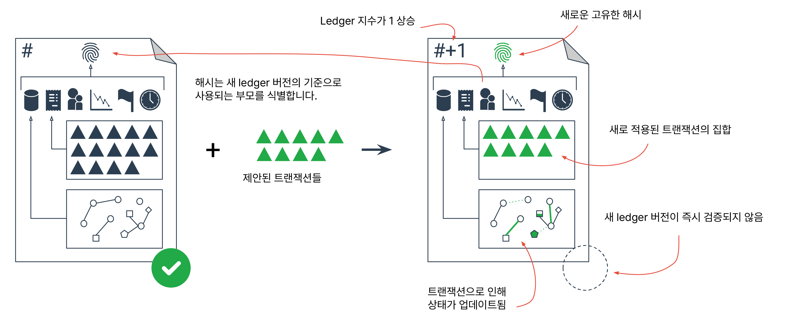
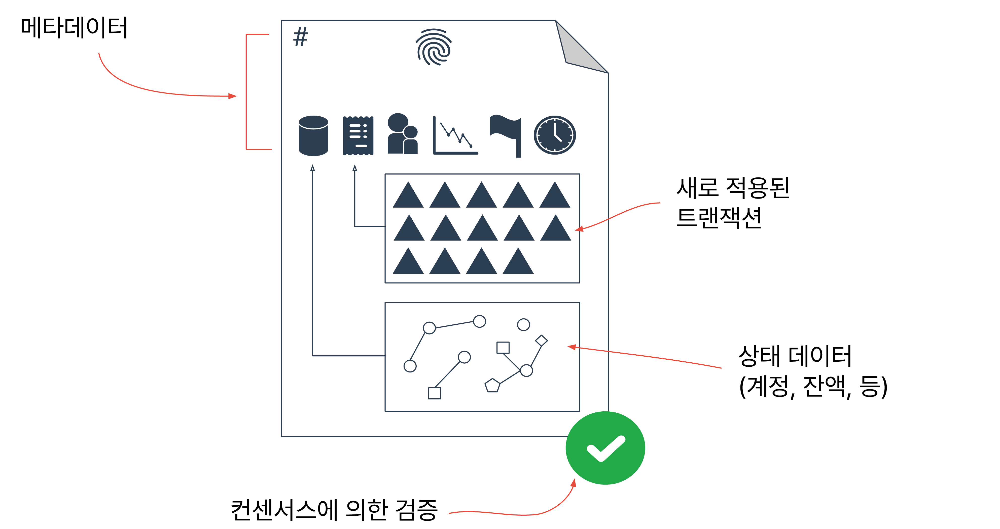

# Ledgers

XRP 원장은 모두에게 공개되는 공유 글로벌 원장입니다. 개별 참여자는 원장을 관리하는 단일 기관을 신뢰하지 않고도 원장의 무결성을 신뢰할 수 있습니다. XRP 레저 프로토콜은 매우 특정한 규칙에 따라서만 업데이트할 수 있는 레저 데이터베이스를 관리함으로써 이를 달성합니다. P2P 네트워크의 각 서버는 원장 데이터베이스의 전체 사본을 보관하고, 네트워크는 [합의 프로세스](https://xrpl.org/consensus.html)에 따라 블록에 적용되는 후보 트랜잭션을 배포합니다.

<figure><figcaption></figcaption></figure>

공유 글로벌 원장은 원장 버전 또는 간단히 원장이라고 하는 일련의 블록으로 구성됩니다. 모든 원장 버전에는 원장의 올바른 순서를 식별하는 \*\*[원장 인덱스](https://xrpl.org/basic-data-types.html#ledger-index)\*\*가 있습니다. 영구적으로 폐쇄된 각 원장에는 고유한 식별 해시값도 있습니다.

언제든지 각 XRP 레저 서버에는 진행 중인 공개 원장과 보류 중인 여러 개의 폐쇄 원장이 있으며, 변경할 수 없는 검증된 원장의 내역이 있습니다.

단일 원장 버전은 여러 부분으로 구성됩니다:

<figure><figcaption></figcaption></figure>

* **header** - 원장 인덱스, 기타 콘텐츠의 해시, 기타 메타데이터입니다.
* **transaction tree** - 이 원장을 만들기 위해 이전 원장에 적용된 트랜잭션입니다.
* **state tree** - 잔액, 설정 등 원장에 있는 모든 데이터(원장 항목)입니다.

**See Also**

* For more information about ledger headers, ledger object IDs, and ledger object types, see [Ledger Data Formats](https://xrpl.org/ledger-data-formats.html)
* For information on how servers track the history of changes to ledger state, see [Ledger History](https://xrpl.org/ledger-history.html)
