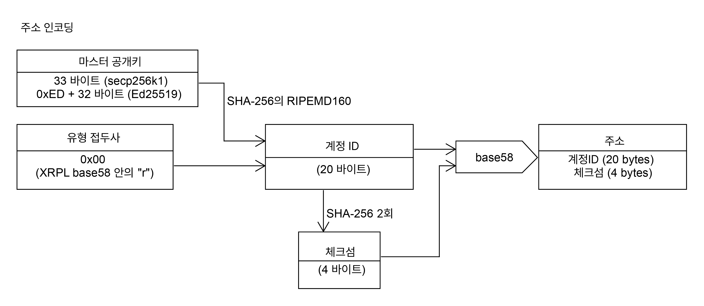

# 계정

XRP Ledger에서 "계정"은 XRP의 소유자이며, [트랜잭션](../../references/xrp-ledger/undefined-1/)의 발신자를 나타냅니다. 계정의 핵심 요소는 다음과 같습니다:

* 식별 **주소**, 예를 들어 <mark style="background-color:yellow;">rf1BiGeXwwQoi8Z2ueFYTEXSwuJYfV2Jpn</mark> 같은 것입니다. (이것은 [X-Address 형식](./#undefined-1)과 대비되는 "클래식 주소"입니다.)&#x20;
* **XRP 잔액**. 이 XRP 중 일부는 [reserve](reserves.md)를 위해 따로 두어져 있습니다.
* **시퀀스 번호**는 이 계정이 보내는 모든 트랜잭션이 올바른 순서로, 각각 한 번만 적용되도록 도와줍니다. 트랜잭션 실행하려면, 트랜잭션의 시퀀스 번호와 그 발신자의 시퀀스 번호가 일치해야 합니다. 그 다음, 트랜잭션 적용의 일환으로 계정의 시퀀스 번호가 1씩 증가합니다. (참고: [기본 데이터 유형: 계정 시퀀스](../../references/xrp-ledger/undefined/).)&#x20;
* 이 계정과 그 잔액에 영향을 미친 **트랜잭션의 이력**.&#x20;
* [트랜잭션을 승인](../transactions/)하는 한 가지 이상의 방법, 아래를 포함할 수 있습니다: &#x20;
  * 계정에 본질적으로 속한 마스터 키 쌍. ([비활성화](../../references/xrp-ledger/undefined-1/undefined-1/accountset.md)는 가능하지만 변경은 불가능합니다.)
  * [교체 가능한](../../references/xrp-ledger/undefined-1/undefined-1/setregularkey.md) "일반" 키 쌍.&#x20;
  * [다중 서명](undefined-1.md)을 위한 서명자 목록. (계정의 핵심 데이터와는 별도로 저장됩니다.)

ledger의 데이터 트리에서, 계정의 핵심 데이터는 [AccountRoot](../../references/xrp-ledger/ledger/ledger-1/accountroot.md) ledger 객체 유형에 저장됩니다. 계정은 또한 다른 유형의 데이터의 소유자(또는 일부 소유자)가 될 수도 있습니다.


Tip:&#x20;

XRP Ledger에서의 "계정"은 금융적 용도(예: "은행 계좌")와 컴퓨팅 용도(예: "UNIX 계정") 사이의 개념입니다. XRP가 아닌 통화와 자산은 XRP Ledger 계정 자체에 저장되지 않습니다. 각각의 자산은 신뢰 선이라는 회계 관계에 저장되며, 이는 두 당사자를 연결합니다.


## 계정 생성

전용 "계정 생성" 트랜잭션은 없습니다. [결제 트랜잭션](../../references/xrp-ledger/undefined-1/undefined-1/payment.md)은 [계정 reserve](reserves.md) 이상의 XRP를 아직 계정이 없는 수학적으로 유효한 주소로 보내는 경우 자동으로 새 계정을 생성합니다. 이를 계정 충전이라고 하며, 이는 ledger에 [AccountRoot 객체](../../references/xrp-ledger/ledger/ledger-1/accountroot.md)를 생성합니다. 다른 어떤 트랜잭션도 계정을 생성할 수 없습니다.


Caution:

계정에 충전하는 것은 그 계정에 대한 특별한 권한을 **주지 않습니다**. 계정 주소에 해당하는 비밀키를 가진 사람이 계정과 그 안에 있는 모든 XRP를 완전히 제어합니다. 일부 주소의 경우, 비밀키를 가진 사람이 아무도 없을 수 있습니다. 이 경우 계정은 [블랙홀](./)이며, XRP는 영원히 손실됩니다.


XRP Ledger에 계정을 얻는 일반적인 방법은 다음과 같습니다:

1. 강력한 무작위성 출처로부터 키 쌍을 생성하고 그 키 쌍의 주소를 계산합니다. (예를 들어, 이를 수행하기 위해 [wallet\_propose](../../references/http-websocket-apis/api-2/undefined/wallet\_propose.md) 메소드를 사용할 수 있습니다.)
2. XRP Ledger에 이미 계정이 있는 사람이 생성한 주소로 XRP를 보냅니다.\
   \
   예를 들어, 개인 거래소에서 XRP를 사고, 거래소에서 지정한 주소로 XRP를 인출할 수 있습니다.


Caution:

자신의 XRP Ledger 주소에서 처음으로 XRP를 받을 때는 [계정 reserve](reserves.md)(현재 10 XRP)을 지불해야 하며, 이는 해당 XRP 금액을 무기한으로 잠금 처리합니다. 반면, 개인 거래소는 보통 모든 고객의 XRP를 몇 개의 공유 XRP Ledger 계정에 보유하므로, 고객은 거래소에서 개별 계정에 대한 reserve을 지불할 필요가 없습니다. 인출하기 전에, XRP Ledger에서 직접 자신의 계정을 가지는 것이 그 가치가 있는지 고려해 보세요.


## 주소

XRP Ledger의 계정은 XRP Ledger의 [base58](../../references/xrp-ledger/undefined/base58.md) 형식의 주소로 식별됩니다. 이 주소는 비밀 키에서 만들어진 계정의 마스터 [공개 키](https://en.wikipedia.org/wiki/Public-key\_cryptography)에서 파생됩니다. 주소는 JSON에서 문자열로 표시되며 다음과 같은 특성이 있습니다:&#x20;

* 길이가 25에서 35자 사이.&#x20;
* <mark style="background-color:yellow;">r</mark> 문자로 시작.&#x20;
* 숫자 "0", 대문자 "<mark style="background-color:yellow;">O</mark>", 대문자 "<mark style="background-color:yellow;">I</mark>", 소문자 "<mark style="background-color:yellow;">l</mark>"을 제외한 알파벳과 숫자를 사용.&#x20;
* 대소문자 구분.&#x20;
* 무작위 문자로 유효한 주소를 생성할 확률이 대략 2^32분의 1이 되도록 4바이트 체크섬(중복 검사) 포함.


Note:&#x20;

XRP 커뮤니티는 [데스티네이션 태그](../transactions/source-and-destination-tags.md)를 주소에 "packs"하는 X-주소 형식을 [제안](https://github.com/XRPLF/XRPL-Standards/issues/6)하였습니다. 이 주소는 메인넷의 경우 <mark style="background-color:yellow;">X</mark>로, [testnet](../xrp-ledger/parallel-networks.md)의 경우 <mark style="background-color:yellow;">T</mark>로 시작합니다. 거래소와 지갑은 고객이 알아야 하는 모든 데이터를 하나의 값으로 표현하기 위해 X-주소를 사용할 수 있습니다. 자세한 정보는 [X-주소 형식 사이트](https://xrpaddress.info/)와 [코덱](https://github.com/xrp-community/xrpl-tagged-address-codec)을 참조하세요.

XRP Ledger 프로토콜은 기본적으로 "클래식" 주소만 지원하지만, 많은 [클라이언트 라이브러리](../../references/undefined/)도 X-주소를 지원합니다.


자세한 정보는 [계정](./) 및 [base58 인코딩](../../references/xrp-ledger/undefined/base58.md)을 참조하세요.

유효한 주소는 자금을 지원함으로써 [XRP Ledger의 계정이 될 수 있습니다](./#undefined). 또한 자금을 지원하지 않은 주소를 [정규 키 ](../../references/xrp-ledger/undefined-1/undefined-1/setregularkey.md)또는 [서명자 목록](undefined-1.md)의 멤버를 나타내는 데 사용할 수 있습니다. 거래의 발신자는 자금을 지원한 계정만 될 수 있습니다.

유효한 주소를 생성하는 것은 키 쌍에서 시작하는 엄격히 수학적인 작업입니다. XRP Ledger나 다른 당사자와의 통신 없이 완전히 오프라인에서 키 쌍을 생성하고 그 주소를 계산할 수 있습니다. 공개 키에서 주소로의 변환은 단방향 해시 함수를 포함하므로 공개 키가 주소와 일치하는지 확인할 수 있지만 주소만으로 공개 키를 도출할 수는 없습니다. (이것이 서명된 거래가 발신자의 공개 키와 주소를 포함하는 이유 중 일부입니다.)

XRP Ledger 주소를 계산하는 방법에 대한 더 자세한 기술적 세부사항은 [주소 인코딩](./#undefined-5)을 참조하세요.

## 특별한 주소

일부 주소는 XRP Ledger에서 특별한 의미를 가지거나 역사적인 용도를 가지고 있습니다. 대부분의 경우, 이들은 "블랙홀" 주소로, 이 주소는 알려진 비밀 키에서 파생되지 않았습니다. 주소만으로 비밀 키를 추측하는 것은 사실상 불가능하기 때문에, 블랙홀 주소가 소유한 XRP는 영원히 손실됩니다.

| 주소                                   | 이름               | 설명                                                                                                                                                                                                                                                                                                                                            | 블랙홀 여부 |
| ------------------------------------ | ---------------- | --------------------------------------------------------------------------------------------------------------------------------------------------------------------------------------------------------------------------------------------------------------------------------------------------------------------------------------------- | ------ |
| `rrrrrrrrrrrrrrrrrrrrrhoLvTp`        | ACCOUNT\_ZERO    | 값이 <mark style="background-color:yellow;">0</mark>인 XRP Ledger의 [base58](../../references/xrp-ledger/undefined/base58.md) 인코딩 주소입니다. P2P 통신에서 <mark style="background-color:yellow;">rippled</mark>는 이 주소를 XRP의 발행자로 사용합니다.                                                                                                                   | Yes    |
| `rrrrrrrrrrrrrrrrrrrrBZbvji`         | ACCOUNT\_ONE     | 값이 <mark style="background-color:yellow;">1</mark>인 XRP Ledger의 [base58](../../references/xrp-ledger/undefined/base58.md) 인코딩 주소입니다. ledger에서 [RippleState](../../references/xrp-ledger/ledger/ledger-1/ripplestate.md) 항목은 신뢰 선 잔액의 발행자로 이 주소를 플레이스홀더로 사용합니다.                                                                                | Yes    |
| `rHb9CJAWyB4rj91VRWn96DkukG4bwdtyTh` | 제네시스 계정          | <mark style="background-color:yellow;">rippled</mark>가 새로운 genesis ledger를 처음부터 시작할 때(예: 독립 모드에서), 이 계정이 모든 XRP를 보유하고 있습니다. 이 주소는 [하드코딩](https://github.com/XRPLF/rippled/blob/94ed5b3a53077d815ad0dd65d490c8d37a147361/src/ripple/app/ledger/Ledger.cpp#L184)된 시드 값인 <mark style="background-color:yellow;">masterpassphrase</mark>에서 생성됩니다. | No     |
| `rrrrrrrrrrrrrrrrrNAMEtxvNvQ`        | Ripple 이름 예약 블랙홀 | 과거에 Ripple은 사용자들에게 Ripple 이름을 예약하기 위해 이 계정으로 XRP를 보내도록 요청했습니다.                                                                                                                                                                                                                                                                                | Yes    |
| `rrrrrrrrrrrrrrrrrrrn5RM1rHd`        | NaN 주소           | [ripple-lib](https://github.com/XRPLF/xrpl.js)의 이전 버전은 XRP Ledger의 [base58](../../references/xrp-ledger/undefined/base58.md) 문자열 인코딩 형식을 사용하여 [NaN](https://developer.mozilla.org/en-US/docs/Web/JavaScript/Reference/Global\_Objects/NaN) 값을 인코딩할 때 이 주소를 생성했습니다.                                                                            | Yes    |

## 계정 삭제

[DeletableAccounts 수정안](../xrp-ledger/amendments/undefined.md) (2020-05-08 활성화)은 계정을 삭제할 수 있게 했습니다.

삭제하기 위해 계정은 다음의 요구사항을 충족해야 합니다:

* 계정의 <mark style="background-color:yellow;">Sequence</mark> 번호와 256을 더한 값이 현재 [Ledger Index](../../references/xrp-ledger/undefined/)보다 작아야 합니다.
* 계정이 아래의 [ledger 객체 유형](../../references/xrp-ledger/ledger/ledger-1/)들과 연결되어 있지 않아야 합니다(발신자 또는 수신자로서):
  * <mark style="background-color:yellow;">Escrow.</mark>
  * <mark style="background-color:yellow;">PayChannel.</mark>
  * <mark style="background-color:yellow;">RippleState.</mark>
  * <mark style="background-color:yellow;">Check.</mark>
* ledger에서 계정이 소유하는 객체가 1000개 미만이어야 합니다.
* [AccountDelete 트랜잭션](../../references/xrp-ledger/undefined-1/undefined-1/accountdelete.md)은 한 개의 항목에 대한 [소유자 reserve](reserves.md)(현재 2 XRP) 이상의 특별한 [트랜잭션 비용](../transactions/transaction-cost.md)을 지불해야 합니다.

계정이 삭제된 후에는, [계정을 생성](./#undefined)하는 일반적인 방법을 통해 ledger에 다시 생성될 수 있습니다. 삭제되었다가 다시 생성된 계정은 처음 생성된 계정과 다르지 않습니다.


Warning:

[AccountDelete 트랜잭션](../../references/xrp-ledger/undefined-1/undefined-1/accountdelete.md)의 트랜잭션 비용은 계정이 삭제될 수 있는 요구사항을 충족하지 않아 트랜잭션이 실패하더라도 검증된 ledger에 트랜잭션이 포함되면 항상 적용됩니다. 계정을 삭제할 수 없는 경우에 고비용의 트랜잭션 비용을 지불할 가능성을 크게 줄이기 위해, <mark style="background-color:yellow;">fail\_hard</mark> 옵션이 활성화된 상태로 [트랜잭션을 제출](../../references/http-websocket-apis/api-1/undefined-1/submit.md)하세요.


비트코인과 많은 다른 암호화폐와는 달리, XRP Ledger의 공개 ledger 체인의 각 새 버전에는 ledger의 전체 상태가 포함되어 있으며, 이는 각 새 계정에 따라 크기가 증가합니다. 이러한 이유로, 필요한 경우가 아니라면 새로운 XRP Ledger 계정을 생성하지 않는 것이 좋습니다. 계정을 삭제함으로써 계정의 10 XRP [reserve](reserves.md) 중 일부를 회수할 수 있지만, 그렇게 하기 위해서는 최소한 2 XRP를 소멸시켜야 합니다.

많은 사용자를 대신해서 가치를 송수신하는 기관은 [**출발 태그**와 **데스티네이션 태그**](../transactions/source-and-destination-tags.md)를 사용하여 고객에게 보내고 받는 결제를 구분할 수 있으며, 이를 통해 XRP Ledger에서 한 개(또는 소수)의 계정만을 사용할 수 있습니다.

## 트랜잭션 히스토리

XRP Ledger에서는 트랜잭션의 식별 해시와 ledger 인덱스에 의해 연결된 트랜잭션의 "스레드"에 의해 트랜잭션 히스토리가 추적됩니다. <mark style="background-color:yellow;">AccountRoot</mark> ledger 객체는 가장 최근에 그것을 수정한 트랜잭션의 식별 해시와 ledger를 가지고 있습니다; 그 트랜잭션의 메타데이터는 <mark style="background-color:yellow;">AccountRoot</mark> 노드의 이전 상태를 포함하므로, 이 방식으로 단일 계정의 히스토리를 순회하는 것이 가능합니다. 이 트랜잭션 히스토리는 <mark style="background-color:yellow;">AccountRoot</mark> 노드를 직접 수정하는 모든 트랜잭션을 포함하며, 이에는 다음이 포함됩니다:

* 계정에서 보낸 트랜잭션들은 계정의 <mark style="background-color:yellow;">시퀀스</mark> 번호를 수정하므로 포함됩니다. 이러한 트랜잭션들은 [트랜잭션 비용](../transactions/transaction-cost.md) 때문에 계정의 XRP 잔액도 수정합니다.
* 계정의 XRP 잔액을 수정한 트랜잭션들, 이에는 들어오는 [결제 트랜잭션](../../references/xrp-ledger/undefined-1/undefined-1/payment.md)과 [PaymentChannelClaim](../../references/xrp-ledger/undefined-1/undefined-1/paymentchannelclaim.md) 및 [EscrowFinish](../../references/xrp-ledger/undefined-1/undefined-1/escrowfinish.md)와 같은 다른 유형의 트랜잭션들이 포함됩니다.

계정의 개념적 트랜잭션 히스토리는 계정이 소유한 객체와 non-XRP 잔액을 수정한 트랜잭션들도 포함합니다. 이러한 객체들은 별도의 ledger 객체로, 각각이 그것들에 영향을 미친 트랜잭션의 자체 스레드를 가지고 있습니다. 계정의 전체 ledger 히스토리를 가지고 있다면, 그것을 앞으로 따라가며 계정이 생성하거나 수정한 ledger 객체를 찾을 수 있습니다. "완전한" 트랜잭션 히스토리는 트랜잭션이 소유한 객체들의 히스토리를 포함합니다. 이에는 다음이 포함됩니다:

* 계정에 연결된 <mark style="background-color:yellow;">RippleState</mark> 객체 (신뢰선).
* <mark style="background-color:yellow;">DirectoryNode</mark> 객체, 특히 계정이 소유한 객체를 추적하는 소유자 디렉리.
* <mark style="background-color:yellow;">Offer</mark> 객체, 분산형 거래소에서의 계정의 대기 중인 화폐 교환 주문을 나타냅니다.
* <mark style="background-color:yellow;">PayChannel</mark> 객체, 계정에서 들어오고 나가는 비동기 지불 채널을 나타냅니다.
* <mark style="background-color:yellow;">Escrow</mark> 객체, 시간이나 암호 조건에 의해 잠긴 계정에서 또는 계정으로의 보류 중인 결제를 나타냅니다.
* <mark style="background-color:yellow;">SignerList</mark> 객체, [다중 서명](undefined-1.md)으로 계정에 대한 트랜잭션을 승인할 수 있는 주소 목록을 나타냅니다.

이러한 각 객체에 대한 자세한 정보는 [ledger 형식 참조](../../references/xrp-ledger/ledger/)를 참조하세요.

## 주소 인코딩


Tip:

이 기술적 세부사항은 XRP Ledger 호환성을 위한 low-level 라이브러리 소프트웨어를 구축하는 사람들에게만 관련이 있습니다!


XRP Ledger 주소는 rpshnaf39wBUDNEGHJKLM4PQRST7VWXYZ2bcdeCg65jkm8oFqi1tuvAxyz 딕셔너리를 사용한 [base58](../../references/xrp-ledger/undefined/base58.md)로 인코딩됩니다. XRP Ledger는 여러 유형의 키를 base58로 인코딩하므로, 이들을 구분하기 위해 인코딩된 데이터 앞에 "유형 접두사" (또는 "버전 접두사")라고 불리는 한 바이트를 붙입니다. 이 유형 접두사로 인해 주소는 보통 base58 형식에서 다른 글자로 시작하게 됩니다.

다음 다이어그램은 키와 주소 간의 관계를 보여줍니다:

<figure><figcaption></figcaption></figure>

공개 키에서 XRP Ledger 주소를 계산하는 공식은 다음과 같습니다. 완전한 예제 코드는 [encode\_address.js](https://github.com/XRPLF/xrpl-dev-portal/blob/master/content/\_code-samples/address\_encoding/js/encode\_address.js)를 참조하세요. 패스프레이즈(passpharase)나 시드 값에서 공개 키를 파생시키는 과정은 [키 유도](cryptographic-keys.md)를 참조하세요.

1.  필요한 알고리즘을 가져옵니다: SHA-256, RIPEMD160, 그리고 base58. base58에 대한 사전을 설정합니다.\


    ```javascript
    'use strict';
    const assert = require('assert');
    const crypto = require('crypto');
    const R_B58_DICT = 'rpshnaf39wBUDNEGHJKLM4PQRST7VWXYZ2bcdeCg65jkm8oFqi1tuvAxyz';
    const base58 = require('base-x')(R_B58_DICT);

    assert(crypto.getHashes().includes('sha256'));
    assert(crypto.getHashes().includes('ripemd160'));
    ```


2.  33바이트의 ECDSA secp256k1 공개 키, 또는 32바이트의 Ed25519 공개 키로 시작합니다. Ed25519 키의 경우 키 앞에 바이트 0xED를 붙입니다.\


    ```javascript
    const pubkey_hex =
      'ED9434799226374926EDA3B54B1B461B4ABF7237962EAE18528FEA67595397FA32';
    const pubkey = Buffer.from(pubkey_hex, 'hex');
    assert(pubkey.length == 33);
    ```


3.  공개 키의 SHA-256 해시의 RIPEMD160 해시를 계산합니다. 이 값은 "계정 ID"입니다.\


    ```javascript
    const pubkey_inner_hash = crypto.createHash('sha256').update(pubkey);
    const pubkey_outer_hash = crypto.createHash('ripemd160');
    pubkey_outer_hash.update(pubkey_inner_hash.digest());
    const account_id = pubkey_outer_hash.digest();
    ```


4.  계정 ID의 SHA-256 해시의 SHA-256 해시를 계산하고, 처음 4바이트를 가져옵니다. 이 값은 "체크섬"입니다.\


    ```javascript
    const address_type_prefix = Buffer.from([0x00]);
    const payload = Buffer.concat([address_type_prefix, account_id]);
    const chksum_hash1 = crypto.createHash('sha256').update(payload).digest();
    const chksum_hash2 = crypto.createHash('sha256').update(chksum_hash1).digest();
    const checksum =  chksum_hash2.slice(0,4);
    ```


5.  페이로드와 체크섬을 연결합니다. 연결된 버퍼의 base58 값을 계산합니다. 결과는 주소입니다.\


    ```javascript
    const dataToEncode = Buffer.concat([payload, checksum]);
    const address = base58.encode(dataToEncode);
    console.log(address);
    // rDTXLQ7ZKZVKz33zJbHjgVShjsBnqMBhmN
    ```

## 참고

* **Concepts:**
  * [Reserves](reserves.md)
  * [Cryptographic Keys](cryptographic-keys.md)
  * [Issuing and Operational Addresses](undefined-4.md)
* **References:**
  * [account\_info method](../../references/http-websocket-apis/api-1/undefined/account\_info.md)
  * [wallet\_propose method](../../references/http-websocket-apis/api-2/undefined/wallet\_propose.md)
  * [AccountSet transaction](../../references/xrp-ledger/undefined-1/undefined-1/accountset.md)
  * [Payment transaction](../../references/xrp-ledger/undefined-1/undefined-1/payment.md)
  * [AccountRoot object](../../references/xrp-ledger/ledger/ledger-1/accountroot.md)
* **Tutorials:**
  * [Manage Account Settings (Category)](../../tutorials/tasks/manage-account-settings/)
  * [Monitor Incoming Payments with WebSocket](../../tutorials/http-websocket-apis/http-websocket-apis-get-started-using-http-websocket-apis.md)
