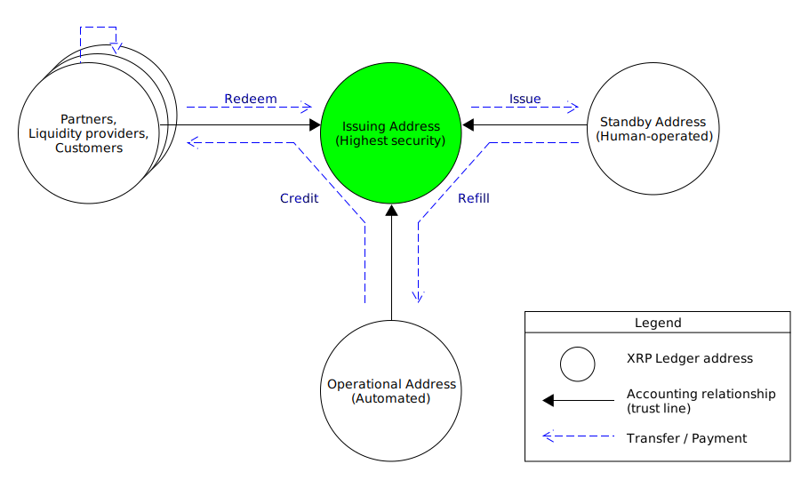

# 계정 유형

XRP 원장에서 금융 기관은 일반적으로 손상된 비밀 키와 관련된 위험을 최소화하기 위해 여러 XRP Ledger 주소를 사용합니다. 업계 표준은 다음과 같이 역할을 분리합니다:

* "콜드 월렛"이라고도 하는 하나의 발행 주소. 이 주소는 원장 내에서 금융 기관의 회계 관계의 중심이지만 가능한 한 적은 트랜잭션만 전송합니다.
* "핫 월렛"이라고도 하는 하나 이상의 운영 주소. 자동화된 인터넷 연결 시스템은 이 주소들의 비밀 키를 사용하여 고객 및 파트너에게 전송과 같은 일상 업무를 수행합니다.
* "웜 월렛"이라고도 하는 선택적 백업 주소들. 신뢰할 수 있는 인간 운영자들이 이 주소들을 사용하여 운영 주소로 돈을 전송합니다.

## **자금 생명주기**

토큰 발행자가 이러한 역할 분리를 따르면 자금은 다음 다이어그램과 같은 특정 방향으로 흘러갑니다:

<figure><figcaption></figcaption></figure>

발행 주소는 백업 주소에 대한 지불을 보내서 토큰을 생성합니다. 이러한 토큰은 발행 주소의 관점에서는 음의 가치를 가지므로 이들은 (대개) 의무를 나타냅니다. 동일한 토큰은 백업 주소의 관점을 포함하여 다른 관점에서는 양의 가치를 가집니다.

실제 인간에 의해 운영되는 백업 주소는 그 토큰들을 운영 주소로 전송합니다. 이 단계는 발행 주소가 이후에 가능한 한 적게 사용되도록 하면서, 백업용으로 어느 정도 토큰을 사용할 수 있게 합니다.

자동 시스템에 의해 운영되는 운영 주소는 유동성 제공자, 파트너 및 기타 고객과 같은 다른 상대방에게 지불을 보냅니다. 그 상대방은 서로에게 자유롭게 자금을 여러 번 보낼 수 있습니다.

언제나 토큰 결제는 신뢰 라인을 통해 발행자에게 "리플"되어야 합니다.

결국 누군가는 발행자에게 토큰을 되돌려 보냅니다. 이렇게 하면 해당 토큰이 파괴되어 XRP 원장에서 발행자의 의무가 줄어듭니다. 토큰이 안정화코인인 경우, 이는 원장 외의 자산에 대한 토큰을 상환하는 첫 번째 단계입니다.

## **발행 주소**

발행 주소는 금고와 같습니다. 파트너, 고객, 및 운영 주소는 발행 주소에 대한 신뢰 라인을 생성하지만, 이 주소는 가능한 한 적은 트랜잭션만 전송합니다. 주기적으로, 인간 운영자는 발행 주소에서 백업 또는 운영 주소의 잔액을 보충하기 위해 트랜잭션을 생성하고 서명합니다. 이러한 트랜잭션을 서명하는 데 사용되는 비밀 키는 인터넷에 연결된 컴퓨터에서는 절대로 액세스하면 안됩니다.

금고와는 달리, 발행 주소는 고객 및 파트너로부터 직접 지불을 받을 수 있습니다. XRP 원장의 모든 트랜잭션이 공개되므로, 자동 시스템은 비밀 키가 필요 없이 발행 주소로의 지불을 감시할 수 있습니다.

### **발행 주소 침해**

악의적인 행위자가 기관의 발행 주소 뒤의 비밀 키를 알게되면, 그 행위자는 새로운 토큰을 생성하고 사용자에게 보내거나 분산 거래소에서 거래할 수 있습니다. 이로 인해 안정화코인 발행자가 지급 능력을 잃을 수 있습니다. 금융 기관이 합법적으로 획득된 토큰을 구분하고 공정하게 상환하는 것이 어려워질 수 있습니다. 금융 기관이 발행 주소의 통제를 잃게되면, 기관은 새로운 발행 주소를 생성해야하며, 기존 발행 주소에 신뢰 라인이 있는 모든 사용자는 새 주소에 새로운 신뢰 라인을 생성해야 합니다.

### **다중 발행 주소**

금융 기관은 단일 발행 주소에서 XRP 원장에 둘 이상의 유형의 토큰을 발행할 수 있습니다. 그러나, 주소에서 발행된 모든 (유동성 있는) 토큰에 동등하게 적용되는 일부 설정이 있습니다. 금융 기관이 각 토큰 유형에 대해 설정을 다르게 관리하려는 유연성을 원하면, 기관은 여러 발행 주소를 가져야 합니다.

## **운영 주소**

운영 주소는 현금 등록기와 같습니다. 기관을 대신하여 고객과 파트너에게 토큰을 전송하여 지불을 합니다. 트랜잭션을 자동으로 서명하기 위해, 운영 주소의 비밀 키는 인터넷에 연결된 서버에 저장되어야 합니다. 고객 및 파트너는 운영 주소에 신뢰 라인을 생성하면 안됩니다.

각 운영 주소는 토큰 및 XRP의 제한된 잔액을 가지고 있습니다. 운영 주소의 잔액이 부족하면, 금융 기관은 발행 주소 또는 백업 주소에서 지불을 보내서 잔액을 보충합니다.

## **대기 주소**

기관은 발행 주소와 운영 주소 사이의 중간 단계로 "대기 주소"를 사용하여 위험과 편의성을 균형있게 조절할 수 있습니다.

## 참고자료

* **Concepts:**
  * [Accounts](https://xrpl.org/accounts.html)
  * [Cryptographic Keys](https://xrpl.org/cryptographic-keys.html)
* **Tutorials:**
  * [Assign a Regular Key Pair](https://xrpl.org/assign-a-regular-key-pair.html)
  * [Change or Remove a Regular Key Pair](https://xrpl.org/change-or-remove-a-regular-key-pair.html)
* **References:**
  * [account\_info method](https://xrpl.org/account\_info.html)
  * [SetRegularKey transaction](https://xrpl.org/setregularkey.html)
  * [AccountRoot object](https://xrpl.org/accountroot.html)
