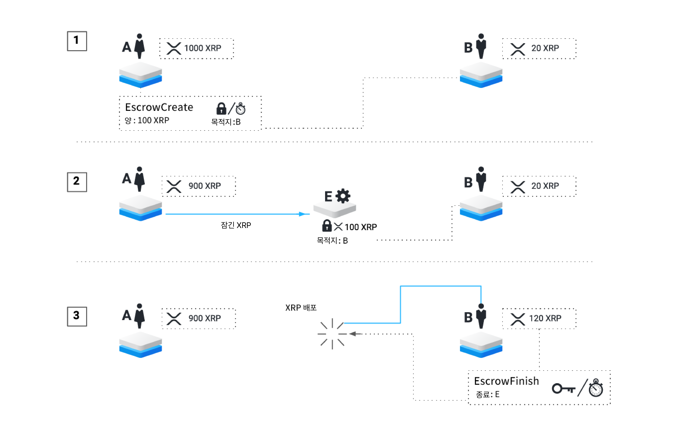
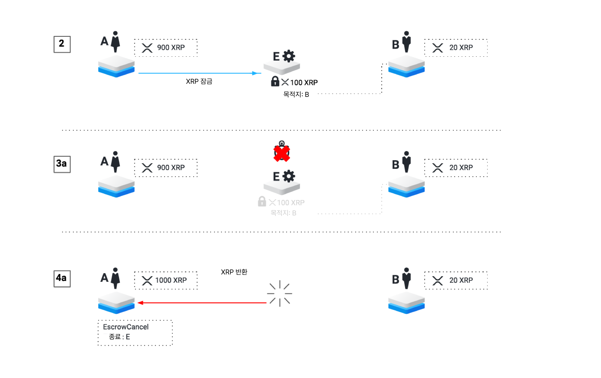
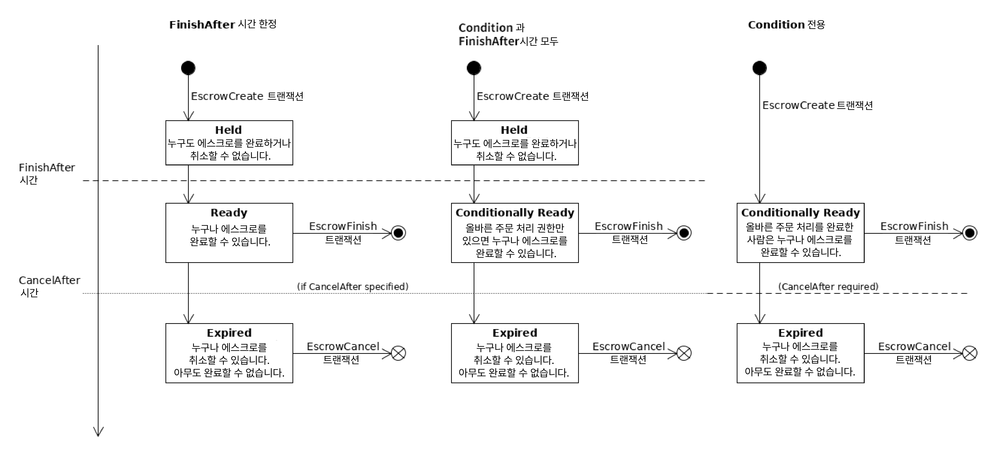

# 에스크로

에스크로는 XRP Ledger의 기능으로, 조건부 XRP 지불을 보낼 수 있게 해줍니다. 이러한 조건부 지불인 에스크로는 XRP를 예약하고, 특정 조건이 충족되었을 때 나중에 이를 전달합니다. 에스크로를 성공적으로 완료하기 위한 조건에는 시간 기반 잠금과 [암호 조건](https://datatracker.ietf.org/doc/html/draft-thomas-crypto-conditions-04)이 포함됩니다. 에스크로는 시간 내에 완료되지 않으면 만료될 수도 있습니다.

에스크로에 예약된 XRP는 잠겨 있습니다. 에스크로가 성공적으로 완료되거나 취소되기 전까지는 아무도 XRP를 사용하거나 파괴할 수 없습니다. 만료 시간 이전에는 의도한 수령인만 XRP를 받을 수 있습니다. 만료 시간 이후에는 XRP를 송신자에게만 반환할 수 있습니다.

## 사용

<figure><figcaption></figcaption></figure>

**1단계**: 에스크로를 보내기 위해 송신자는 [EscrowCreate 트랜잭션](../../references/xrp-ledger/undefined-1/undefined-1/escrowcreate.md)을 사용하여 일부 XRP를 잠그게 됩니다. 이 트랜잭션에서는 완료 시간, 만료 시간 또는 둘 다를 정의할 수 있습니다. 또한 트랜잭션에는 에스크로를 완료하기 위해 충족되어야 할 암호 조건을 정의할 수도 있습니다. 이 트랜잭션은 XRP의 수령인을 정의해야 합니다. 수령인은 송신자와 동일할 수도 있습니다.

**2단계**: 이 트랜잭션이 처리된 후에는 XRP Ledger에 [에스크로](undefined-2.md) 객체가 생성됩니다. 이 개체는 생성한 트랜잭션에 의해 정의된 에스크로의 속성을 포함합니다. 만약 에스크로에 완료 시간이 정의되어 있다면, 해당 시간이 지나기 전까지는 아무도 XRP에 접근할 수 없습니다.

**3단계**: 수령인이나 다른 XRP Ledger 주소는 [EscrowFinish 트랜잭션](../../references/xrp-ledger/undefined-1/undefined-1/escrowfinish.md)을 내서 XRP를 전달합니다. 올바른 조건이 충족되면, 이 트랜잭션은 ledger에서 에스크로 객체를 파괴하고 XRP를 수령인에게 이체합니다. 에스크로에 암호 조건이 있는 경우, 이 트랜잭션에는 해당 조건의 충족을 포함해야 합니다. 이미 지나간 만료 시간이 있는 에스크로의 경우, EscrowFinish 트랜잭션은 <mark style="background-color:yellow;">tecNO\_PERMISSION</mark> 코드와 함께 실패합니다.

## 만료 시나리오

<figure><figcaption></figcaption></figure>

모든 에스크로는 동일한 방식으로 시작하므로, **단계 1과 2**는 성공적인 경우와 동일합니다

**3단계a**: 에스크로에 만료 시간이 있는 경우, 그리고 해당 시간까지 에스크로 성공적으로 완료되지 않은 경우, 에스크로는 만료되었다고 간주됩니다. XRP Ledger에는 여전히 존재하지만 성공적으로 완료할 수 없습니다. (만료된 객체는 트랜잭션이 수정될 때까지 ledger에 남아 있습니다. 시간 기반 트리거는 ledger 내용을 변경할 수 없습니다.)

**4단계a**: 송신자나 다른 XRP Ledger 주소는 [EscrowCancel 트랜잭션](../../references/xrp-ledger/undefined-1/undefined-1/escrowcancel.md)을 보내 만료된 에스크로를 취소할 수 있습니다. 이로써 ledger에서 [에스크로 객체](undefined-2.md)가 파괴되고 XRP가 송신자에게 반환됩니다.

## 제한 사항

에스크로는 XRP Ledger를 Interledger Protocol 및 기타 스마트 컨트랙트와와 함께 사용할 수 있도록 지원하기 위해 설계되었습니다. 현재 버전은 복잡성을 피하기 위해 간소한 범위를 가지고 있습니다.

* 에스크로는 토큰이 아닌 XRP만 사용할 수 있습니다.
* 에스크로는 적어도 두 개의 트랜잭션을 전송해야 합니다: 하나는 에스크로를 생성하기 위한 것이고, 다른 하나는 에스크로를 완료하거나 취소하기 위한 것입니다. 따라서 매우 작은 금액에 대해 에스크로를사용하는 것은 재정적으로 합리적이지 않을 수 있습니다. 왜냐하면 참여자는 두 개의 [트랜잭션의 비용](../transactions/transaction-cost.md)을 부담해야 하기 때문입니다.
  * 암호 조건을 사용하는 경우, 에스크로를 완료하는 트랜잭션의 비용이 일반적인 경우보다 높습니다.
* 모든 에스크로는 "완료 후" 시간 또는 암호 조건 또는 둘 다로 생성되어야 합니다. 완료 후 시간이 없는 경우, 에스크로에는 반드시 만료 시간이 있어야 합니다.


Note:

[fix1571 수정안](../xrp-ledger/amendments/undefined.md)은 에스크로 생성에 대한 요구 사항을 변경했습니다. 이전에 생성된 에스크로에는 조건이나 완료 후 시간이 없는 만료 시간이 제공될 수 있습니다. 그러한 에스크로는 누구나 즉시 완료할 수 있습니다(자금을 수령인에게 보내는 것).


* 에스크로 생성 트랜잭션이 실행될 때, 시간 값은 과거일 수 없습니다.
* 시간 제한 릴리스 및 만료는 XRP Ledger가 마감될 때로 제한됩니다. 이는 실제로 ledger 닫히는 시점에 따라 시간이 약 5초 간격으로 반올림될 수 있음을 의미합니다.
* 유효한 암호 조건종류는 PREIMAGE-SHA-256만 지원됩니다.

에스크로는 고가이면서 소량의 지불에 가장 적합한 강력한 보증을 제공합니다. [결제 채널](undefined-4.md)은 빠른 소액 지불에 더 적합합니다. 물론, 많은 사용 사례에서는 조건 없는 지불이 선호됩니다.

## 상태 다이어그램

다음 다이어그램은 에스크로가 진행할 수 있는 상태를 보여줍니다:

<figure><figcaption></figcaption></figure>

다이어그램은 에스크로의 "finish-after" 시간 (<mark style="background-color:yellow;">FinishAfter 필드</mark>), 암호 조건 (<mark style="background-color:yellow;">Condition</mark> 필드) 및 만료 시간 (<mark style="background-color:yellow;">CancelAfter</mark> 필드)의 세 가지 가능한 조합에 대한 세 가지 다른 경우를 보여줍니다:

* **시간 기반 에스크로 (왼쪽)**: 종료 후 시간만 있는 경우, 에스크로는 **보류** 상태로 생성됩니다. 지정된 시간이 지나면 **준비** 상태가 되며, 누구나 에스크로를 완료할 수 있습니다. 에스크로에 **만료** 시간이 있고, 그 시간까지 완료되지 않으면 에스크로는 만료됩니다. 만료된 상태에서는 에스크로를 완료할 수 없으며, 누구나 취소할 수 있습니다. <mark style="background-color:yellow;">CancelAfter</mark> 필드가 없는 경우, 에스크로는 만료되지 않으며 취소할 수 없습니다.
* **조합 에스크로 (가운데)**: 에스크로가 암호 조건 (<mark style="background-color:yellow;">Condition</mark> 필드)과 "finish-after" 시간 (<mark style="background-color:yellow;">FinishAfter</mark> 필드)을 모두 지정하는 경우, 에스크로는 FinishAfter 시간이 경과할 때까지 **보류** 상태로 유지됩니다. 그런 다음 **조건부** **준비** 상태가 되며, 올바른 암호 조건 충족을 제공하면 에스크로를 완료할 수 있습니다. 에스크로에 만료 시간 (<mark style="background-color:yellow;">CancelAfter</mark> 필드)이 있고, 그 시간까지 완료되지 않으면 에스크로는 **만료**됩니다. 만료된 상태에서는 에스크로를 완료할 수 없으며, 누구나 취소할 수 있습니다. <mark style="background-color:yellow;">CancelAfter</mark> 필드가 없는 경우, 에스크로는 만료되지 않으며 취소할 수 없습니다.
* **조건부 에스크로 (오른쪽)**: 에스크로가 crypto-condition (<mark style="background-color:yellow;">Condition</mark> 필드)만 지정하고 종료 후 시간이 지정되지 않은 경우, 에스크로는 생성 시 즉시 **조건부** **준비** 상태가 됩니다. 이 기간 동안에는 누구나 올바른 암호 조건 충족을 제공하면 에스크로를 완료할 수 있습니다. 만료 시간 (<mark style="background-color:yellow;">CancelAfter</mark> 필드) 이전에 에스크로를 완료하는 사람이 없으면 에스크로는 **만료**됩니다. (종료 후 시간이 없는 에스크로는 반드시 만료 시간을 가져야 함). 만료된 상태에서는 에스크로를 완료할 수 없으며, 누구나 취소할 수 있습니다.

## 에스크로의 가용성

조건부 결제는 2017-03-31 이후 XRP Ledger 컨센서스 프로토콜의 ["에스크로" 수정안](../xrp-ledger/amendments/undefined.md#escrow)을 통해 가능해졌습니다. 2016년에는 XRP Ledger testnet에서 "Suspended Payments" (SusPay)라는 이름으로 이와 동일한 기능의 이전 버전이 제공되었습니다.

stand-alone 모드에서 테스트하는 경우에는 <mark style="background-color:yellow;">rippled.cfg</mark>에 다음 구절을 추가하여 에스크로 기능을 개별적으로 활성화할 수 있습니다:

```
[features]
Escrow
```

## EscrowFinish 트랜잭션 비용

EscrowFinish 트랜잭션은 [crypto-condition](https://datatracker.ietf.org/doc/html/draft-thomas-crypto-conditions-04)을 사용하는 경우, crypto-condition 충족을 검증하는 과정에서 높은 처리 부하가 발생하기 때문에 더 [높은 트랜잭션 비용](../transactions/transaction-cost.md)을 지불해야 합니다.

만약 시간 제한 릴리스 및 만료는 XRP Ledger가 마감될 때로 제한됩니다. crypto-condition 없이 순수하게 시간에 의해 잠겨 있는 경우, EscrowFinish는 참조 트랜잭션의 표준 [트랜잭션 비용](../transactions/transaction-cost.md)만 지불하면 됩니다.

추가적인 트랜잭션 비용은 충족의 크기에 비례합니다. 현재, fulfillment를 포함한 EscrowFinish는 충족의 크기에 따라 **최소한 330** [**드롭의 XRP**](../../references/xrp-ledger/undefined/)**와 충족의 크기당 16바이트마다 10 드롭의 XRP가 추가 트랜잭션 비용으로 필요**합니다. 트랜잭션이 다중 서명인 경우, [다중 서명](../undefined-4/undefined/undefined-1.md)의 비용은 충족의 비용에 추가됩니다.


Note:

위의 공식은 거래의 기준 비용이 10드롭의 XRP라는 가정을 기반으로 합니다.


[수수료 투표](../undefined-1/undefined-6.md)가 참조 비용 값을 변경하는 경우, 공식은 새로운 <mark style="background-color:yellow;">reference\_fee</mark>에 따라 조정됩니다. 충족을 포함한 EscrowFinish 트랜잭션의 일반적인 공식은 다음과 같습니다:

```
reference_fee * (signer_count + 33 + (fulfillment_bytes / 16))
```

## 왜 에스크로를 사용하는 걸까요?

[에스크로](https://en.wikipedia.org/wiki/Escrow)라는 오랜된 방법은 인터넷을 비롯한 여러 상황에서 위험으로 간주되는 여러 종류의 금융 거래를 가능하게 합니다. 거래나 평가 기간 동안 신뢰할 수 있는 제3자가 돈을 보유하면 양측은 상대방이 약속을 지킬 것이라는 보장을 받을 수 있습니다.

에스크로 기능은 이러한 아이디어를 더욱 발전시켜 XRP Ledger에 내장된 자동화된 시스템으로 제3자를 대체하여 자금의 잠금 및 해제를 객관적이고 자동화할 수 있게 합니다.

XRP Ledger 자체의 무결성을 바탕으로 하는 완전히 자동화된 에스크로는 Ripple에게 중요한 문제를 해결해주며, 에스크로가 가능하게 하는 다양한 새로운 사용 사례가 있을 것으로 기대됩니다. Ripple은 산업이 에스크로를 활용하는 새로운 독특한 방법을 찾을 수 있도록 장려합니다.

## 사용 사례: 시간 기반 락업

**배경**: Ripple은 XRP의 총 공급량 중 상당량을 보유하고 있으며, XRP Ledger와 관련 기술의 건전한 개발을 자금 지원하고 유도하기 위해 방법적으로 판매합니다. 동시에 이렇게 큰 규모의 XRP를 소유하면 회사에 다음과 같은 문제가 발생합니다:

* XRP Ledger를 사용하는 개인과 기업은 Ripple이 일반적보다 높은 속도로 판매하여 시장을 침수할 경우, 자신들의 XRP 투자가 희석되거나 가치가 하락할 수 있다는 우려가 있습니다.
  * 시장 침수는 Ripple에게 장기적인 손실을 가져오지만, 회사가 그렇게 할 수 있다는 가능성은 XRP의 가격에 하락 압력을 가하고, 이로 인해 회사의 자산 가치를 감소시킵니다.
* Ripple은 디지털 도난 및 내부자에 의한 악의적인 행위를 방지하기 위해 계정 소유권을 주의깊게 관리해야 합니다.

**해결책**: Ripple은 550억 개의 XRP를 시간 기반 에스크로에 넣음으로써 유통되는 XRP의 공급이 예측 가능하게 하고 천천히 안정적인 속도로 증가하도록 보장합니다. XRP를 보유하는 다른 사람들은 Ripple이 시장을 침수하지 못한다는 것을 알 수 있으며, 회사의 우선 순위나 전략이 변경되더라도 시장을 침수할 수 없습니다.

자금을 에스크로에 넣는 것은 Ripple의 자산을 직접적으로 악의적인 행위로부터 보호하지는 않지만, 악의적인 행위자가 일시적으로 Ripple의 XRP 계정을 임시적으로 통제하게 되었을 때 빠르게 도난이나 재지정될 수 있는 XRP의 양을 크게 줄여줍니다. 이로 인해 XRP의 잠재적인 대량 손실의 위험을 줄이고, Ripple이 의도하지 않은 XRP 자산의 사용을 탐지, 방지 및 추적하는 데 시간을 더 많이 가질 수 있습니다.

## 사용 사례: Interledger 결제

**배경**: 금융 기술의 급속한 발전을 맞이하면서, 다중 디지털 화폐 시스템 또는 분개장치를 거치는 활동을 조정하는 것이 핵심 도전 사항 중 하나입니다. 이 문제에 대한 여러 제안된 솔루션(이전의 XRP Ledger도 포함)은 "모든 것을 지배할 하나의 분개장치"를 만드는 것으로 요약할 수 있습니다. Ripple은 한 가지 시스템으로 전 세계의 모든 사람들의 요구를 충족시킬 수 없다고 믿습니다. 사실, 일부 원하는 기능은 상호 배타적일 수 있습니다. 대신, Ripple은 상호 연결된 분개장치 네트워크(Interledger)가 금융 기술의 진정한 미래라고 믿습니다. Interledger 프로토콜은 최대한 많은 시스템이 안전하고 원활하게 연결되도록 하는 표준을 정의합니다.

Interledger 결제의 가장 기본적인 원칙은 조건부 이체입니다. 다중 홉 결제는 위험 요소가 있습니다: 중간에 홉이 많을수록 결제 실패 가능성도 높아집니다. Interledger는 조건 충족을 위한 "[두 단계 커밋](https://en.wikipedia.org/wiki/Two-phase\_commit\_protocol)"의 금융적 개념을 통해 이 문제를 해결합니다. 두 단계는 (1) 조건부 이체를 준비하고, (2) 조건 충족을 충족시켜 이체를 실행하는 것입니다. Interledger 프로젝트는 조건을 정의하고 확인하는 자동화된 방법을 표준화하기 위해 암호 조건 사양을 정의하였으며, 이를 위한 "공통 분모"로서 SHA-256 해시를 선택했습니다.

**해결책**: 에스크로 기능은 Interledger 프로토콜을 사용하여 다중 홉 결제를 연결하는 데 이상적인 XRP Ledger를 만들어줍니다. 왜냐하면 에스크로 기능은 PREIMAGE-SHA-256 암호 조건을 기반으로 한 XRP 전송을 원래부터 지원하며, 해당 조건의 일치를 제시하면 몇 초 내에 해당 이체를 실행합니다.
