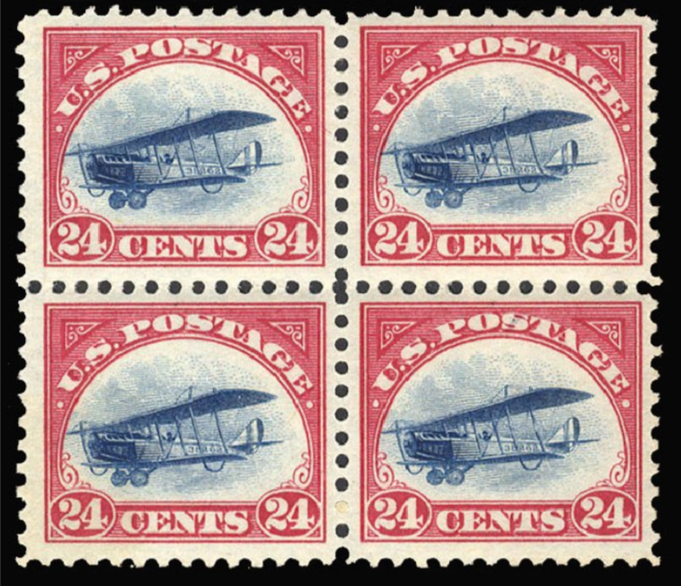

# Non-Fungible Tokens

XRP Ledger에서는 대체 불가능한 토큰(NFT)을 기본적으로 지원합니다. 대체 불가능한 토큰은 고유한 물리적, 비물리적 또는 순수 디지털 상품의 소유권을 인코딩하는 역할을 합니다. 이는 예술 작품이나 게임 아이템과 같은 것들을 포함할 수 있습니다.

_(_[_NonFungibleTokensV1\_1 수정안_](../../undefined-4/undefined-7/undefined.md)_으로 추가됨.)_

## 배경&#x20;

XRP Ledger는 [토큰](../)을 지원합니다. 이러한 자산은 주로 교환 가능합니다.

Fun·gi·ble /´fənjəbəl/ (adj)

1. able to replace or be replaced by another identical item; mutually interchangeable.

교환 가능한 토큰은 XRP Ledger의 탈중앙화 거래소에서 사용자들 간에 XRP나 다른 발행된 자산과 거래될 수 있습니다. 이로써 이러한 토큰은 결제에 이상적입니다.

교환 가능한 항목의 좋은 예로는 우표가 있습니다. 1919년에 우편물을 항공우편로 보내야 할 때 24센트 우표를 구매하여 봉투에 붙이게 됩니다. 만약 그 우표를 잃어버렸다면 다른 24센트 우표를 사용하거나 10센트 우표 2장과 2센트 우표 2장을 사용할 수 있습니다. 매우 대체 가능합니다.

<figure><figcaption></figcaption></figure>

하지만 1919년에 있다면, 우편물 우표에 실린 비행기가 우연히 뒤집혀 인쇄된 24센트 항공우편 우표를 제공받을 수도 있을 것입니다. 이는 세계적으로 유명한 "역전 제니" 우표입니다. 단 한 장의 우표 시트에서 순환된 100장만 존재하여 매우 희귀하고 수요가 많습니다. 각각의 우표의 현재 가치는 150만 달러 이상으로 평가됩니다.

<figure><figcaption></figcaption></figure>

이 우표는 일반 24센트 우표로 대체할 수 없습니다. _대체 불가능한_ 우표가 된 것입니다.

이와 유사한 디지털 자산을 표현하기 위해 XRP Ledger의 비교 가능하지 않은 토큰 기능([XLS-20](about:blank)으로도 알려짐)을 사용합니다.

## XRP Ledger의 NFTs

XRP Ledger에서 비교 가능하지 않은 토큰은 <mark style="background-color:yellow;">NFToken</mark> 객체로 표현됩니다. NFToken은 고유하고 나뉘어질 수 없는 단위로서 결제에 사용되지 않습니다. 사용자는 이러한 토큰을 생성, 보유, 구매, 판매 및 소각할 수 있습니다.

ledger는 동일한 계정이 소유하는 최대 32개의 <mark style="background-color:yellow;">NFToken</mark> 객체를 하나의 [NFTokenPage 객체](../../../references/xrp-ledger/ledger/ledger-1/nftokenpage.md)에 저장하여 공간을 절약합니다. 결과적으로 NFToken 객체에 대한 소유자의 [reserve requirement](https://xrpl.org/reserves.html) 새로운 페이지를 만들어 추가 토큰을 저장할 때만 증가합니다.

계정은 <mark style="background-color:yellow;">NFToken</mark> 객체를 대신해서 NFToken 객체를 생성하고 판매할 수 있는 중개인 또는 "권한 있는 발행자"를 지정할 수도 있습니다.

<mark style="background-color:yellow;">NFToken</mark> 객체에는 토큰이 생성될 때 정의되는 여러 설정이 있으며, 나중에 변경할 수 없습니다. 이러한 설정은 다음과 같습니다:

* 토큰을 고유하게 식별하는 다양한 식별 데이터.&#x20;
* 발행자가 현재 소유자와 관계없이 토큰을 소각할 수 있는지 여부.&#x20;
* 토큰 소유자가 다른 사람에게 전송할 수 있는지 여부. (NFToken은 항상 발행자에게 직접 전송할 수 있음.)&#x20;
  * 전송이 허용되는 경우, 발행자는 거래 가격의 일부로 이체 수수료를 부과할 수 있습니다.&#x20;
* 토큰 소유자가 비교 가능한 토큰 금액으로 <mark style="background-color:yellow;">NFToken</mark>을 판매할 수 있는지 또는 XRP로만 판매할 수 있는지 여부.&#x20;

## NFToken 수명 주기&#x20;

[NFTokenMint 트랜잭션](../../../references/xrp-ledger/undefined-1/undefined-1/nftokenmint.md) 유형을 사용하여 누구나 새로운 <mark style="background-color:yellow;">NFToken</mark>을 생성할 수 있습니다. NFToken은 발행 계정의 [NFTokenPage 객체](../../../references/xrp-ledger/ledger/ledger-1/nftokenpage.md)에 저장됩니다. 소유자 또는 관심있는 당사자는 [NFTokenCreateOffer 트랜잭션](../../../references/xrp-ledger/undefined-1/undefined-1/nftokencreateoffer.md)을 보내어 <mark style="background-color:yellow;">NFToken</mark>의 구매 또는 판매를 제안할 수 있습니다. ledger는 제안된 이체를 <mark style="background-color:yellow;">NFTokenOffer</mark> 객체로 추적하며, 양측이 제안을 수락하거나 취소할 때 NFTokenOffer를 삭제합니다. <mark style="background-color:yellow;">NFToken</mark>이 이전 가능하다면 계정 간에 여러 차례 거래될 수 있습니다.

NFTokenBurn 트랜잭션을 사용하여 소유한 <mark style="background-color:yellow;">NFToken</mark>을 소각할 수 있습니다. 발행자가 <mark style="background-color:yellow;">tfBurnable</mark> 플래그를 활성화하여 토큰을 발행한 경우, 발행자는 현재 소유자와 관계없이 토큰을 소각할 수도 있습니다. (예를 들어 일정 시점에 소진되는 이벤트 티켓을 나타내는 토큰에 유용할 수 있습니다.)

<figure><figcaption></figcaption></figure>

NFT 객체의 이전에 대한 자세한 정보는 [XRP Ledger에서의 NFT 거래](xrp-ledger-nft.md) 문서를 참조하십시오.
