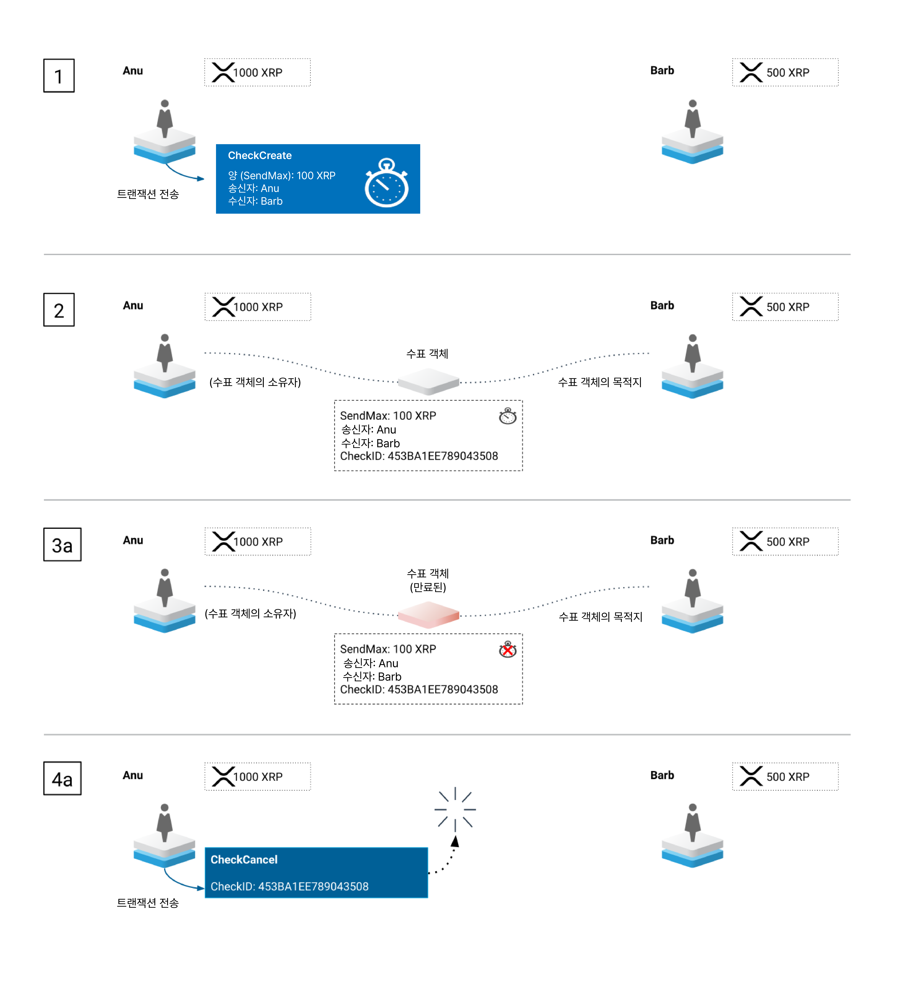

# 수표

_(XRP Ledger의_ [_Checks 수정안_](../xrp-ledger/amendments/undefined.md#checks)_에 의해 추가됨.)_

XRP Ledger의 수표 기능은 사용자가 예약된 지불을 생성하고 의도한 수취인에 의해 취소되거나 현금화될 수 있는 기능을 제공합니다. 개인용 종이 수표와 마찬가지로, XRP Ledger 수표는 자금을 보내는 사람이 금액과 수령인을 지정하는 수표를 생성하여 시작됩니다. 수령인은 수표를 현금화하여 자금을 송금자의 계정에서 수령인의 계정으로 이동시킵니다. 수령인이 수표를 현금화할 때까지 자금은 이동하지 않습니다. 수표가 생성될 때 자금이 보류되지 않기 때문에, 수령인이 현금화를 시도할 때 송신자에게 충분한 자금이 없는 경우 수표의 현금화는 실패할 수 있습니다. 수표의 현금화에 실패한 경우 수표의 수령인은 수표가 만료될 때까지 재시도할 수 있습니다.

XRP Ledger 수표는 현금화할 수 없게 되는 만료 시간을 가질 수 있습니다. 수령인이 수표를 만료되기 전에 성공적으로 현금화하지 못하면 수표는 더 이상 현금화할 수 없지만, 객체는 XRP Ledger에 그대로 남아 있으며 누군가가 취소할 때까지 유지됩니다. 만료 후에는 누구나 수표를 취소할 수 있습니다. 만료되기 전에는 송신자와 수령인만 수표를 취소할 수 있습니다. 송신자가 수표를 성공적으로 현금화하거나 누군가가 취소할 경우 수표 객체는 ledger에서 제거됩니다.

수표는 [에스크로](undefined-2.md)와 [결제 채널](undefined-4.md)과 몇 가지 유사점이 있지만, 이러한 기능과 수표 사이에 중요한 차이점이 있습니다:

* 수표를 사용하여 [토큰](../undefined-4/)을 보낼 수 있습니다. 결제 채널과 에스크로에서는 XRP만 보낼 수 있습니다.
* 수표는 어떠한 자금도 잠기거나 보류하지 않습니다. 결제 채널과 에스크로에서 사용되는 XRP는 송신자가 제공하는 클레임으로 인출되기 전까지(결제 채널) 또는 만료 또는 암호 조건(에스크로)이 충족되기 전까지 사용할 수 없습니다.
* 에스크로를 통해 자신에게 XRP를 보낼 수 있습니다. 그러나 수표는 자신에게는 보낼 수 없습니다.


Note:&#x20;

[수표 수정안](../xrp-ledger/amendments/undefined.md)은 [OfferCreate](../../references/xrp-ledger/undefined-1/undefined-1/offercreate.md) 트랜잭션의 만료 동작을 변경합니다. 자세한 내용은 [제안 만료](../dex/undefined.md#undefined-6)를 참조하세요.


## 수표의 필요성

전통적인 종이 수표는 현금을 즉시 교환하지 않고 자금을 이동시킬 수 있게 합니다. XRP Ledger 수표는 은행 업계에서 친숙하고 인정받는 프로세스를 통해 사람들이 비동기적으로 자금을 교환할 수 있도록 합니다.

XRP Ledger 수표는 또한 XRP Ledger에만 있는 문제를 해결합니다. 원하지 않는 지불을 거부하거나 지불의 일부만 수락할 수 있는 기능을 제공하여 규정 준수에 신경을 써야 하는 기관에 유용합니다.

## 사용 사례: 지불 승인

**문제:** [BSA, KYC, AML 및 CFT](../../tutorials/xrp-ledger/undefined.md)와 같은 규정을 준수하기 위해 금융 기관은 받은 자금의 원천에 대한 문서를 제공해야 합니다. 이러한 규정은 기관이 처리하는 모든 지불의 원천과 목적지를 알고자 하여 불법 자금 이체를 방지하기 위한 것입니다. XRP Ledger의 특성 상, 누구든지 잠재적으로 XRP(그리고 적절한 조건하에 토큰)를 기관의 XRP Ledger 계정으로 송금할 수 있습니다. 이러한 원하지 않는 지불을 처리하는 것은 이러한 기관의 규정 준수 부서에 상당한 비용과 시간 지연을 유발하며, 잠재적으로 벌금이나 처벌을 받을 수도 있습니다.

**해결책:** 기관은 [AccountSet 거래에서 <mark style="background-color:yellow;">asfDepositAuth</mark> 플래그를 설정](../../references/xrp-ledger/undefined-1/undefined-1/accountset.md)하여 XRP Ledger 계정에서 [입금 승인](../undefined-2/undefined/undefined-3.md)을 활성화할 수 있습니다. 이렇게 하면 해당 계정은 결제 거래를 통해 자금을 받을 수 없게 됩니다. 예금 승인이 활성화된 계정은 에스크로, 결제 채널, 또는 수표를 통해 자금을 받을 수 있습니다. 수표는 예금 승인이 활성화된 경우 자금을 이동시키는 가장 직관적이고 유연한 방법입니다.

## 사용 방법

수표는 일반적으로 아래에 설명된 생명주기를 따릅니다.

<figure><figcaption></figcaption></figure>

**1단계:** 수표를 생성하기 위해 송신자는 CheckCreate 거래를 제출하고 수령인(<mark style="background-color:yellow;">Destination</mark>), 만료 시간(<mark style="background-color:yellow;">Expiration</mark>), 송신자의 계정에서 인출될 수 있는 최대 금액(<mark style="background-color:yellow;">SendMax</mark>)을 지정합니다.

**2단계:** CheckCreate 거래가 처리된 후, XRP Ledger에 [Check 객체](../../references/xrp-ledger/ledger/ledger-1/check.md)가 생성됩니다. 이 객체는 생성한 거래에서 정의된 Check의 속성을 포함합니다. 만료 시간이 경과하기 전까지는 송신자([CheckCancel](../../references/xrp-ledger/undefined-1/undefined-1/checkcancel.md) 거래를 사용하여 취소) 또는 수령인(취소 또는 현금화)만이 객체를 수정할 수 있습니다. 만료 시간이 지나면 누구나 Check를 취소할 수 있습니다.

**3단계:** 수표를 현금화하기 위해 수령인은 [CheckCash](../../references/xrp-ledger/undefined-1/undefined-1/checkcash.md) 거래를 제출합니다. 수령인은 다음 두 가지 옵션 중 하나를 선택하여 수표를 현금화할 수 있습니다:

* <mark style="background-color:yellow;">Amount</mark> - 수령인은 정확한 현금화 금액을 지정할 수 있습니다. 이는 송신자가 [수수료](../transactions/fees.md)를 고려하여 수표를 패딩한 경우에 유용할 수 있으며, 수령인이 송장이나 계약서와 같은 정확한 금액을 수락하고자 할 때 유용할 수 있습니다.
* <mark style="background-color:yellow;">DeliverMin</mark> - 수령인은 이 옵션을 사용하여 수표로부터 수령하려는 최소 금액을 지정할 수 있습니다. 수령인이 이 옵션을 사용하는 경우, XRP Ledger는 가능한 한 많은 금액을 제공하고 항상 이 금액 이상을 제공합니다. 수령인에게 제공될 수 있는 금액이 요청한 금액 이상이 아닌 경우 거래는 실패합니다.

송신자가 충분한 자금을 가지고 있고 만료 시간이 지나지 않은 경우, 자금은 송신자의 계정에서 인출되어 수령인의 계정에 입금되며, Check 체는 파괴됩니다.

## 만료

만료되는 경우, 수표의 생명주기는 아래와 같습니다.

<figure><figcaption></figcaption></figure>

모든 수표는 동일한 방식으로 시작되므로 **1단계와 2단계**는 동일합니다.

**3단계a:** 수령인이 수표를 현금화하기 전에 수표가 만료되면 수표를 더 이상 현금화할 수 없지만 객체는 ledger에 남아 있습니다.

**4단계a:** 수표가 만료된 후에는 누구나 CheckCancel 거래를 제출하여 수표를 취소할 수 있습니다. 이 거래는 수표를 ledger에서 제거합니다.

## 수표의 사용 가능 여부

수표 수정안은 2020년 6월 18일에 XRP Ledger Mainnet에서 활성화되었습니다. 수정안이 활성화되고 투표되는 방법에 대한 자세한 내용은 수정안 프로세스를 참조하세요.

테스트 네트워크나 개인 네트워크에서 수정안의 상태를 확인하려면 feature 메소드를 사용하세요.

&#x20;
