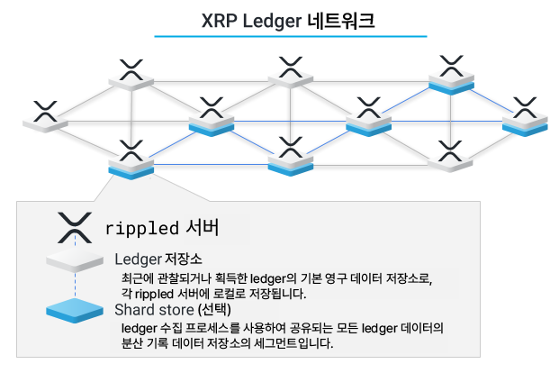

# 히스토리 샤딩(History Sharding)

XRP Ledger 서버가 실행되면서, 네트워크 운영 중에 구축하거나 획득한 ledger에 대한 데이터를 포함하는 데이터베이스가 자연스럽게 생성됩니다. 각 서버는 해당 ledger 데이터를 자체의 ledger 저장소에 저장하지만, [온라인 삭제](online-deletion.md)는 시간이 지남에 따라 오래된 ledger의 데이터를 자동으로 제거합니다. 히스토리 샤딩은 XRP Ledger의 전체(수 테라바이트에 이르는) 히스토리를 기록하는 작업을 네트워크가 분할하여 처리할 수 있도록 별도의 저장 시스템을 제공합니다.

히스토리 샤딩은 XRP Ledger 네트워크의 서버들 사이에 트랜잭션 히스토리를 샤드(shard)라고 하는 세그먼트들 분배합니다. 샤드는 ledger의 범위를 나타냅니다. 서버는 ledger 저장소와 샤드 저장소 모두에 대해 대부분 동일한 형식을 사용하지만, 두 개의 저장소는 별개입니다.

<figure><figcaption></figcaption></figure>

## 히스토리 샤드를 획득하고 공유하기

서버는 설정에 따라 히스토리 샤드를 획득하고 저장합니다. 샤드를 획득하기 위한 과정은 네트워크와 동기화되고 설정된 최근 ledger 수에 대한 ledger 히스토리를 보충한 후에 시작됩니다. 이 동안 네트워크 활동이 상대적으로 낮은 시간대에, 샤드 데이터베이스를 유지하도록 설정된 서버는 샤드 저장소에 추가할 샤드를 임의로 선택합니다. 네트워크 ledger 히스토리의 고르게 분산될 수 있도록하기 위해 샤드는 무작위로 선택되며, 가장 최근의 샤드에는 특별한 고려사항이 없습니다.

한번 샤드가 선택되면, 해당 샤드의 ledger 획득 과정이 시작됩니다. 먼저, 서버는 샤드의 마지막 ledger 시퀀스를 가져오고 첫 번째 ledger 쪽으로 거꾸로 작업을 진행합니다. 데이터 검색 과정은 서버가 로컬에서 데이터를 확인하는 것으로 시작됩니다. 데이터가 사용할 수 없는 경우, 서버는 피어에게 데이터를 요청합니다. 요청된 기간에 데이터를 제공할 수 있는 서버들은 해당 기간에 대한 자신의 히스토리를 응답합니다. 요청한 서버는 이러한 응답을 결합하여 샤드를 생성합니다. 샤드는 특정 범위 내의 모든 ledger를 포함할 때 완성됩니다.

서버는 설정된 샤드 저장 개수에 도달할 때까지 추가적인 샤드를 선택하고 다운로드합니다. 서버가 샤드를 완전히 획득하기 전에 공간이 부족해지면, 공간이 충분히 확보될 때까지 검색 과정을 중지합니다.

## XRP Ledger 네트워크 데이터 무결성

모든 ledger의 히스토리는 특정 범위의 히스토리 ledger를 유지하는 서버들에 의해 공유됩니다. 이로써 서버는 유지해야 할 모든 데이터를 가지고 있는지 확인하고, 각 블록체인의 히스토리에 대한 "proof trees" 또는 "ledger deltas"를 생성할 수 있습니다. 이것은 각 ledger가 이전 상태에 대한 트랜잭션을 적용하여 생성되었음을 보여줍니다. 히스토리 샤드를 저장하는 서버들 샤드를 임의로 선택하기 때문에 모든 닫힌 ledger의 전체 히스토리가 정규 분포 곡선으로 저장되어, XRP Ledger 네트워크가 히스토리를 고르게 유지할 확률이 증가합니다.

히스토리 샤드는 결정적인 형식으로 기록되므로, 동일한 샤드를 조립하는 두 개의 서버는 데이터를 획득한 순서나 데이터를 얻은 위치에 관계없이 정확히 같은 이진 데이터를 생성합니다. 이를 통해 샤드 데이터의 체크섬이나 암호화 해시를 비교하여 데이터의 무결성을 확인할 수 있으며, 다른 형식을 통해 역사적인 샤드를 공유하고 가져올 수도 있습니다. (예를 들어, Bittorrent를 사용하여 샤드 데이터를 다운로드하거나, 샤드 데이터가 미리 로드된 물리적 미디어를 획득하고, 네트워크에서 다운로드할 수 있는 데이터와 일치하는지 확인할 수 있습니다.) 
