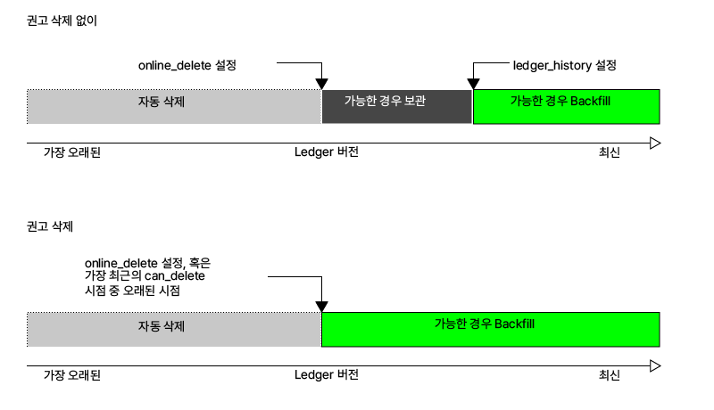
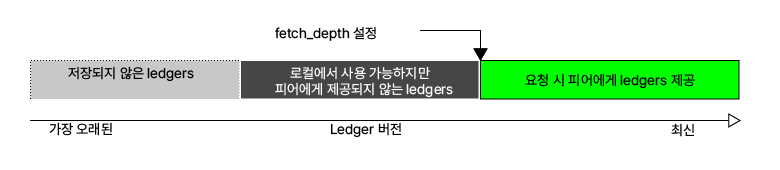
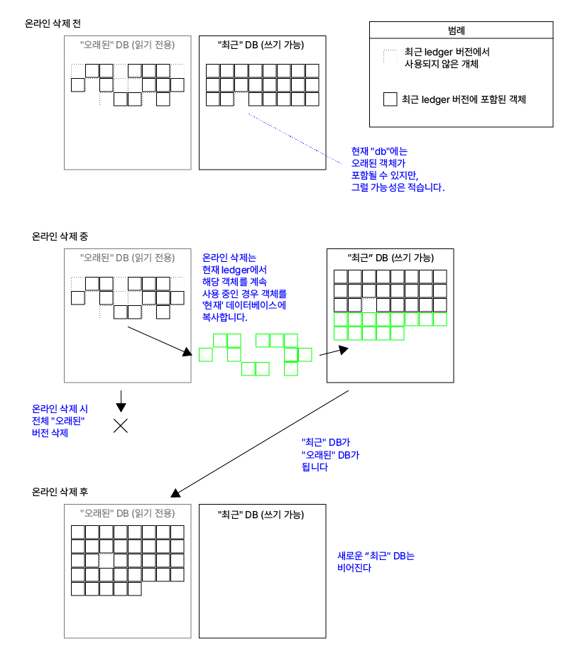

# 온라인 삭제(Online Deletion)

온라인 삭제 기능은 <mark style="background-color:yellow;">rippled</mark> 서버가 오래된 ledger 버전의 로컬 복사본을 삭제하여 디스크 사용량이 시간이 지남에 따라 급격히 증가하지 않도록 합니다. 기본 설정 파일은 온라인 삭제 자동으로 실행하도록 설정되어 있지만, 온라인 삭제를 필요할 때만 실행하도록 구성할 수도 있습니다. 

서버는 항상 ledger의 완전한 현재 상태를 유지합니다. 즉, 모든 잔액과 설정을 포함합니다. 삭제되는 데이터에는 이전 트랜잭션과 저장된 히스토리보다 오래된 ledger 상태 버전을 포합합니다.

기본 구성 파일은 <mark style="background-color:yellow;">rippled</mark> 서버가 가장 최근의 2000년도 ledger 버전을 유지하고 이전 데이터를 자동으로 삭제하도록 설정합니다.


Tip:

온라인 삭제를 사용하더라도 개별 ledger 버전의 크기가 시간이 지남에 따라 증가하는 관계로 동일한 기간의 ledger 데이터를 저장하는 데 필요한 디스크 공간은 시간이 지남에 따라 증가합니다. 그러나 이 증가 속도는 오래된 ledger를 삭제하지 않을 때 데이터가 축적되는 속도에 비해 매우 느립니다. 디스크 공간 요구 사항에 대한 자세한 정보는 [용량 계획](../../../tutorials/rippled/rippled/undefined-4.md)을 참조하십시오.


## 배경&#x20;

<mark style="background-color:yellow;">rippled</mark> 서버는 _ledger 저장소_에 [ledger 히스토리](../../../concepts/xrp-ledger/ledger/)를 저장합니다. 이 데이터는 시간이 지남에 따라 누적됩니다.

ledger  내부에서는 ledger 데이터가 "중복 제거(deduplicated)"됩니다. 다시 말해, 버전 간에 변경되지 않는 데이터는 한 번만 저장됩니다. ledger 저장소에 있는 레코드 자체에는 어떤 ledger 버전(들)이  그것들을 포함하는지를 나타내지 않습니다. 온라인 삭제 작업의 일부는 오래된 ledger 버전에서만 사용되는 레코드를 식별하는 것입니다. 이 프로세스는 시간이 많이 소요되며 디스크 I/O 및 애플리케이 캐시에 영향을 줍니다. 따라서 서버는 새로운 ledger를 닫을 때마다 오래된 데이터를 삭제할 수 없습니다.

## 온라인 삭제 동작&#x20;

온라인 삭제 설정은 <mark style="background-color:yellow;">rippled</mark> 서버가 한 번에 몇 개의 ledger 버전을 ledger 저장소에 유지해야 하는지를 구성합니다. 그러나 지정된 숫자는 엄격한 규칙이 아닌 가이드라인입니다:

* 서버는 설정된 ledger 버전 수보다 더 최근의 데이터를 삭제하지 않지만, 충분히 오랜 시간 실행되지 않았거나 네트워크와 동기화가 손실된 경우 해당 수보다 적은 양의 데이터만 사용 가능할 수 있습니다. (서버는 적어도 일부 히스토리를 보충하려고 시도합니다. 자세한 내용은 [fetching history](../../../concepts/xrp-ledger/ledger/)를 참조하십시오.)&#x20;
* 서버는 온라인 삭제가 자동으로 실행되도록 설정된 경우, 설정된 ledger 버전 수보다 두 배가 넘는 ledger 버전을 저장할 수 있습니다. (실행될 때마다 저장된 ledger 버전 수를 대략적으로 설정된 수로 감소시킵니다.) 서버가 바쁘서온라인 삭제가 지연된 경우 ledger 버전은 계속해서 누적될 수 있습니다. 정상적으로 작동할 때, 온라인 삭제는 서버가 설정된 ledger 버전 수의 두 배를 가지면 시작하지만, 여러 개의 ledger 버전이 더 누적될 때까지 완료되지 않을 수 있습니다.&#x20;
* advisory deletion이 활성화된 경우, 서버는 관리자가 [can\_delete 메소드](../../../references/http-websocket-apis/api-2/undefined-1/can\_delete.md)를 호출할 때까지 획득하고 구축한 모든 ledger 버전을 저장합니다. 서버가 저장하는 데이터 양은 [can\_delete](../../../references/http-websocket-apis/api-2/undefined-1/can\_delete.md) 메소드를 호출하는 빈도와 <mark style="background-color:yellow;">online\_delete</mark> 설정이 표현하는 시간 간격에 따라 달라집니다:
  * online\_delete 간격보다 _더 자주_ <mark style="background-color:yellow;">can\_delete</mark> 메소드를 호출하는 경우, 서버는 **최대 **<mark style="background-color:yellow;">**online\_delete**</mark>** 값의 두 배까지** ledger 버전을 저장합니다. (삭제 후, 이 값은 대략적으로 online\_delete 값으로 감소합니다.) 예를 들어, 하루에 한 번 now 값을 가지고 <mark style="background-color:yellow;">online\_delete</mark> 값이 50,000인 can\_delete 메소드를 호출하는 경우, 서버는 일반적으로 삭제를 실행하기 전에 최대 100,000개의 ledger 버전을 저장합니다. 삭제를 실행한 후에, 서버는 적어도 50,000개의 ledger 버전 (약 이틀치) 유지합니다. 이러한 구성으로, 대략 모든 다른 <mark style="background-color:yellow;">can\_delete</mark> 호출은 삭제할 ledger 버전을 충분히 가지고 있지 않기 때문에 아무런 변화를 초래하지 을 것입니다.
  * <mark style="background-color:yellow;">online\_delete</mark> 간격보다 덜 자주 <mark style="background-color:yellow;">can\_delete</mark> 메소드를 호출하는 경우, 서버는 <mark style="background-color:yellow;">**can\_delete**</mark>** 호출 간격의 약 두 배에 해당하는 시간**에 걸쳐 대부분의 ledger 버전을 저장합니다. (삭제 후, 이 값은 대략적으로 한 간격의 데이터로 감소합니다.)\
    예를 들어, 하루에 한 번 <mark style="background-color:yellow;">now</mark> 값을 가지고 <mark style="background-color:yellow;">online\_delete</mark> 값이 2000인 <mark style="background-color:yellow;">can\_delete</mark> 메소드를 호출하는 경우, 서버는 일반적으로 삭제를 실행하기 전에 최대 2일의 ledger 버전을 저장합니다. 삭제 후에는 서버는 대략 하루치 (약 25,000개의 ledger 버전)를 유지하지만, 최소한 2000개의 ledger 버전은 유지합니다.

온라인 삭제가 활성화되어 자동으로 실행되는 경우 (advisory deletion가 비활성화된 경우), 서버가 저장하는 전체 ledger 데이터 양은 서버가 구성된 ledger 버전 수와 최소한 같아야 하며, 최대로는 대략 그 값의 두 배입니다.

온라인 삭제가 실행될 때, 이는 SQLite 데이터베이스 파일의 크기를 줄이지 않습니다. 대신, 이 파일 내에서 공간을 새 데이터에 재사용할 수 있도록 만듭니다. 온라인 삭제는 ledger 저장소를 포함하는 RocksDB 또는 NuDB 데이터베이스 파일의 크기를 줄입니다.

서버는 삭제할 수 있는 범위를 결정할 때 유효한 ledger 버전만을 고려합니다. 서버가 새로운 ledger 버전을 유효성 검사할 수 없는 예외적인 상황(로컬 네트워크 연결 중단 또는 글로벌 XRP Ledger 네트워크가 컨센서스에 도달할 수 없는 경우)에서, <mark style="background-color:yellow;">rippled</mark>는 네트워크가 복원될 때 빠르게 복구하기 위해 계속해서 ledger를 닫습니다. 이 경우 서버에 닫혀 있지만 검증되지 않은 많은 ledger 버전이 누적될 수 있습니다. 이러한 검증되지 않은 ledger는 온라인 삭제를 실행하기 전에 서버가 보관하는 검증된 ledger 버전 수에는 영향을 미치지 않습니다.

## 온라인 삭제 중단

온라인 삭제는 [서버 상태](../../../references/http-websocket-apis/api/rippled.md)가 완전한 상태보다 낮아지면 자동으로 중단됩니다. 이런 경우, 서버는 <mark style="background-color:yellow;">SHAMapStore::WRN</mark> 접두사를 가진 로그 메시지를 기록합니다. 서버는 완전히 동기화된 다음 유효한  ledger 버전 이후에 다시 온라인 삭제를 시작하려고 합니다.

온라인 삭제가 실행 중인 상태에서 서버를 중지하거나 충돌이 발생하면, 서버가 다시 시작되고 완전히 동기화된 후에 온라인 삭제가 재개됩니다.

온라인 삭제를 일시적으로 비활성화하려면 [can\_delete 메소드](../../../references/http-websocket-apis/api-2/undefined-1/can\_delete.md)를 인수 <mark style="background-color:yellow;">never</mark>와 함께 사용할 수 있습니다. 이 변경은 [can\_delete](../../../references/http-websocket-apis/api-2/undefined-1/can\_delete.md)을 다시 호출하여 온라인 삭제를 다시 활성화할 때까지 지속됩니다. 온라인 삭제가 언제 발생하는지를 제어하는 자세한 정보는 [권고 삭제](../../../tutorials/rippled/rippled-1/undefined-3.md)를 참조하십시오.

## 구성&#x20;

온라인 삭제와 관련된 설정은 다음과 같습니다:

* <mark style="background-color:yellow;">**online\_delete**</mark> - 보관할 유효한 ledger 버전 수를 지정합니다. 서버는 주기적으로 이 숫보다 오래된 ledger 버전을 삭제합니다. 지정하지 않으면 어떠한 ledger도 삭제되지 않습니다.\
  기본 설정 파일에서는 이 값을 2000으로 지정합니다. 이 값은 256보다 작을 수 없습니다. 왜냐하면 [수수료 투표](../../../concepts/consensus-protocol/undefined-3.md) 및 [수정 프로세스](../../../concepts/xrp-ledger/amendments/)와 같은 일부 이벤트는 256개의 ledger마다 업데이트 되기 때문입니다.


Caution:

online\_delete가 비활성화된 상태에서 <mark style="background-color:yellow;">rippled</mark>를 실행하고 나중에 <mark style="background-color:yellow;">online\_delete</mark>를 다시 활성화한 뒤 서버를 재시작하면, 서버는 <mark style="background-color:yellow;">online\_delete</mark>가 비활성화된 동안 당신의 서버가 이미 다운로드한 기존 ledger 히스토리를 무시하지만 삭제하지는 않습니다. 디스크 공간을 절약하기 위해 온라인 삭제 설정을 변경한 후 서버를 다시 시작하기 전에 기존 히스토리를 삭제하십시오.


* <mark style="background-color:yellow;">**\[ledger\_history]**</mark> - 보충할 유효한 ledger 수를 지정합니다. <mark style="background-color:yellow;">online\_delete</mark> 이하이어야 합니다. 서버가 이보다 적은 수의 유효한 ledger 버전을 가지고 있지 않은 경우, 가능할 때 피어로부터 데이터를 가져오려고 시도합니다.\
  이 설정의 기본값은 256개의 ledger입니다.\
  다음 다이어그램은 <mark style="background-color:yellow;">online\_delete</mark>와 <mark style="background-color:yellow;">ledger\_history</mark> 설정 간의 관계를 보여줍니다:

<figure><figcaption></figcaption></figure>

* <mark style="background-color:yellow;">**advisory\_delete**</mark> - 활성화되면, 온라인 삭제가 자동으로 예약되지 않습니다. 대신, 관리자는 수동으로 온라인 삭제를 트리거해야 합니다. 비활성화하려면 값으로 0을, 활성화하려면 <mark style="background-color:yellow;">1</mark>을 사용합니다.\
  이 설정은 기본적으로 비활성화되어 있습니다.
* <mark style="background-color:yellow;">**\[fetch\_depth]**</mark> - 피어에 제공할 ledger 버전 수를 지정합니다. 서버는 지정된 ledger 버전 수보다 오래된 히스토리 데이터에 대한 피어로부터의 fetch 요청을 수락하지 않습니다. 모든 사용 가능한 데이터를 피어에 제공하려면 값을 <mark style="background-color:yellow;">full</mark>로 지정합니다.\
  <mark style="background-color:yellow;">fetch\_depth</mark>의 기본값은 <mark style="background-color:yellow;">full</mark>입니다 (모든 사용 가능한 데이터 제공).\
  두 설정 모두 지정된 경우, <mark style="background-color:yellow;">fetch\_depth</mark> 설정은 <mark style="background-color:yellow;">online\_delete</mark>보다 높을 수 없습니다.  <mark style="background-color:yellow;">fetch\_depth</mark>가 더 높게 설정되면 서버는 fetch\_depth를 <mark style="background-color:yellow;">online\_delete</mark>와 동일하게 처리합니다. 다음 다이어그램은 <mark style="background-color:yellow;">fetch\_depth</mark>가 작동하는 방식을 보여줍니다:

<figure><figcaption></figcaption></figure>

다양한 양의 기록을 저장하는 데 필요한 디스크 공간에 대한 추정치는 [용량 계획](../../../tutorials/rippled/rippled/undefined-4.md)을 참조하십시오.

## Advisory Deletion&#x20;

기본 설정 파일에서는 온라인 삭제가 자동으로 주기적으로 발생하도록 스케줄링합니다. 설정 파일에서 <mark style="background-color:yellow;">online\_delete</mark> 간격을 지정하지 않은 경우 온라인 삭제가 발생하지 않습니다. 설정 파일에서 <mark style="background-color:yellow;">advisory\_delete</mark> 설정을 활성화하면, 관리자가 [can\_delete 메소드](../../../references/http-websocket-apis/api-2/undefined-1/can\_delete.md)를 사용하여 트리거할 때에만 온라인 삭제가 수행됩니다.

스케줄된 작업과 함께 advisory deletion을 사용하여 ledger 버전이 닫힌 수 대신 시계 시간을 기준으로 자동 삭제를 트리거할 수 있습니다. 서버가 많은 사용량을 처리하는 경우, 온라인 삭제로 인한 추가 부하로 인해 서버가 지연되고 일시적으로 컨센서스 네트워크와 동기화가 해제될 수 있습니다. 이 경우, advisory deletion를 사용하고 온라인 삭제가 피크가 아닌 시간에만 발생하도록 예약할 수 있다.

다른 이유로도 advisory deletion를 사용할 수 있습니다. 예를 들어, 삭제하기 전에 트랜잭션 데이터가 별도의 서버에 백업되었는지 확인하기 전에 수동으로 확인하고자 할 수 있습니다. 또는 아래의 별도의 작업이 트랜잭션 데이터 처리를 완료했는 수동으로 확인하고자 할 수도 있습니다.

<mark style="background-color:yellow;">can\_delete</mark> API 메소드는, <mark style="background-color:yellow;">advisory deletion</mark>이 설정 파일에서 활성화된 경우, 일반적으로 또는 특정 ledger 버전까지 자동 삭제를 활성화 또는 비활성화할 수 있습니다. 이러한 설정 변경은 <mark style="background-color:yellow;">rippled</mark> 서버를 재시작해도 유지되며, 설정 파일에서 <mark style="background-color:yellow;">advisory\_delete</mark>를 비활성화하지 않는 한 유지됩니다.

## 작동방식

온라인 삭제는 두 개의 데이터베이스를 생성하여 동작합니다: 언제든지 "이전(old)" 데이터베이스는 읽기 전용이고, "현재(current)" 데이터베이스는 쓰기 가능한 상태입니다. <mark style="background-color:yellow;">rippled</mark> 서버는 두 데이터베이스에서 객체를 읽을 수 있으므로, 현재 ledger 버전은 두 데이터베이스 중 어느 것에 속한 객체를 포함할 수 있습니다. 만약 어떤 ledger 버전에서 객체가 ledger 버전 간에 변경되지 않는다면, 해당 객체의 복사본 하나만 데이터베이스에 남아 있으므로, 서버는 그 객체의 중복 사본 저장하지 않습니다. 새로운 ledger 버전에서 객체를 수정할 서버는 수정된 객체를 "새(new)" 데이터베이스에 저장하고, 이전 버전의 객체(이전 ledger 버전서 사용되는 객체)는 "이전(old)" 데이터베이스에 그대로 유지됩니다.

온라인 삭제가 진행되면, 서버는 먼저 보관할 가장 오래된 ledger 버전을 거치고, 해당 ledger 버전의 모든 객체를 읽기 전용인 "이전(old)" 데이터베이스에서 "현재(current)" 데이터베이스로 복사합니다. 이로써 "현재(current)" 데이터베이스에는 선택된 ledger 버전과 그 이후 버전에서 사용되는 모든 객체가 포함되도록 보장됩니다. 그런 다음, 서버는 "이전(old)" 데이터베이스를 삭제하고, 기존의 "현재(current)" 데이터베이스를 "이전(old)"으로 변경하여 읽기 전용 상태로 설정합니다. 서버는 이 시점 이후에 더 새로운 변경 사항을 포함하는 새로운 "현재(current)" 데이터베이스를 생성합니다.

<figure><figcaption></figcaption></figure>
