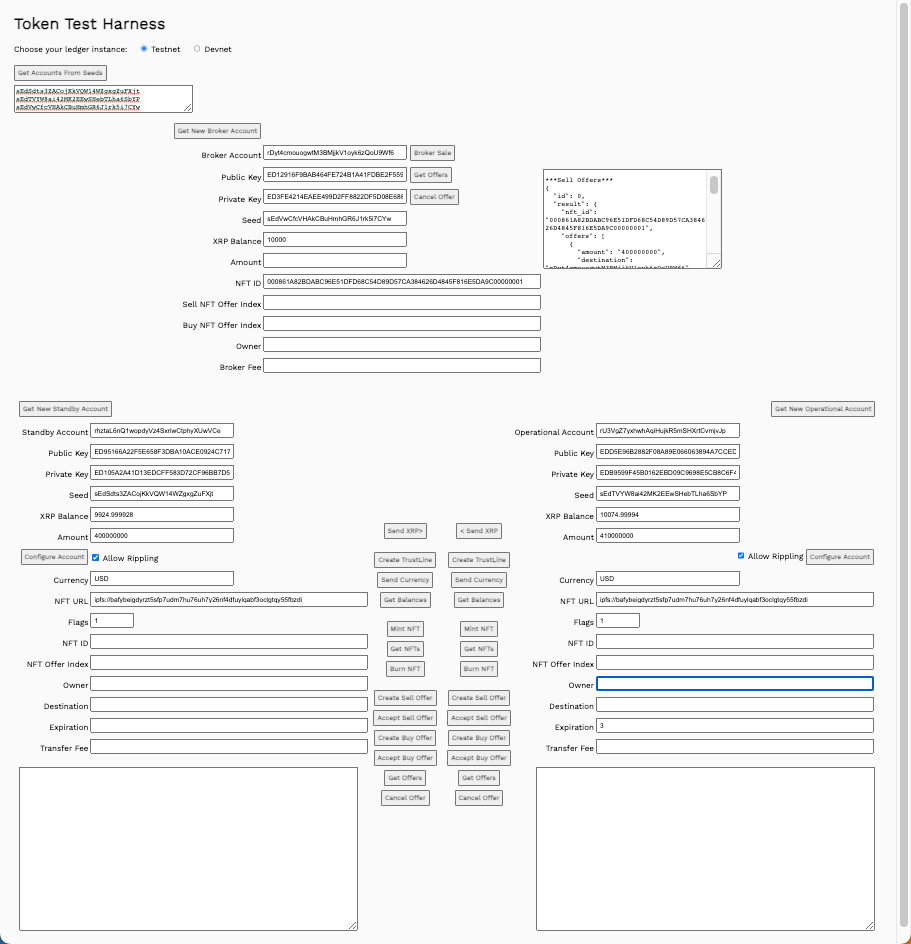

# Software Ecosystem

XRP Ledger는 가치 인터넷을 지원하고 가능하게 하는 소프트웨어 프로젝트의 깊고 다층적인 생태계의 본거지입니다. XRP Ledger와 상호작용하는 모든 프로젝트, 도구, 비즈니스를 나열하는 것은 불가능하므로 이 페이지에서는 몇 가지 카테고리만 나열하고 이 웹사이트에 문서화된 몇 가지 핵심 프로젝트만 강조합니다.

<figure><figcaption></figcaption></figure>

## 스택 레벨(Stack Levels)

* 코어 서버([_Core Servers_](https://xrpl.org/software-ecosystem.html#core-servers)_)_는 항상 트랜잭션을 중계하고 처리하는 피어투피어 네트워크인 XRP 원장의 기초를 형성합니다.\

* 클라이언트 라이브러리([_Client Libraries_](https://xrpl.org/software-ecosystem.html#client-libraries)_)_는 상위 수준의 소프트웨어에 존재하며, 프로그램 코드로 직접 가져올 수 있고 XRP 원장에 액세스하는 메서드를 포함합니다.\

* 미들웨어([_Middleware_](https://xrpl.org/software-ecosystem.html#middleware)_)_는 XRP 원장 데이터에 대한 간접 액세스를 제공합니다. 이 계층의 애플리케이션은 종종 자체 데이터 저장 및 처리 기능을 가지고 있습니다.\

* 앱과 서비스(A[_pps and Services_](https://xrpl.org/software-ecosystem.html#apps-and-services))는 XRP 원장과 사용자 수준의 상호작용을 제공하거나 더 높은 수준의 앱과 서비스를 위한 기반을 제공합니다.

## 코어 서버(Core Servers)

XRP Ledger의 핵심인 P2P 네트워크는 합의 및 거래 처리 규칙을 시행하기 위해 매우 안정적이고 효율적인 서버를 필요로 합니다. XRP Ledger Foundation은 rippled("리플-디"로 발음)라고 하는 이 서버 소프트웨어의 참조 구현을 게시합니다. 이 서버는 허용된 [a permissive open-source license](https://github.com/XRPLF/rippled/blob/develop/LICENSE.md) 하에 제공되므로 누구나 자신의 서버 인스턴스를 검사하고 수정할 수 있으며, 제한 없이 다시 게시할 수 있습니다.

<figure><figcaption></figcaption></figure>
