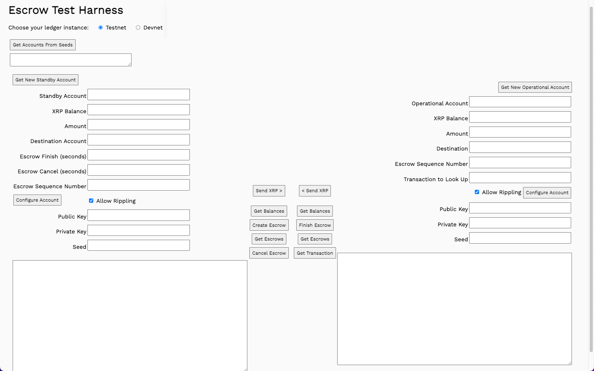
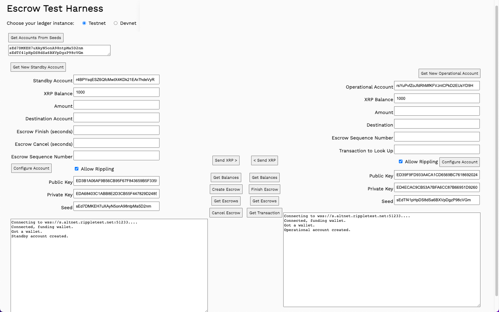
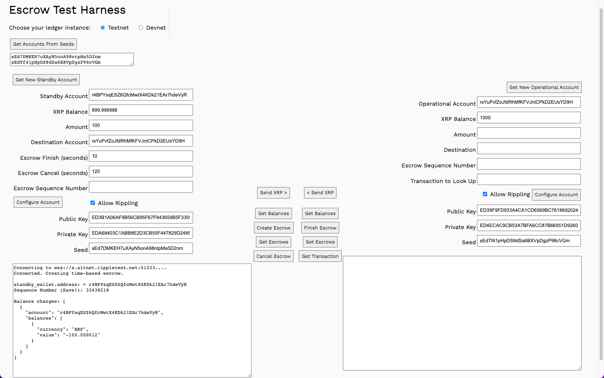
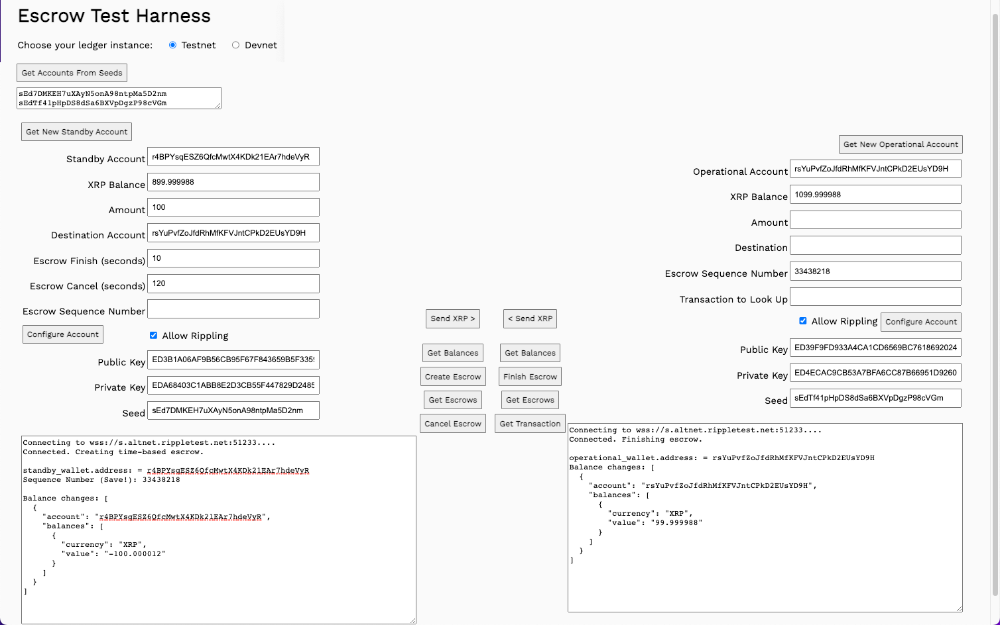
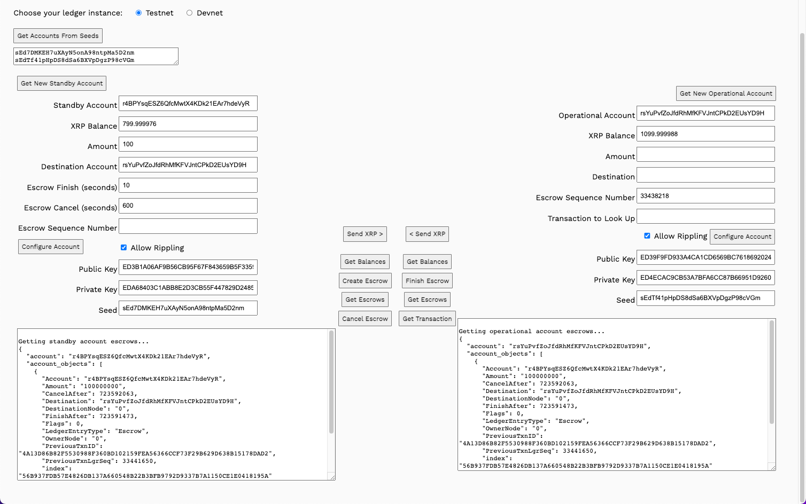
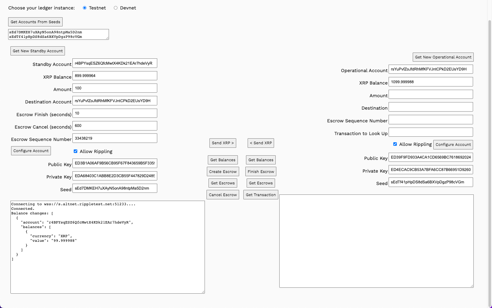
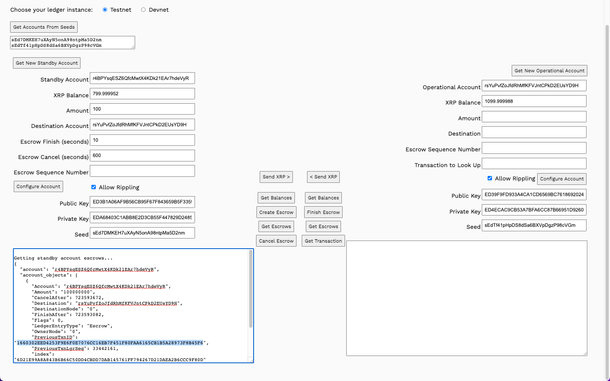

# 시간 기반 에스크로 생성하기(Create Time-based Escrows Using JavaScript)

이 페이지에서는 아래의 4가지를 배울 수 있습니다:

1. Create escrow payments that become available at a specified time and expire at a specified time.
2. Finish an escrow payment.
3. Retrieve information on escrows attached to an account.
4. Cancel an escrow payment and return the XRP to the sending account.

<figure><figcaption></figcaption></figure>

## 전제 조건

[Quickstart Samples](https://github.com/XRPLF/xrpl-dev-portal/tree/master/content/\_code-samples/quickstart/js/)로드 하세요.

## 사용 방법 <a href="#usage" id="usage"></a>

**Test 계정 만들기**:

1. Open `8.escrow.html` in a browser
2. Choose **Testnet** or **Devnet**.
3. Get test accounts.
   1. If you have existing account seeds
      1. Paste account seeds in the **Seeds** field.
      2. Click **Get Accounts from Seeds**.
   2. If you do not have account seeds:
      1. Click **Get New Standby Account**.
      2. Click **Get New Operational Account**.

<figure><figcaption></figcaption></figure>

## 에스크로 생성(Create Escrow)



에스크로를 완료하는 데 걸리는 최소 시간과 수취인이 에스크로에 있는 자금을 더 이상 사용할 수 없는 취소 시간을 설정하여 시간 기반 에스크로를 만들 수 있습니다. 실제 시나리오에서는 시간을 며칠 또는 몇 주 단위로 표현하지만, 이 양식을 사용하면 완료 및 취소 시간을 초 단위로 설정할 수 있으므로 다양한 시나리오를 빠르게 실행할 수 있습니다. (장기 에스크로를 사용하려면 하루에 86,400초가 있습니다).

**시간 기반 에스크로 만들기**:

1. Enter an **Amount** to transfer.
2. Copy the **Operational Account** value.
3. Paste it in the **Destination Account** field.
4. Set the **Escrow Finish (seconds)** value. For example, enter _10_.
5. Set the **Escrow Cancel (seconds)** value. For example, enter _120_.
6. Click **Create Escrow**.
7. Copy the _Sequence Number_ of the escrow called out in the **Standby Result** field.

에스크로는 XRP Ledger instance에 생성되며, 거래 비용에 100XRP를 더한 금액을 예약합니다. 에스크로를 생성할 때 **Sequence Number**를 캡처하여 저장하면 에스크로 트랜잭션을 완료하는 데 사용할 수 있습니다.

<figure><figcaption></figcaption></figure>

## 에스크로 완료(Finish Escrow)

에스크로에 보관된 XRP를 받는 사람은 에스크로 완료 날짜 및 시간 이후부터 에스크로 취소 날짜 및 시간 전까지 기간 내에 언제든지 거래를 완료할 수 있습니다. 위의 예시에 따라 시퀀스 번호를 사용하여 10초가 지나면 트랜잭션을 완료할 수 있습니다.

**시간 기반의 에스크로 완료하기**

1. Paste the sequence number in the Operational account **Escrow Sequence Number** field.
2. Click **Finish Escrow**.

거래가 완료되고 Standby 및 Operational accounts, 모두에 대한 잔액이 업데이트됩니다.

<figure><figcaption></figcaption></figure>

## 에스크로 불러오기(Get Escrows) <a href="#get-escrows" id="get-escrows"></a>

Standby 및 Operational accounts에 대한 **Get Escrows**를 클릭하여 현재 에스크로 목록을 확인합니다. 지금 버튼을 클릭하면 현재 에스크로가 없습니다.

이 튜토리얼에서는 위의 에스크로 만들기의 단계에 따라 새 에스크로 트랜잭션을 생성하고, **Escrow Cancel (seconds)** 필드를 600초로 설정하여 탐색할 시간을 더 확보할 수 있습니다. 트랜잭션 결과에서 시퀀스 번호를 캡처하는 것을 잊지 마세요.

Standby 및 Operational accounts의 모두에 대해 **Get Escrows**를 클릭합니다. 계정 정보 요청은 두 계정에 대해 동일한 계정 오브젝트를 반환하며, 에스크로 트랜잭션으로 생성된 계정 간의 링크를 보여줍니다.

<figure><figcaption></figcaption></figure>

## 에스크로 취소(Cancel Escrow) <a href="#cancel-escrow" id="cancel-escrow"></a>

에스크로 취소 시간이 지나면 수취인은 더 이상 에스크로를 사용할 수 없습니다. 에스크로 개시자는 거래 수수료를 제외한 XRP를 회수할 수 있습니다. 에스크로 취소 시간 전에 거래를 취소하려고 하면 거래 수수료가 청구되지만, 실제 에스크로는 제한 시간에 도달할 때까지 취소할 수 없습니다.

이전 단계에서 생성한 에스크로에 할당된 시간을 기다린 다음 에스크로 취소 버튼을 사용해볼 수 있습니다.

**만료된 에스크로를 취소하기:**

1. Enter the sequence number in the Standby **Escrow Sequence Number** field.
2. Click **Cancel Escrow**.

자금은 초기 거래 수수료를 제외한 금액이 Standby account로 반환됩니다.

<figure><figcaption></figcaption></figure>

## 시퀀스 번호 찾기(Oh No! I Forgot to Save the Sequence Number!)

시퀀스 번호를 저장하는 것을 잊어버린 경우 에스크로 거래 기록에서 찾을 수 있습니다.

**시퀀스 번호 찾기:**

1. Create a new escrow as described in [Create Escrow](https://xrpl.org/create-time-based-escrows-using-javascript.html#create-escrow), above.
2. Click **Get Escrows** to get the escrow information.
3.  Copy the _PreviousTxnID_ value from the results.

    <figure><figcaption></figcaption></figure>
4.  Paste the _PreviousTxnID_ in the **Transaction to Look Up** field.&#x20;

    <figure><figcaption></figcaption></figure>
5. Click **Get Transaction**.
6.  Locate the _Sequence_ value in the results.&#x20;

    <figure><figcaption></figcaption></figure>

## 실전 예제

이 웹사이트의 소스 리포지토리에서  [Quickstart Sample](https://github.com/XRPLF/xrpl-dev-portal/tree/master/content/\_code-samples/quickstart/js/) 다운로드할 수 있습니다.\


### ripple8-escrow.js <a href="#ripple8-escrowjs" id="ripple8-escrowjs"></a>

이 예제는 모든 XRP 레저 네트워크, 테스트넷 또는 데브넷에서 사용할 수 있습니다. 코드를 업데이트하여 다른 또는 추가적인 XRP 레저 네트워크를 선택할 수 있습니다.

#### Add Seconds to Date <a href="#add-seconds-to-date" id="add-seconds-to-date"></a>

이 함수는 두 가지 작업을 수행합니다. 새 날짜 객체를 생성하고 양식 필드에서 가져온 초 수를 추가합니다. 그런 다음 날짜를 JavaScript 형식에서 XRP 원장 형식으로 조정합니다.

You provide the _numOfSeconds_ argument, the second parameter is a new Date object.

```
function addSeconds(numOfSeconds, date = new Date()) {
```

Set the _seconds_ value to the date seconds plus the number of seconds you provide.

```
  date.setSeconds(date.getSeconds() + numOfSeconds);
```

JavaScript dates are in milliseconds. Divide the date by 1000 to base it on seconds.

```
  date = Math.floor(date / 1000)
```

Subtract the number of seconds in the Ripple epoch to convert the value to an XRP Ledger compatible date value.

```
  date = date - 946684800
```

Return the result.

```
  return date;
}
```

#### Create Time-based Escrow <a href="#create-time-based-escrow" id="create-time-based-escrow"></a>

```
async function createTimeEscrow() {
```

Instantiate two new date objects, then set the dates to the current date plus the set number of seconds for the finish and cancel dates.

```
  let escrow_finish_date = new Date()
  let escrow_cancel_date = new Date()
  escrow_finish_date = addSeconds(parseInt(standbyEscrowFinishDateField.value))
  escrow_cancel_date = addSeconds(parseInt(standbyEscrowCancelDateField.value))
```

Connect to the ledger.

```
  results  = "Connecting to the selected ledger.\n"
  standbyResultField.value = results
  let net = getNet()
  results = "Connecting to " + net + "....\n"
  const client = new xrpl.Client(net)
  await client.connect()
  results  += "Connected. Creating time-based escrow.\n"
  standbyResultField.value = results
```

Get the wallet information based on the account seed values.

```
  const standby_wallet = xrpl.Wallet.fromSeed(standbySeedField.value)
  const operational_wallet = xrpl.Wallet.fromSeed(operationalSeedField.value)
  const sendAmount = standbyAmountField.value
  results += "\nstandby_wallet.address: = " + standby_wallet.address
  standbyResultField.value = results
```

Define the `EscrowCreate` transaction, automatically filling values in common fields.

```
  const escrowTx = await client.autofill({
    "TransactionType": "EscrowCreate",
    "Account": standby_wallet.address,
    "Amount": xrpl.xrpToDrops(sendAmount),
    "Destination": standbyDestinationField.value,
    "FinishAfter": escrow_finish_date,
    "CancelAfter": escrow_cancel_date
  })
```

Sign the escrow transaction definition.

```
  const signed = standby_wallet.sign(escrowTx)
```

Submit the transaction.

```
  const tx = await client.submitAndWait(signed.tx_blob)
```

Report the results.

```
  results += "\nSequence Number (Save!): " + JSON.stringify(tx.result.Sequence)
  results += "\n\nBalance changes: " + 
  JSON.stringify(xrpl.getBalanceChanges(tx.result.meta), null, 2)
  standbyBalanceField.value = (await client.getXrpBalance(standby_wallet.address))
  operationalBalanceField.value = (await client.getXrpBalance(operational_wallet.address))
  standbyResultField.value = results
```

Disconnect from the XRP Ledger.

```
  client.disconnect()
} // End of createTimeEscrow()
```

#### Finish Time-based Escrow <a href="#finish-time-based-escrow" id="finish-time-based-escrow"></a>

```
async function finishEscrow() {
```

Connect to the XRP Ledger and get the account wallets.

```
  results  = "Connecting to the selected ledger.\n"
  operationalResultField.value = results
  let net = getNet()
  results = 'Connecting to ' + getNet() + '....'
  const client = new xrpl.Client(net)
  await client.connect()

  results  += "\nConnected. Finishing escrow.\n"
  operationalResultField.value = results

  const operational_wallet = xrpl.Wallet.fromSeed(operationalSeedField.value)
  const standby_wallet = xrpl.Wallet.fromSeed(standbySeedField.value)
  const sendAmount = operationalAmountField.value

  results += "\noperational_wallet.address: = " + operational_wallet.address
  operationalResultField.value = results
```

Define the transaction. The _Owner_ is the account that created the escrow. The _OfferSequence_ is the sequence number of the escrow transaction. Automatically fill in the common fields for the transaction.

```
  const prepared = await client.autofill({
    "TransactionType": "EscrowFinish",
    "Account": operationalAccountField.value,
    "Owner": standbyAccountField.value,
    "OfferSequence": parseInt(operationalEscrowSequenceField.value)
  })
```

Sign the transaction definition.

```
  const signed = operational_wallet.sign(prepared)
```

Submit the signed transaction to the XRP ledger.

```
  const tx = await client.submitAndWait(signed.tx_blob)
```

Report the results.

```
  results  += "\nBalance changes: " + 
    JSON.stringify(xrpl.getBalanceChanges(tx.result.meta), null, 2)
  operationalResultField.value = results

  standbyBalanceField.value = (await client.getXrpBalance(standby_wallet.address))
  operationalBalanceField.value = (await client.getXrpBalance(operational_wallet.address))
```

Disconnect from the XRP Ledger.

```
  client.disconnect()
} // End of finishEscrow()
```

#### Get Standby Escrows <a href="#get-standby-escrows" id="get-standby-escrows"></a>

Get the escrows associated with the Standby account.

```
async function getStandbyEscrows() {
```

Connect to the network. The information you are looking for is public information, so there is no need to instantiate your wallet.

```
  let net = getNet()
  const client = new xrpl.Client(net)
  results = 'Connecting to ' + getNet() + '....'
  standbyResultField.value = results

  await client.connect()   
  results += '\nConnected.'
  standbyResultField.value = results

  results= "\nGetting standby account escrows...\n"
```

Create the `account_objects` request. Specify that you want objects of the type _escrow_.

```
  const escrow_objects = await client.request({
    "id": 5,
    "command": "account_objects",
    "account": standbyAccountField.value,
    "ledger_index": "validated",
    "type": "escrow"
  })
```

Report the results.

```
  results += JSON.stringify(escrow_objects.result, null, 2)
  standbyResultField.value = results
```

Disconnect from the XRP Ledger

```
  client.disconnect()
} // End of getStandbyEscrows()
```

#### Get Operational Escrows <a href="#get-operational-escrows" id="get-operational-escrows"></a>

This function is the same as `getStandbyEscrows()`, but for the Operational account.

```
async function getOperationalEscrows() {
```

Connect to the network. The information you are looking for is public information, so there is no need to instantiate your wallet.

```
  let net = getNet()
  const client = new xrpl.Client(net)
  results = 'Connecting to ' + getNet() + '....'
  operationalResultField.value = results

  await client.connect()   
  results += '\nConnected.'
  operationalResultField.value = results

  results= "\nGetting operational account escrows...\n"
```

Create the `account_objects` request. Specify that you want objects of the type _escrow_.

```
  const escrow_objects = await client.request({
    "id": 5,
    "command": "account_objects",
    "account": operationalAccountField.value,
    "ledger_index": "validated",
    "type": "escrow"
  })
```

Report the results.

```
  results += JSON.stringify(escrow_objects.result, null, 2)
  operationalResultField.value = results
```

Disconnect from the XRP Ledger instance.

```
  client.disconnect()
} // End of getOperationalEscrows()
```

#### Get Transaction Info <a href="#get-transaction-info" id="get-transaction-info"></a>

```
async function getTransaction() {
```

Connect to the XRP Ledger.

```
  let net = getNet()
  const client = new xrpl.Client(net)
  results = 'Connecting to ' + getNet() + '....'
  operationalResultField.value = results

  await client.connect()   
  results += '\nConnected.'
  operationalResultField.value = results

  results= "\nGetting transaction information...\n"
```

Prepare and send the transaction information request. The only required parameter is the transaction ID.

```
  const tx_info = await client.request({
    "id": 1,
    "command": "tx",
    "transaction": operationalTransactionField.value,
  })
```

Report the results.

```
  results += JSON.stringify(tx_info.result, null, 2)
  operationalResultField.value = results
```

Disconnect from the XRP Ledger instance.

```
  client.disconnect()
} // End of getTransaction()
```

#### Cancel Escrow <a href="#cancel-escrow-1" id="cancel-escrow-1"></a>

Cancel an escrow after it passes the expiration date.

```
async function cancelEscrow() {
```

Connect to the XRP Ledger instance.

```
  let net = getNet()
  const client = new xrpl.Client(net)
  results = 'Connecting to ' + getNet() + '....'
  standbyResultField.value = results

  await client.connect()   
  results += '\nConnected.'
  standbyResultField.value = results
```

Get the account wallets.

```
  const standby_wallet = xrpl.Wallet.fromSeed(standbySeedField.value)
  const operational_wallet = xrpl.Wallet.fromSeed(operationalSeedField.value)
```

Prepare the EscrowCancel transaction.

```
  const prepared = await client.autofill({
    "TransactionType": "EscrowCancel",
    "Account": standby_wallet.address,
    "Owner": standbyAccountField.value,
    "OfferSequence": parseInt(standbyEscrowSequenceNumberField.value)
  })
```

Sign the transaction.

```
  const signed = standby_wallet.sign(prepared)
```

Submit the transaction and wait for the response.

```
  const tx = await client.submitAndWait(signed.tx_blob)
```

Report the results.

```
  results  += "\nBalance changes: " + 
    JSON.stringify(xrpl.getBalanceChanges(tx.result.meta), null, 2)
  standbyResultField.value = results
  standbyBalanceField.value = (await client.getXrpBalance(standby_wallet.address))
  operationalBalanceField.value = (await client.getXrpBalance(operational_wallet.address))
```

Disconnect from the XRP Ledger instance.

```
  client.disconnect()
}
```

### 8.escrow.html <a href="#8escrowhtml" id="8escrowhtml"></a>

```
<html>
  <head>
    <title>Time-based Escrow Test Harness</title>
    <link href='https://fonts.googleapis.com/css?family=Work Sans' rel='stylesheet'>
    <style>
       body{font-family: "Work Sans", sans-serif;padding: 20px;background: #fafafa;}
       h1{font-weight: bold;}
       input, button {padding: 6px;margin-bottom: 8px;}
       button{font-weight: bold;font-family: "Work Sans", sans-serif;}
       td{vertical-align: middle;}
    </style>
    <script src='https://unpkg.com/xrpl@2.2.3'></script>
    <script src='ripplex1-send-xrp.js'></script>
    <script src='ripplex2-send-currency.js'></script>
    <script src='ripplex8-escrow.js'></script>
  </head>

<!-- ************************************************************** -->
<!-- ********************** The Form ****************************** -->
<!-- ************************************************************** -->

  <body>
    <h1>Time-based Escrow Test Harness</h1>
    <form id="theForm">
      Choose your ledger instance:  
      &nbsp;&nbsp;
      <input type="radio" id="tn" name="server"
        value="wss://s.altnet.rippletest.net:51233" checked>
      <label for="tn">Testnet</label>
      &nbsp;&nbsp;
      <input type="radio" id="dn" name="server"
        value="wss://s.devnet.rippletest.net:51233">
      <label for="dn">Devnet</label>
      <br/><br/>
      <button type="button" onClick="getAccountsFromSeeds()">Get Accounts From Seeds</button>
      <br/>
      <textarea id="seeds" cols="40" rows= "2"></textarea>
      <br/><br/>
      <table>
        <tr valign="top">
          <td>
            <table>
              <tr valign="top">
                <td>
                <td>
                  <button type="button" onClick="getAccount('standby')">Get New Standby Account</button>
                  <table>
                    <tr valign="top">
                      <td align="right">
                        Standby Account
                      </td>
                      <td>
                        <input type="text" id="standbyAccountField" size="40"></input>
                        <br>
                      </td>
                    </tr>

                    <tr>
                      <td align="right">
                        XRP Balance
                      </td>
                      <td>
                        <input type="text" id="standbyBalanceField" size="40"></input>
                        <br>
                      </td>
                    </tr>
                    <tr>
                      <td align="right">
                        Amount
                      </td>
                      <td>
                        <input type="text" id="standbyAmountField" size="40"></input>
                        <br>
                      </td>
                    </tr>
                    <tr>
                      <td align="right">
                        Destination Account
                      </td>
                      <td>
                        <input type="text" id="standbyDestinationField" size="40"></input>
                        <br>
                      </td>
                    </tr>
                    <tr>
                      <td align="right">
                        Escrow Finish (seconds)
                      </td>
                      <td>
                        <input type="text" id="standbyEscrowFinishDateField" size="40"></input>
                        <br>
                      </td>
                    </tr>
                    <tr>
                      <td align="right">
                        Escrow Cancel (seconds)
                      </td>
                      <td>
                        <input type="text" id="standbyEscrowCancelDateField" size="40"></input>
                        <br>
                      </td>
                    </tr>
                    <tr>
                      <td align="right">
                        Escrow Sequence Number
                      </td>
                      <td>
                        <input type="text" id="standbyEscrowSequenceNumberField" size="40"></input>
                        <br>
                      </td>
                    </tr>
                    <tr valign="top">
                      <td><button type="button" onClick="configureAccount('standby',document.querySelector('#standbyDefault').checked)">Configure Account</button></td>
                      <td>
                        <input type="checkbox" id="standbyDefault" checked="true"/>
                        <label for="standbyDefault">Allow Rippling</label>
                      </td>
                    </tr>
                    <tr>
                      <td align="right">
                        Public Key
                      </td>
                      <td>
                        <input type="text" id="standbyPubKeyField" size="40"></input>
                        <br>
                      </td>
                    </tr>
                    <tr>
                      <td align="right">
                        Private Key
                      </td>
                      <td>
                        <input type="text" id="standbyPrivKeyField" size="40"></input>
                        <br>
                      </td>
                    </tr>
                    <tr>
                      <td align="right">
                        Seed
                      </td>
                      <td>
                        <input type="text" id="standbySeedField" size="40"></input>
                        <br>
                      </td>
                    </tr>
                  </table>
                  <p align="left">
                    <textarea id="standbyResultField" cols="80" rows="20" ></textarea>
                  </p>
                </td>
                </td>
                <td>
                  <table>
                    <tr valign="top">
                      <td align="center" valign="top">
                        <button type="button" onClick="sendXRP()">Send XRP &#62;</button>
                        <br/><br/>
                        <button type="button" onClick="getBalances()">Get Balances</button>       
                        <br/>
                        <button type="button" onClick="createTimeEscrow()">Create Time-based Escrow</button>
                        <br/>
                        <button type="button" onClick="getStandbyEscrows()">Get Escrows</button>
                        <br/>
                        <button type="button" onClick="cancelEscrow()">Cancel Escrow</button>
                      </td>
                      </td>
                    </tr>
                    </td>
                    </tr>
                  </table>
                </td>
              </tr>
            </table>
          </td>
          <td>
            <table>
              <tr>
                <td>
                <td>
                  <table>
                    <tr valign="top">
                      <td align="center" valign="top">
                        <button type="button" onClick="oPsendXRP()">&#60; Send XRP</button>
                        <br/><br/>
                        <button type="button" onClick="getBalances()">Get Balances</button>
                        <br/>
                        <button type="button" onClick="finishEscrow()">Finish Time-based Escrow</button>
                        <br/>
                        <button type="button" onClick="getOperationalEscrows()">Get Escrows</button>
                        <br/>
                        <button type="button" onClick="getTransaction()">Get Transaction</button>
                      </td>
                      <td valign="top" align="right">
                        <button type="button" onClick="getAccount('operational')">Get New Operational Account</button>
                        <table>
                          <tr valign="top">
                            <td align="right">
                              Operational Account
                            </td>
                            <td>
                              <input type="text" id="operationalAccountField" size="40"></input>
                              <br>
                            </td>
                          </tr>

                          <tr>
                            <td align="right">
                              XRP Balance
                            </td>
                            <td>
                              <input type="text" id="operationalBalanceField" size="40"></input>
                              <br>
                            </td>
                          </tr>
                          <tr>
                            <td align="right">
                              Amount
                            </td>
                            <td>
                              <input type="text" id="operationalAmountField" size="40"></input>
                              <br>
                            </td>
                          </tr>
                          <tr>
                            <td align="right">
                              Destination
                            </td>
                            <td>
                              <input type="text" id="operationalDestinationField" size="40"></input>
                              <br>
                            </td>
                          </tr>
                          <tr>
                          <tr>
                            <td align="right">
                              Escrow Sequence Number
                            </td>
                            <td>
                              <input type="text" id="operationalEscrowSequenceField" size="40"></input>
                              <br>
                            </td>
                          </tr>
                          <tr>                            <td align="right">
                              Transaction to Look Up
                            </td>
                            <td>
                              <input type="text" id="operationalTransactionField" size="40"></input>
                              <br>
                            </td>
                          </tr>
                          <tr>
                          <td>
                            </td>
                            <td align="right">
                            <input type="checkbox" id="operationalDefault" checked="true"/>
                              <label for="operationalDefault">Allow Rippling</label>
                              <button type="button" onClick="configureAccount('operational',document.querySelector('#operationalDefault').checked)">Configure Account</button>
                            </td>
                          </tr>
                          <tr>
                            <td align="right">
                              Public Key
                            </td>
                            <td>
                              <input type="text" id="operationalPubKeyField" size="40"></input>
                              <br>
                            </td>
                          </tr>
                          <tr>
                            <td align="right">
                              Private Key
                            </td>
                            <td>
                              <input type="text" id="operationalPrivKeyField" size="40"></input>
                              <br>
                            </td>
                          </tr>
                          <tr>
                            <td align="right">
                              Seed
                            </td>
                            <td>
                              <input type="text" id="operationalSeedField" size="40"></input>
                              <br>
                            </td>
                          </tr>
                        </table>
                        <p align="right">
                          <textarea id="operationalResultField" cols="80" rows="20" ></textarea>
                        </p>
                      </td>
                      </td>
                    </tr>
                    </td>
                    </tr>
                  </table>
                </td>
              </tr>
            </table>
          </td>
        </tr>
      </table>
    </form>
  </body>
</html>
```

