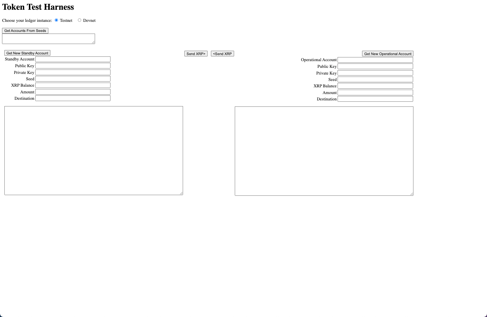
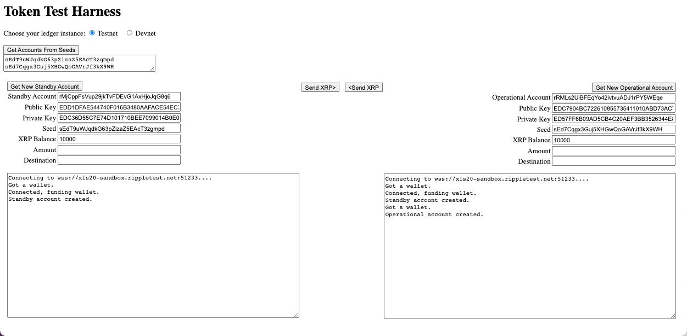

# 계정 생성 및 XRP 전송(Create Accounts and Send XRP Using JavaScript)

이번 페이지에서 아래의 3가지를 할 예정입니다:

1. 테스트넷에 계정을 생성하고, 실제 가치가 없는 1000개의 테스트 XRP를 받습니다.
2. 시드 값(seed values)에서 계정을 검색합니다.&#x20;
3. 계정 간에 XRP를 전송합니다.

계정을 만들면 오프라인에서 공개/개인 키 쌍을 받게 됩니다. 계정은 XRP로 자금을 조달할 때까지 원장에 표시되지 않습니다. 이 예시는 테스트넷용 계정을 만드는 방법을 보여드리며, 메인넷에서 사용할 수 있는 계정을 만드는 방법은 설명하지 않습니다.

<figure><figcaption></figcaption></figure>

## 전제 조건

시작하려면 로컬 디스크에 새 폴더를 만들고 npm을 사용하여 JavaScript 라이브러리를 설치하세요.

```
    npm install xrpl
```

&#x20;[Quickstart Samples](https://github.com/XRPLF/xrpl-dev-portal/tree/master/content/\_code-samples/quickstart/js/)를 다운로드하여 활용하세요.


**Note:**

[Quickstart Samples](https://github.com/XRPLF/xrpl-dev-portal/tree/master/content/\_code-samples/quickstart/js/)이 없으면 다음에 나오는 예제를 사용할 수 없습니다.


## 사용법



**Test 계정 만들기:**

1. Open `1.get-accounts-send-xrp.html` in a browser
2. Choose **Testnet** or **Devnet**.
3. Click **Get New Standby Account**.
4. Click **Get New Operational Account.**
5. Copy and paste the **Seeds** field in a persistent location, such as a Notepad, so that you can reuse the accounts after reloading the form.

<figure><figcaption></figcaption></figure>

## 실전 예제

이 웹사이트의 소스 리포지토리에서 [Quickstart Samples](https://github.com/XRPLF/xrpl-dev-portal/tree/master/content/\_code-samples/quickstart/js/)을 다운로드받을 수 있습니다.


### ripplex-1-send-xrp.js <a href="#ripplex-1-send-xrpjs" id="ripplex-1-send-xrpjs"></a>

이 예제는 모든 XRP 레저 네트워크, 테스트넷 또는 데브넷에서 사용할 수 있습니다. 코드를 업데이트하여 다른 또는 추가적인 XRP 레저 네트워크를 선택할 수 있습니다.

#### getNet() <a href="#getnet" id="getnet"></a>

```
// ******************************************************
// ************* Get the Preferred Network **************
// ******************************************************   

    function getNet() {
```

이 함수는 brute force(무차별 대입) if 문을 사용하여 선택한 네트워크 인스턴스를 검색하고 URI를 반환합니다.

```
  let net
  if (document.getElementById("tn").checked) net = "wss://s.altnet.rippletest.net:51233"
  if (document.getElementById("dn").checked) net = "wss://s.devnet.rippletest.net:51233"
  return net
} // End of getNet()
```

#### getAccount(type) <a href="#getaccounttype" id="getaccounttype"></a>

```
// *******************************************************
// ************* Get Account *****************************
// *******************************************************

async function getAccount(type) {
```

선택한 ledger를 가져옵니다.

```
  let net = getNet()
```

클라이언트를 인스턴스화합니다.

```
  const client = new xrpl.Client(net)
```

결과 변수를 사용하여 진행률 정보를 저장합니다.

```
  results = 'Connecting to ' + net + '....'
```

Null 값을 이용하여 default faucet를 사용합니다.

```
  let faucetHost = null
```

해당 결과 필드에 진행 상황을 보고합니다.

```
  if (type == 'standby') {
    standbyResultField.value = results
  } else {
    operationalResultField.value = results
  }
```

서버에 연결합니다.

```
  await client.connect()

  results += '\nConnected, funding wallet.'
  if (type == 'standby') {
    standbyResultField.value = results
  } else {
    operationalResultField.value = results
  }
```

test account 을 만들고 XRP를 받습니다.

```
  const my_wallet = (await client.fundWallet(null, { faucetHost })).wallet

  results += '\nGot a wallet.'
  if (type == 'standby') {
    standbyResultField.value = results
  } else {
    operationalResultField.value = results
  }       
```

계정의 현재 XRP 잔액을 확인합니다.

```
  const my_balance = (await client.getXrpBalance(my_wallet.address))  
```

standby account인 경우 standby account fields를 채웁니다.

```
  if (type == 'standby') {
    standbyAccountField.value = my_wallet.address
    standbyPubKeyField.value = my_wallet.publicKey
    standbyPrivKeyField.value = my_wallet.privateKey
    standbyBalanceField.value = (await client.getXrpBalance(my_wallet.address))
    standbySeedField.value = my_wallet.seed
    results += '\nStandby account created.'
    standbyResultField.value = results
```

그렇지 않으면 operational account fields를 채웁니다.

```
  } else {
    operationalAccountField.value = my_wallet.address
    operationalPubKeyField.value = my_wallet.publicKey
    operationalPrivKeyField.value = my_wallet.privateKey
    operationalSeedField.value = my_wallet.seed
    operationalBalanceField.value = (await client.getXrpBalance(my_wallet.address))
    results += '\nOperational account created.'
    operationalResultField.value = results
  }
```

편의를 위해 두 계정의 seed values를 생성한 그대로 **Seeds** field에 삽입합니다. 값을 복사하여 오프라인으로 저장할 수 있습니다. 이 튜토리얼에서 이 양식이나 다른 양식을 다시 로드할 때 복사하여 **Seeds** field에 붙여넣고 getAccountsFromSeeds() 함수를 사용하여 계정을 검색합니다.

```
  seeds.value = standbySeedField.value + '\n' + operationalSeedField.value
```

XRP Ledger 와 연결을 끊습니다.

```
  client.disconnect()
} // End of getAccount()
```

#### Get Accounts from Seeds <a href="#get-accounts-from-seeds" id="get-accounts-from-seeds"></a>
