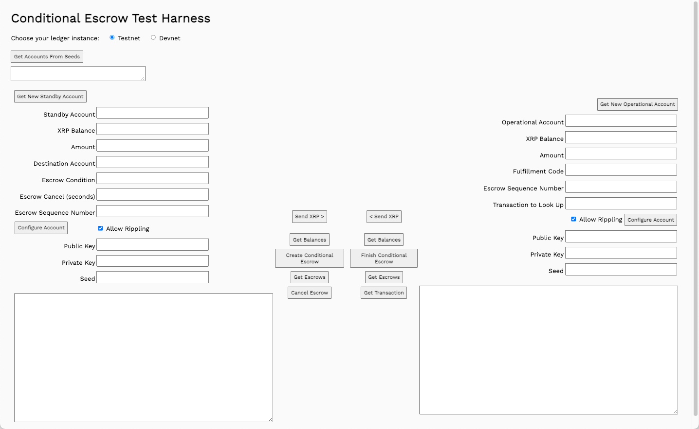
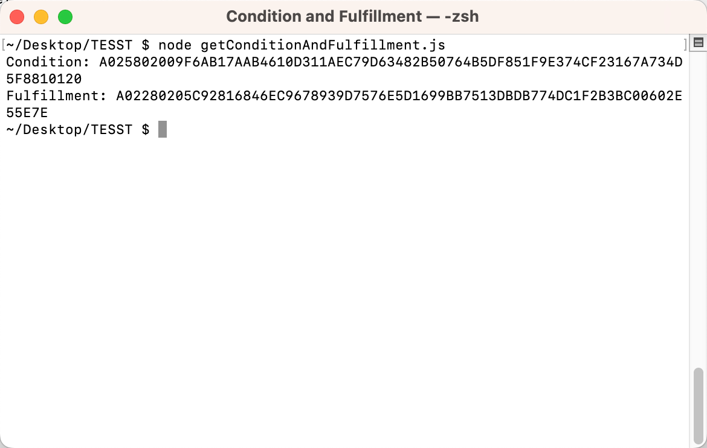
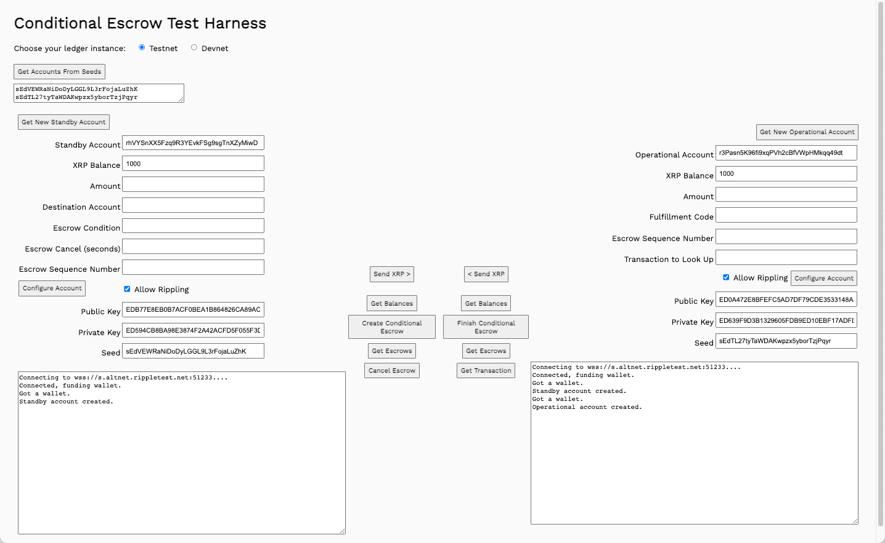
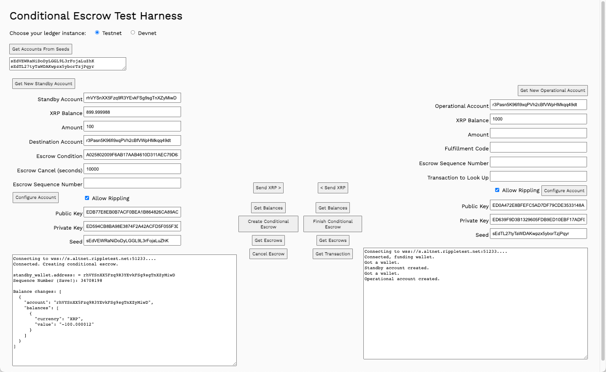
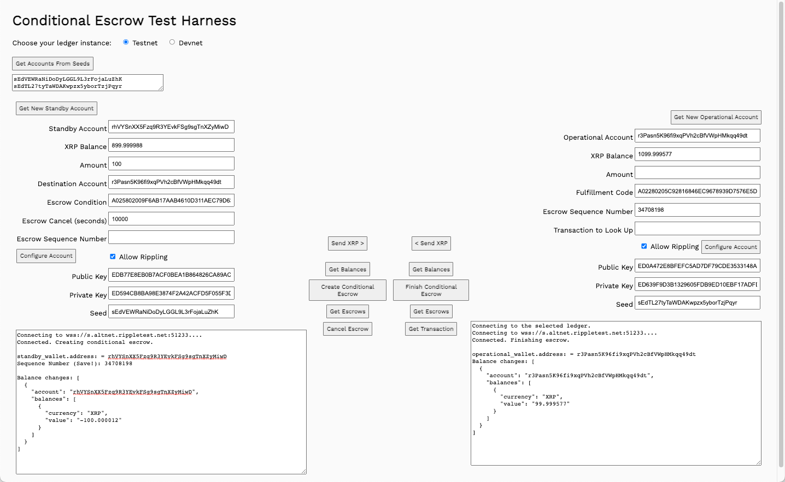

# 조건부 에스크로 생성하기(Create Conditional Escrows Using JavaScript)

이 페이지에서는 아래 3가지를 배울 수 있습니다:

1. Create escrow payments that become available when any account enters a fulfillment code.
2. Complete a conditional escrow transaction.
3. Cancel a conditional escrow transaction.

<figure><figcaption></figcaption></figure>

## 전제 조건

[Quickstart Samples ](https://github.com/XRPLF/xrpl-dev-portal/tree/master/content/\_code-samples/quickstart/js/)이브를 다운로드하여 활용할 수 있습니다.


## 사용 방법

#### 에스크로 생성(Create Escrow)

조건 코드와 연결된 주문 처리 코드를 사용하여 조건 기반 에스크로를 생성합니다. 다섯 종 조건 애플리케이션을 사용하여 조건/이행 쌍을 생성합니다.

Install `five-bells-condition`:

1. In a terminal window, navigate to your local `Quickstart` directory (for convenience).
2. Enter the command `npm install five-bells-condition`.

To create a condition/fulfillment pair:

1. In a terminal window, navigate to your `Quickstart` directory.
2. Enter the command `node getConditionAndFulfillment.js`.
3. Copy and save the generated Condition and Fulfillment pair.

<figure><figcaption></figcaption></figure>

To get test accounts:

1. Open `9.escrow-condition.html` in a browser
2. Choose **Testnet** or **Devnet**.
3. Get test accounts.
   1. If you have existing account seeds
      1. Paste account seeds in the **Seeds** field.
      2. Click **Get Accounts from Seeds**.
   2. If you do not have account seeds:
      1. Click **Get New Standby Account**.
      2. Click **Get New Operational Account**.

<figure><figcaption></figcaption></figure>

## 조건부 에스크로 생성(Create Conditional Escrow) <a href="#create-conditional-escrow" id="create-conditional-escrow"></a>



조건부 에스크로를 생성할 때는 예약하고자 하는 금액과 위에서 생성한 조건 값을 지정해야 합니다. 에스크로를 더 이상 사용할 수 없는 취소 날짜와 시간을 설정할 수도 있습니다.

To create a conditional escrow:

1. Enter an **Amount** to transfer.
2. Copy the **Operational Account** value.
3. Paste it in the **Destination Account** field.
4. Enter the **Escrow Condition** value.
5. Enter the **Escrow Cancel (seconds)** value.
6. Click **Create Escrow**.
7. Copy and save the _Sequence Number_ of the escrow called out in the **Standby Result** field.

에스크로는 XRP Ledger instance에 생성되며, 요청하신 XRP 금액에 거래 비용을 더한 금액을 예약합니다.

에스크로를 생성할 때 _Sequence Number_를 캡처하여 저장하면 에스크로 거래를 완료하는 데 사용할 수 있습니다.

<figure><figcaption></figcaption></figure>

## 조건부 에스크로 완료(Finish Conditional Escrow)

모든 계정은 에스크로 취소 시간 전에 언제든지 조건부 에스크로를 완료할 수 있습니다. 위의 예에 따라 에스크로 취소 시간이 지나면 시퀀스 번호를 사용하여 거래를 완료할 수 있습니다.

To finish a time-based escrow:

1. Paste the sequence number in the Operational account **Escrow Sequence Number** field.
2. Enter the `Fulfillment` code for the `Condition`.
3. Click **Finish Conditional Escrow**.

거래가 완료되고 Standby 및 Operational accounts, 모두에 대한 잔액이 업데이트됩니다.

<figure><figcaption></figcaption></figure>

## 에스크로 불러오기(Get Escrows) <a href="#get-escrows" id="get-escrows"></a>

Standby account 및 Operational account에 대한 **Get Escrows**를 클릭하여 현재 에스크로 목록을 확인합니다.


## 에스크로 취소(Cancel Escrow)

에스크로 취소 시간이 지나면 수취인은 더 이상 에스크로를 사용할 수 없습니다. 에스크로 개시자는 거래 수수료를 제외한 XRP를 회수할 수 있습니다. 취소 시간이 지나면 모든 계정에서 에스크로를 취소할 수 있습니다. 에스크로 취소 시간 전에 거래를 취소하려는 계정에는 명목 거래 비용(12드롭)이 청구되지만 실제 에스크로는 에스크로 취소 시간 이후까지 취소할 수 없습니다.


## 시퀀스 번호 찾기(Oh No! I Forgot to Save the Sequence Number!)

시퀀스 번호를 저장하는 것을 잊어버린 경우 에스크로 거래 기록에서 찾을 수 있습니다.

1. Create a new escrow as described in [Create Escrow](https://xrpl.org/create-conditional-escrows-using-javascript.html#create-escrow), above.
2. Click **Get Escrows** to get the escrow information.
3.  Copy the _PreviousTxnID_ value from the results.

    <figure><figcaption></figcaption></figure>
4.  Paste the _PreviousTxnID_ in the **Transaction to Look Up** field.&#x20;

    <figure><figcaption></figcaption></figure>
5. Click **Get Transaction**.
6.  Locate the _Sequence_ value in the results.&#x20;

    <figure><figcaption></figcaption></figure>

## 실전 예제

이 웹사이트의 소스 리포지토리에서 [Quickstart Samples](https://github.com/XRPLF/xrpl-dev-portal/tree/master/content/\_code-samples/quickstart/js/) 다운로드할 수 있습니다.


### getConditionAndFulfillment.js <a href="#getconditionandfulfillmentjs" id="getconditionandfulfillmentjs"></a>

To generate a condition/fulfillment pair, use Node.js to run the `getConditionAndFulfillment.js` script.

```
function getConditionAndFulfillment() {
```

Instantiate the `five-bells-condition` and `crypto` libraries.

```
  const cc = require('five-bells-condition')
  const crypto = require('crypto')
```

Create a random 32-byte seed string.

```
  const preimageData = crypto.randomBytes(32)
```

Create a fulfillment object.

```
  const fulfillment = new cc.PreimageSha256()
```

Generate a fulfillment code.

```
  fulfillment.setPreimage(preimageData)
```

Generate the condition value based on the fulfillment value.

```
  const condition = fulfillment.getConditionBinary().toString('hex').toUpperCase()
```

Return the condition.

```
  console.log('Condition:', condition)
```

Convert the fulfillment code to a hexadecimal string.

```
  const fulfillment_hex = fulfillment.serializeBinary().toString('hex').toUpperCase()
```

Return the fulfillment code. Keep it secret until you want to finish the escrow.

```
  console.log('Fulfillment:', fulfillment_hex)
}
getConditionAndFulfillment()
```

### ripplex9-escrow-condition.js <a href="#ripplex9-escrow-conditionjs" id="ripplex9-escrow-conditionjs"></a>

#### Create Conditional Escrow <a href="#create-conditional-escrow-1" id="create-conditional-escrow-1"></a>

```
async function createConditionalEscrow() {
```

Connect to your preferred ledger.

```
  results  = "Connecting to the selected ledger.\n"
  standbyResultField.value = results
  let net = getNet()
  results = "Connecting to " + net + "....\n"
  const client = new xrpl.Client(net)
  await client.connect()

  results  += "Connected. Creating conditional escrow.\n"
  standbyResultField.value = results
```

Instantiate the standby and operational wallets

```
  const standby_wallet = xrpl.Wallet.fromSeed(standbySeedField.value)
  const operational_wallet = xrpl.Wallet.fromSeed(operationalSeedField.value)
```

Capture the amount to send in the escrow.

```
  const sendAmount = standbyAmountField.value
```

Update the results field.

```
  results += "\nstandby_wallet.address: = " + standby_wallet.address
  standbyResultField.value = results
```

Create a date value and add your requested number of seconds.

```
  let escrow_cancel_date = new Date()
  escrow_cancel_date = addSeconds(parseInt(standbyEscrowCancelDateField.value))
```

Prepare the `EscrowCreate` transaction.

```
  const escrowTx = await client.autofill({
    "TransactionType": "EscrowCreate",
    "Account": standby_wallet.address,
    "Amount": xrpl.xrpToDrops(sendAmount),
    "Destination": standbyDestinationField.value,
    "CancelAfter": escrow_cancel_date,
    "Condition": standbyEscrowConditionField.value
  })
```

Sign the transaction.

```
  const signed = standby_wallet.sign(escrowTx)
```

Submit the transaction and wait for the results.

```
  const tx = await client.submitAndWait(signed.tx_blob)
```

Report the results and update balance fields.

```
  results += "\nSequence Number (Save!): " + JSON.stringify(tx.result.Sequence)
  results  += "\n\nBalance changes: " + 
  JSON.stringify(xrpl.getBalanceChanges(tx.result.meta), null, 2)
  standbyBalanceField.value = (await client.getXrpBalance(standby_wallet.address))
  operationalBalanceField.value = (await client.getXrpBalance(operational_wallet.address))
  standbyResultField.value = results
```

Disconnect from the XRPL

```
client.disconnect()

} // End of createTimeEscrow()
```

#### Finish Conditional Escrow <a href="#finish-conditional-escrow-1" id="finish-conditional-escrow-1"></a>

Finish the escrow by submitting the condition and fulfillment codes.

```
async function finishConditionalEscrow() {
```

Connect to your preferred XRP Ledger instance.

```
  results  = "Connecting to the selected ledger.\n"
  operationalResultField.value = results
  let net = getNet()
  results += 'Connecting to ' + getNet() + '....'
  const client = new xrpl.Client(net)
  await client.connect()
  results  += "\nConnected. Finishing escrow.\n"
  operationalResultField.value = results
```

Get the standby and operational account wallets.

```
  const operational_wallet = xrpl.Wallet.fromSeed(operationalSeedField.value)
  const standby_wallet = xrpl.Wallet.fromSeed(standbySeedField.value)
  const sendAmount = operationalAmountField.value

  results += "\noperational_wallet.address: = " + operational_wallet.address
  operationalResultField.value = results
```

Prepare the transaction.

```
  const prepared = await client.autofill({
    "TransactionType": "EscrowFinish",
    "Account": operationalAccountField.value,
    "Owner": standbyAccountField.value,
    "OfferSequence": parseInt(operationalEscrowSequenceField.value),
    "Condition": standbyEscrowConditionField.value,
    "Fulfillment": operationalFulfillmentField.value
  })
```

Sign the transaction.

```
  const signed = operational_wallet.sign(prepared)
```

Submit the transaction and wait for the results.

```
  const tx = await client.submitAndWait(signed.tx_blob)
```

Report the results.

```
  results  += "\nBalance changes: " + 
    JSON.stringify(xrpl.getBalanceChanges(tx.result.meta), null, 2)
  operationalResultField.value = results
  standbyBalanceField.value = (await client.getXrpBalance(standby_wallet.address))
  operationalBalanceField.value = (await client.getXrpBalance(operational_wallet.address))
```

Disconnect from the XRPL.

```
  client.disconnect()

} // End of finishEscrow()
```

### 9.escrow-condition.html <a href="#9escrow-conditionhtml" id="9escrow-conditionhtml"></a>

```
<html>
  <head>
    <title>Conditional Escrow Test Harness</title>
    <link href='https://fonts.googleapis.com/css?family=Work Sans' rel='stylesheet'>
    <style>
       body{font-family: "Work Sans", sans-serif;padding: 20px;background: #fafafa;}
       h1{font-weight: bold;}
       input, button {padding: 6px;margin-bottom: 8px;}
       button{font-weight: bold;font-family: "Work Sans", sans-serif;}
       td{vertical-align: middle;}
    </style>    
    <script src='https://unpkg.com/xrpl@2.2.3'></script>
    <script src='ripplex1-send-xrp.js'></script>
    <script src='ripplex2-send-currency.js'></script>
    <script src='ripplex8-escrow.js'></script>
    <script src='ripplex9-escrow-condition.js'></script>
  </head>

<!-- ************************************************************** -->
<!-- ********************** The Form ****************************** -->
<!-- ************************************************************** -->

  <body>
    <h1>Conditional Escrow Test Harness</h1>
    <form id="theForm">
      Choose your ledger instance:  
      &nbsp;&nbsp;
      <input type="radio" id="tn" name="server"
        value="wss://s.altnet.rippletest.net:51233" checked>
      <label for="tn">Testnet</label>
      &nbsp;&nbsp;
      <input type="radio" id="dn" name="server"
        value="wss://s.devnet.rippletest.net:51233">
      <label for="dn">Devnet</label>
      <br/><br/>
      <button type="button" onClick="getAccountsFromSeeds()">Get Accounts From Seeds</button>
      <br/>
      <textarea id="seeds" cols="40" rows= "2"></textarea>
      <br/><br/>
      <table>
        <tr valign="top">
          <td>
            <table>
              <tr valign="top">
                <td>
                <td>
                  <button type="button" onClick="getAccount('standby')">Get New Standby Account</button>
                  <table>
                    <tr valign="top">
                      <td align="right">
                        Standby Account
                      </td>
                      <td>
                        <input type="text" id="standbyAccountField" size="40"></input>
                        <br>
                      </td>
                    </tr>
                    <tr>
                      <td align="right">
                        XRP Balance
                      </td>
                      <td>
                        <input type="text" id="standbyBalanceField" size="40"></input>
                        <br>
                      </td>
                    </tr>
                    <tr>
                      <td align="right">
                        Amount
                      </td>
                      <td>
                        <input type="text" id="standbyAmountField" size="40"></input>
                        <br>
                      </td>
                    </tr>
                    <tr>
                      <td align="right">
                        Destination Account
                      </td>
                      <td>
                        <input type="text" id="standbyDestinationField" size="40"></input>
                        <br>
                      </td>
                    </tr>
                    <tr>
                      <td align="right">
                        Escrow Condition
                      </td>
                      <td>
                        <input type="text" id="standbyEscrowConditionField" size="40"></input>
                        <br>
                      </td>
                    </tr>
                    <tr>
                      <td align="right">
                        Escrow Cancel (seconds)
                      </td>
                      <td>
                        <input type="text" id="standbyEscrowCancelDateField" size="40"></input>
                        <br>
                      </td>
                    </tr>
                    <tr>
                      <td align="right">
                        Escrow Sequence Number
                      </td>
                      <td>
                        <input type="text" id="standbyEscrowSequenceNumberField" size="40"></input>
                        <br>
                      </td>
                    </tr>
                    <tr valign="top">
                      <td><button type="button" onClick="configureAccount('standby',document.querySelector('#standbyDefault').checked)">Configure Account</button></td>
                      <td>
                        <input type="checkbox" id="standbyDefault" checked="true"/>
                        <label for="standbyDefault">Allow Rippling</label>
                      </td>
                    </tr>
                    <tr>
                      <td align="right">
                        Public Key
                      </td>
                      <td>
                        <input type="text" id="standbyPubKeyField" size="40"></input>
                        <br>
                      </td>
                    </tr>
                    <tr>
                      <td align="right">
                        Private Key
                      </td>
                      <td>
                        <input type="text" id="standbyPrivKeyField" size="40"></input>
                        <br>
                      </td>
                    </tr>
                    <tr>
                      <td align="right">
                        Seed
                      </td>
                      <td>
                        <input type="text" id="standbySeedField" size="40"></input>
                        <br>
                      </td>
                    </tr>
                  </table>
                  <p align="left">
                    <textarea id="standbyResultField" cols="80" rows="20" ></textarea>
                  </p>
                </td>
                </td>
                <td>
                  <table>
                    <tr valign="top">
                      <td align="center" valign="top">
                        <button type="button" onClick="sendXRP()">Send XRP &#62;</button>
                        <br/><br/>
                        <button type="button" onClick="getBalances()">Get Balances</button>       
                        <br/>
                        <button type="button" onClick="createConditionalEscrow()">Create Conditional Escrow</button>
                        <br/>
                        <button type="button" onClick="getStandbyEscrows()">Get Escrows</button>
                        <br/>
                        <button type="button" onClick="cancelEscrow()">Cancel Escrow</button>
                      </td>
                      </td>
                    </tr>
                    </td>
                    </tr>
                  </table>
                </td>
              </tr>
            </table>
          </td>
          <td>
            <table>
              <tr>
                <td>
                <td>
                  <table>
                    <tr valign="top">
                      <td align="center" valign="top">
                        <button type="button" onClick="oPsendXRP()">&#60; Send XRP</button>
                        <br/><br/>
                        <button type="button" onClick="getBalances()">Get Balances</button>
                        <br/>
                        <button type="button" onClick="finishConditionalEscrow()">Finish Conditional Escrow</button>
                        <br/>
                        <button type="button" onClick="getOperationalEscrows()">Get Escrows</button>
                        <br/>
                        <button type="button" onClick="getTransaction()">Get Transaction</button>
                      </td>
                      <td valign="top" align="right">
                        <button type="button" onClick="getAccount('operational')">Get New Operational Account</button>
                        <table>
                          <tr valign="top">
                            <td align="right">
                              Operational Account
                            </td>
                            <td>
                              <input type="text" id="operationalAccountField" size="40"></input>
                              <br>
                            </td>
                          </tr>

                          <tr>
                            <td align="right">
                              XRP Balance
                            </td>
                            <td>
                              <input type="text" id="operationalBalanceField" size="40"></input>
                              <br>
                            </td>
                          </tr>
                          <tr>
                            <td align="right">
                              Amount
                            </td>
                            <td>
                              <input type="text" id="operationalAmountField" size="40"></input>
                              <br>
                            </td>
                          </tr>
                          <tr>
                            <td align="right">
                              Fulfillment Code
                            </td>
                            <td>
                              <input type="text" id="operationalFulfillmentField" size="40"></input>
                              <br>
                            </td>
                          </tr>
                          <tr>
                          <tr>
                            <td align="right">
                              Escrow Sequence Number
                            </td>
                            <td>
                              <input type="text" id="operationalEscrowSequenceField" size="40"></input>
                              <br>
                            </td>
                          </tr>
                          <tr>
                            <td align="right">
                              Transaction to Look Up
                            </td>
                            <td>
                              <input type="text" id="operationalTransactionField" size="40"></input>
                              <br>
                            </td>
                          </tr>
                          <tr>
                          <td>
                            </td>
                            <td align="right">
                            <input type="checkbox" id="operationalDefault" checked="true"/>
                              <label for="operationalDefault">Allow Rippling</label>
                              <button type="button" onClick="configureAccount('operational',document.querySelector('#operationalDefault').checked)">Configure Account</button>
                            </td>
                          </tr>
                          <tr>
                            <td align="right">
                              Public Key
                            </td>
                            <td>
                              <input type="text" id="operationalPubKeyField" size="40"></input>
                              <br>
                            </td>
                          </tr>
                          <tr>
                            <td align="right">
                              Private Key
                            </td>
                            <td>
                              <input type="text" id="operationalPrivKeyField" size="40"></input>
                              <br>
                            </td>
                          </tr>
                          <tr>
                            <td align="right">
                              Seed
                            </td>
                            <td>
                              <input type="text" id="operationalSeedField" size="40"></input>
                              <br>
                            </td>
                          </tr>
                        </table>
                        <p align="right">
                          <textarea id="operationalResultField" cols="80" rows="20" ></textarea>
                        </p>
                      </td>
                      </td>
                    </tr>
                    </td>
                    </tr>
                  </table>
                </td>
              </tr>
            </table>
          </td>
        </tr>
      </table>
    </form>
  </body>
</html>
```

