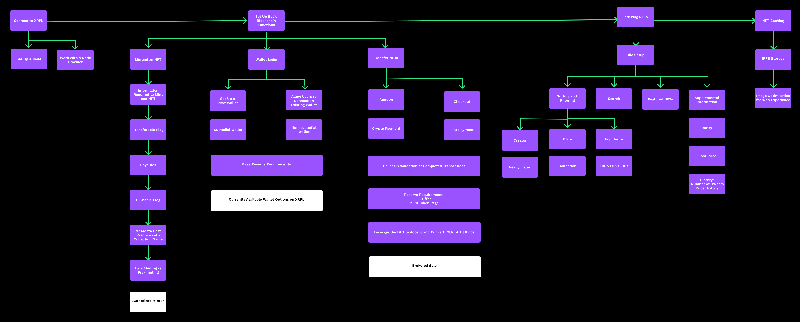

# NFT 마켓플레이스 개요(NFT Marketplace Overview)

### **Key Features**

NFT에 대한 XRPL 네이티브 지원은 다음을 수행할 수 있는 도구를 제공합니다.

* NFT를 발행, 판매, 소각하기
* 적은 비용으로 짧은 시간 내에 NFT 프로젝트를 시작
* 판매자와 입찰자 간의 전송을 주선할 브로커를 지정
* 다른 계정이 여러분을 대신해 NFT를 발행하도록 승인하기
* 마켓플레이스에서 인정하는 크리에이터 친화적인 온렛저 로열티를 받을 수 있습니다.

이 모든 것이 10년이 넘는 XRP 원장의 성능과 신뢰성에 더해집니다.

### **Understand Your Goals**

어떤 종류의 마켓플레이스를 만들지 결정하는 것부터 시작하세요.

* 마켓플레이스, 다른 사람이 발행한 NFT 판매
* 공인 채굴자, 아티스트를 위한 NFT 채굴
* 디지털 아티스트, 나만의 NFT 생성 및 판매

NFT 비즈니스를 시작하기 위해 준비해야 할 4가지 필수 영역이 있습니다.

* 네트워크에 연결할 방법 결정하기
* 블록체인 동작 설정하기
* 필요한 NFT 정보 인덱싱하기
* NFT를 캐시하기 위한 영구 저장소 전략 결정하기

<figure><figcaption></figcaption></figure>

### **Connect to XRPL**

트랜잭션 수가 적은 소규모 사이트를 설정하고 싶으시다면 무료 XRP 레저 퍼블릭 서버 중 하나를 사용하실 수 있습니다. \*\*[퍼블릭 서버](https://xrpl.org/public-servers.html)\*\*를 참조하세요.

거래량이 많은 대규모 사이트를 설정하고 싶으시다면 자체 XRP 레저 서버 인스턴스에 투자하는 것이 좋습니다. \*\*[리플 설치](https://xrpl.org/install-rippled.html)\*\*를 참조하세요.

See also:

* [Pros and cons of running your own server](https://xrpl.org/networks-and-servers.html#reasons-to-run-your-own-server).

### **Set Up Basic Blockchain Functions**

판매할 대체 불가능한 토큰을 발행하여 마켓플레이스를 구축할 수 있습니다.

첫 번째 NFT를 생성하려면 NFT 토큰 발행 및 소각 튜토리얼의 지침을 따르세요. NFT 토큰 발행 및 소각을 참조하세요.

NFT토큰 URL은 NFT의 콘텐츠가 저장된 위치로 연결되는 링크입니다. 한 가지 옵션은 IPFS 계정을 생성하고 NFToken 콘텐츠를 영구 URL에 저장하는 것입니다. NFT 데이터 저장 모범 사례를 참조하세요.

발행자가 나중에 토큰을 소각할 수 있게 하려면 Flags 필드를 1로 설정하고, NFT를 전송할 수 있게 하려면 Flags 필드를 8로 설정합니다. NFT를 소각과 전송이 모두 가능하도록 설정하려면 플래그 필드를 9로 설정합니다. 소각 가능 플래그 및 전송 가능 플래그를 참조하세요.

전송 수수료를 설정하여 향후 판매에서 로열티를 받을 수 있습니다. 이 값은 판매 가격의 0\~50%를 나타내는 0\~50000 사이의 값입니다. 양도 수수료를 참조하세요.

토큰 택슨 필드를 사용하여 논리적 컬렉션에서 NFT를 발행할 수 있습니다. 컬렉션에 NFT 발행하기를 참조하세요.

직접 만든 콘텐츠로 자신만의 NFT를 채굴할 수도 있지만, 다른 크리에이터를 대신하여 NFT를 생성하는 공인 채굴자가 될 수도 있습니다. 이렇게 하면 크리에이터는 새로운 NFT를 만드는 데 집중할 수 있고, 여러분은 NFT의 생산과 판매를 처리할 수 있습니다.

승인된 채굴자가 여러분을 대신해 NFT 생성을 완료한 후에는 권한을 취소하여 더 이상 NFT를 제어할 수 없도록 할 수 있습니다.

\*\*[승인된 채굴자](https://xrpl.org/nftoken-authorized-minting.html)\*\*를 참조하세요.

채굴된 NFT는 NFT 토큰 페이지에 나열됩니다. 계정의 모든 NFT토큰페이지에 대해 2XRP의 준비금이 필요합니다. NFT 준비금 요건을 참조하세요.

각 NFT 토큰 페이지는 16\~32개의 NFT를 보유합니다. 많은 수의 NFT를 발행하면 많은 양의 XRP가 묶일 수 있습니다. 온디맨드 채굴(또는 지연 채굴)을 통해 XRP를 유동적으로 유지할 수 있습니다. 지연 채굴과 스크립트 채굴을 참조하세요.

### **Setting up a wallet**

새 지갑을 설정합니다. Xumm을 참조하세요.

계정을 설정할 때 기본 예치금 요건인 10XRP가 있다는 점을 기억하세요. \*\*[예약금](https://xrpl.org/reserves.html#base-reserve-and-owner-reserve)\*\*을 참조하세요.

### **Transferring NFTs**

판매 오퍼를 생성하거나 구매 오퍼를 수락하여 NFT를 전송합니다.

* \*\*[NFT 토큰 전송](https://xrpl.org/transfer-nfts-using-javascript.html)\*\*을 참조하세요.

NFT를 경매 형식으로 판매할 수 있습니다.&#x20;

* \*\*[NFT 경매 진행하기](https://xrpl.org/nftoken-auctions.html)\*\*를 참조하세요.

중개자 역할을 하여 판매자와 입찰자를 연결하고 전송을 완료하고 구매 가격의 일정 비율을 보유할 수 있습니다.&#x20;

* \*\*[NFT 토큰 판매 중개하기](https://xrpl.org/broker-an-nft-sale-using-javascript.html)\*\*를 참조하세요.

### **Reserve requirements**

판매를 위해 NFT를 발행할 때 몇 가지 XRP 준비금 요구 사항이 있습니다. 각 NFT토큰 페이지에는 2 XRP의 준비금이 필요합니다. NFT토큰 페이지에는 16\~32개의 NFT를 저장할 수 있습니다.

각 NFTokenOffer 객체에는 2 XRP의 준비금이 필요합니다.

NFT 토큰 오퍼를 게시하거나 NFT를 판매할 때 소액의 전송 수수료(약 6000드롭, 또는 0.006 XRP)가 발생합니다. 대량으로 판매할 때는 사소한 금액이 빠르게 합산될 수 있으므로 비즈니스 비용의 일부로 고려해야 합니다.

See:

1. [NFTokenOffer](https://xrpl.org/nft-reserve-requirements.html#nftokenoffer-reserve)
2. NFToken page ([Owner reserve](https://xrpl.org/nft-reserve-requirements.html#owner-reserve))
3. Trivial [transfer fees](https://xrpl.org/transfer-fees.html)

### **Checkout**

XRPL NFT에 대한 가장 간단한 결제는 XRP입니다. XRP를 사용해 NFT를 판매하고 구매하는 예는 \*\*[NFT토큰 전송](https://xrpl.org/transfer-nfts-using-javascript.html)\*\*을 참조하세요.

다른 통화로 거래할 때는 탈중앙화 거래소를 활용하여 모든 종류의 발행 통화를 수락하고 환전할 수 있습니다. \*\*[탈중앙화 거래소에서 거래](https://xrpl.org/trade-in-the-decentralized-exchange.html#trade-in-the-decentralized-exchange)\*\*를 참조하세요.

## **Indexing NFTs**

판매용 NFT를 리스팅할 때 객체 메타데이터를 사용하여 정리하는 것이 유용할 수 있습니다. XRPL 라이브러리, 클리오 서버, XRPL API 및 빗썸 라이브러리의 확장 기능에서 쿼리를 사용하여 제작자, 가격, 컬렉션, 희귀도 등을 기준으로 NFT를 정렬하고 필터링할 수 있습니다.

See:

* [Clio setup](https://xrpl.org/install-clio-on-ubuntu.html)
* [XRPL Data API](https://api.xrpldata.com/docs/static/index.html#/)
* [Bithomp](https://docs.bithomp.com/#nft-xls-20)

## **NFT Caching**

암호화폐 공간에서 생성되는 NFT는 미디어, 속성 등을 포함한 메타데이터를 저장할 것으로 예상됩니다. 현재 대부분은 중앙 집중화를 피하기 위해 IPFS 또는 Arweave에 저장됩니다.

IPFS/Arweave는 탈중앙화를 촉진하는 훌륭한 솔루션이지만, 메타데이터를 효율적으로 가져오는 것이 문제입니다. 고품질 미디어로 여러 페이지를 스크롤하는 사용자로부터 즉각적인 응답이 필요한 최신 웹사이트의 경우, 메타데이터를 가져오기 위해 IPFS/Arweave에 직접 접근하는 것은 충분히 빠르지 않습니다. 현재 XRPL의 많은 NFT 마켓플레이스는 빠르고 안정적인 반응형 웹사이트를 위해 IPFS 원본의 캐시 버전을 저장하고 있지만, 이 프로세스는 비용이 많이 들고 비효율적입니다.

Cloudflare, Infura 및 기타 많은 제공업체는 이러한 분산형 파일을 저장하고 사용자를 위해 빠르게 검색하는 데 점점 더 집중하고 있습니다.

See [NFT Caching](https://xrpl.org/nftoken.html#retrieving-nftoken-data-and-metadata).

See also:

* [“International Standards on Combating Money Laundering and the Financing of Terrorism & Proliferation.” FATF, 2012](http://www.fatf-gafi.org/publications/fatfrecommendations/documents/fatf-recommendations.html)
* [“Virtual Currencies: Key Definitions and Potential AML/CFT Risks.” FATF, 2014](http://www.fatf-gafi.org/publications/methodsandtrends/documents/virtual-currency-definitions-aml-cft-risk.html)
