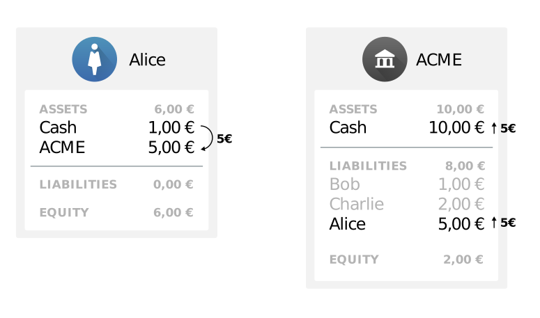
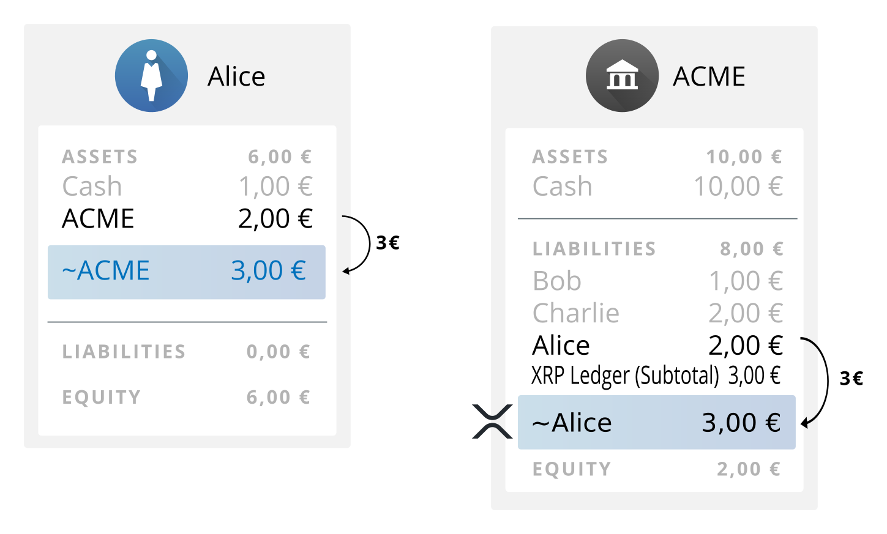

# 스테이블코인 발행인(Stablecoin Issuer)

**스테이블코인(Stablecoin)**은 외부 세계의 자산으로 뒷받침되는 토큰입니다. 스테이블코인을 통해 사용자는 익숙한 통화로 거래할 수 있으며, 블록체인을 통해 편리하게 자금을 입출금할 수 있습니다. 이러한 서비스를 제공하는 대가로 스테이블코인 발행자는 스테이블코인의 인출 또는 송금 수수료 등 다양한 방식으로 수익을 얻을 수 있습니다.

누구나 XRP Ledger에 어떤 통화 코드로든 토큰을 발행할 수 있지만, 스테이블코인의 가치는 해당 자산으로 상환될 수 있다는 약속에서 비롯됩니다. 스테이블코인 발행에는 관할권에 따라 달라지는 규제 의무도 수반될 수 있습니다. 이러한 이EUR 스테이블코인을 발행하려면 일반적으로 평판이 좋은 비즈니스가 필요합니다.


**NOTE:**

_XRP Ledger의 스테이블코인 발행자_를 이전에는 "**gateways**"라고 불렀습니다.


이 문서에서는 스테이블코인을 발행하기 전에 알아야 할 정보를 제공하고, 스테이블코인 발행자를 설정하는 데 관련된 선택 사항을 요약하며, XRP Ledger와기술 통합을 구현하기 위한 리소스를 제공합니다.

## 배경 정보(Background Information)

### 신뢰선과 토큰(Trust Lines and Tokens) 

기본 암호화폐인 XRP를 제외한 XRP Ledger의 모든 자산은 **토큰**으로 표시되며, 토큰의 의미를 정의하는 특정 발행자와 연결됩니다. XRP Ledger는 사용자가 원하는 토큰만 보유하고 받을 수 있도록 **신뢰선(Trustline)**이라고 하는 방향성 회계 관계 시스템을 갖추고 있습니다.

외부 시스템의 자금으로 뒷받침되는 토큰을 **스테이블코인**이라고 부르기도 합니다. 여기에는 은행 계좌의 법정 화폐, 다른 블록체인의 암호화폐 또는 다른 유형의 자산과 가치 형태로 뒷받침되는 토큰이 포함됩니다. "스테이블코인(stablecoin)"이라는 용어는 토큰과 토큰이 나타내는 자산 간의 환율이 1:1(수수료 제외)로 "안정적(stable)"이어야 한다는 개념에서 유래했습니다.

* 참조: [Trust Lines and Issuing](https://xrpl.org/trust-lines-and-issuing.html)

### XRP

XRP는 XRP Ledger의 기본 암호화폐입니다. XRP는 모든 XRP Ledger 주소에서 다른 주소로 직접 전송할 수 있습니다. 이는 XRP를 편리한 브릿지 화폐로 만드는 데 도움이 됩니다.

토큰 발행자는 XRP를 축적하거나 교환할 필요가 없습니다. Reserve 요건을 충족하고 네트워크를 통해 트랜잭션을 전송하는 데 드는 비용을 지불하기 위해 소량의 XRP 잔액만 보유하면 됩니다. 10달러에 해당하는 XRP는 바쁜 발행자의 경우 최소 1년간의 거래 비용으로 충분할 것입니다.

* 참조: [What is XRP?](https://xrpl.org/what-is-xrp.html), [Reserves](https://xrpl.org/reserves.html), and [Transaction Cost](https://xrpl.org/transaction-cost.html)

### 유동성 및 트레이딩(Liquidity and Trading)

XRP Ledger은 탈중앙화 거래소를 포함하고 있으며, 여기서 모든 사용자는 어떤 조합으로든 XRP와 토큰을 교환하기 위해 입찰을 하고 이행할 수 있습니다. 탈중앙화 거래소는 또한 원자 간 결제를 가능하게 하는 유동성을 제공합니다.

스테이블코인 발행자가 탈중앙화 거래소를 직접 사용할 필요는 없지만, 모든 토큰은 자동으로 거래에 사용할 수 있습니다. 토큰이 널리 사용되면 사용자들은 자연스럽게 토큰을 서로 거래하며 다른 인기 자산에 유동성을 공급할 것입니다. 발행자는 특히 토큰이 신규일 때 기준 금리로 XRP 또는 기타 인기 토큰에 유동성을 공급하고자 할 수 있습니다. 스테이블코인 발행자가 유동성을 공급하는 경우, 거래와 발행에 서로 다른 주소를 사용하는 것이 가장 좋습니다.

* 참조: [Decentralized Exchange](https://xrpl.org/decentralized-exchange.html)

### 권장하는 비즈니스 관행

XRP Ledger에 있는 스테이블코인 발행자의 토큰 가치는 고객이 필요할 때 토큰을 상환할 수 있다는 신뢰에서 직접적으로 비롯됩니다. 비즈니스 중단의 위험을 줄이려면 다음 모범 사례를 따라야 합니다:

* 별도의 발급 주소와 운영 주소를 사용하여 네트워크에서 위험 프로필을 제한합니다.&#x20;
* 은행비밀보호법 등 관할 지역의 자금세탁 방지 규정을 준수합니다. 여기에는 일반적으로 "고객알기제도(KYC)" 정보 수집 요건이 포함됩니다.&#x20;
* XRP Ledger 재단의 토큰 발행자 자체 평가를 완료합니다.&#x20;
* 모든 정책과 수수료를 공개합니다.&#x20;
* 클라이언트 애플리케이션이 귀하에 대한 관련 세부 정보를 표시할 수 있도록 도메인 확인이 포함된 xrp-ledger.toml 파일을 제공하세요.

### 핫월렛과 콜드월렛(Hot and Cold Wallets)

XRP Ledger에서 금융기관은 일반적으로 여러 개의 XRP Ledger 주소를 사용해 유출된 비밀 키와 관련된 위험을 최소화합니다. 업계 표준은 다음과 같이 역할을 분리하는 것입니다:

* "콜드 월렛"이라고도 하는 하나의 **발급 주소**. 이 주소는 Ledger에서 금융 기관의 회계 관계의 허브이지만 가능한 한 적은 수의 트랜잭션을 전송합니다.&#x20;
* "핫 지갑"이라고도 하는 하나 이상의 **운영 주소**. 인터넷에 연결된 자동화된 시스템은 이러한 주소의 비밀 키를 사용하여 고객 및 파트너에게 이체하는 등의 일상적인 비즈니스를 수행합니다.&#x20;
* "웜 월렛"이라고도 하는 **선택적 대기 주소**. 신뢰할 수 있는 사람이 이 주소를 사용하여 운영 주소로 돈을 이체합니다.&#x20;

주요 기사: [Issuing and Operational Addresses](https://xrpl.org/account-types.html)

### 수수료와 수익원(Fees and Revenue Sources)

스테이블코인 발행자는 다음과 같은 다양한 방법으로 수익을 얻을 수 있습니다:

* 출금 또는 입금 수수료. 발행자는 XRP Ledger로 돈을 옮기거나 빼는 서비스에 대해 소액의 수수료(예: 1%)를 부과할 수 있습니다. 이 수수료는 XRP Ledger가 아니라 발행자의 자체 시스템에서 사용자에게 얼마를 발행하거나 크레딧을 제공할지 결정할 때 부과됩니다.&#x20;
* 송금 수수료. 발행자는 사용자가 XRP Ledger에서 스테이블코인을 전송할 때 부과할 수수료를 백분율로 설정할 수 있습니다. 이 금액은 사용자가 거래할 때마다 XRP Ledger에서 차감되며, 발행자가 Ledger 외부에 보유한 자산의 양을 줄이지 않고도 스테이블코인 발행자가 Ledger에서 사용자에게 갚아야 할 총 의무를 감소시킵니다.&#x20;
* 부가가치를 통한 간접 수익. 스테이블코인은 다른 인접 서비스의 채택을 용이하게 하는 편리한 기능을 제공합니다.&#x20;
* 담보(collateral)에 대한 이자. 발행자는 스테이블코인을 뒷받침하는 자산을 이자 수익 계좌에 보유할 수 있습니다. 물론, 고객의 인출을 처리할 수 있는 충분한 자금을 항상 확보하고 있어야 합니다.&#x20;
* 금융 거래소. 기업은 탈중앙화 거래소에서 자체 스테이블코인을 사고 팔 수 있으며, 교차 통화 거래에 유동성을 제공할 수 있습니다.

### 수수료율 선택하기(Choosing Fee Rates)

토큰 수수료는 선택 사항입니다. 수수료가 높을수록 해당 토큰이 사용될 때 더 많은 수익을 얻을 수 있습니다. 반면에 수수료가 높으면 고객이 서비스 사용을 꺼리게 됩니다. 다른 발행자, 특히 동일한 유형의 자산으로 뒷받침되는 토큰을 사용하는 다른 발행자가 부과하는 수수료와 전신 수수료와 같은 XRP Ledger를 벗어난 기존 결제 시스템에서 부과하는 수수료를 고려하세요. 적절한 수수료 구조를 선택하는 것은 시장에서 기꺼이 지불할 의사가 있는 가격과 가격의 균형을 맞추는 문제입니다.

### 규정 준수 가이드라인(Compliance Guidelines)

토큰 발행자는 현지 규정을 준수하고 해당 기관에 보고할 책임이 있습니다. 규정은 국가와 주마다 다르지만 다음 섹션에 설명된 보고 및 규정 준수 요건을 포함할 수 있습니다. 토큰을 발행하기 전에 관할권 및 사용 사례에 대한 요건에 대해 전문적인 법률 자문을 구해야 합니다. 다음 리소스는 유용한 배경 자료가 될 수 있습니다.

### 고객확인제도(KYC)

고객확인제도(KYC)는 금융기관이 범죄 활동에 금융기관을 이용하는 것을 방지하기 위해 고객의 신원을 파악하고 확인하기 위해 실시하는 실사 활동을 말합니다. 금융 관련 범죄 활동에는 자금 세탁, 테러 자금 조달, 금융 사기, 신원 도용 등이 포함될 수 있습니다. 고객은 개인, 중개자 또는 기업일 수 있습니다.

KYC 프로세스는 일반적으로 다음을 목표로 합니다:

* 고객 신원 확인(조직 및 비즈니스의 경우 모든 실소유주 확인)
* 비즈니스 관계의 목적과 의도된 성격 이해
* 예상되는 거래 활동을 이해합니다.

금융기관과 관련 비즈니스가 위험, 특히 법적 위험과 평판 위험을 완화하기 위해서는 KYC가 매우 중요합니다. KYC 프로그램이 부적절하거나 존재하지 않는 경우 기관 또는 직원 개인이 민형사상 처벌을 받을 수 있습니다.

* **참조:**
  * [(USA) Bank Secrecy Act / Anti-Money Laundering Examination Manual](https://bsaaml.ffiec.gov/manual/Introduction/01)
  * [The Non-US Standard on KYC set by the Financial Action Task Force (FATF)](http://www.fatf-gafi.org/publications/fatfrecommendations/documents/fatf-recommendations.html)

### 자금 세탁 방지(AML) 및 테러 자금 조달 방지(CFT)

자금 세탁은 합법적인 금융 채널과 신뢰할 수 있는 기관을 통해 합법적으로 자금에 접근하거나 유통할 수 있도록 자금의 출처, 성격 또는 소유권을 위장하여 불법 자금을 이동시키는 프로세스입니다. 간단히 말해, "더러운 돈(dirty money)"을 "깨끗한 돈(clean money)"으로 전환하는 것입니다. 자금 세탁 방지(AML)는 자금 세탁을 막기 위해 고안된 법률과 절차를 말합니다.

테러 자금 조달이란 테러 활동에 관여하는 조직이나 테러 및 그 확산을 지원하는 조직에 자금을 모집, 수집 또는 제공하는 것을 말합니다. 테러 자금 조달 방지(CFT)는 테러 자금 조달에 사용되는 자금의 흐름을 식별, 보고 및 차단하는 프로세스를 말합니다.

* **참조:**
  * [“International Standards on Combating Money Laundering and the Financing of Terrorism & Proliferation.” FATF, 2012](http://www.fatf-gafi.org/publications/fatfrecommendations/documents/fatf-recommendations.html)
  * [“Virtual Currencies: Key Definitions and Potential AML/CFT Risks.” FATF, 2014](http://www.fatf-gafi.org/publications/methodsandtrends/documents/virtual-currency-definitions-aml-cft-risk.html)

### 자금 출처(Source of Funds)

불법 자금이 시스템을 통과하는 것을 방지하기 위해 금융 기관은 고객 자금의 출처가 범죄 활동과 관련이 있는지 합리적인 범위 내에서 판단할 수 있어야 합니다.

모든 고객의 정확한 자금 출처를 파악하는 것은 행정적으로 불가능할 수 있습니다. 따라서 일부 규제 당국은 모든 계정에 대해 구체적인 규제나 지침을 제공하지 않을 수 있습니다. 그러나 특정 경우에는 당국이 금융 기관에 자금 출처를 파악하고 보고하도록 요구할 수 있습니다. 자금 세탁 또는 테러 자금 조달의 위험이 높은 경우(일반적으로 "위험기반접근법(Risk-Based Approach; RBA)"이라고 함) 금융 기관은 고객의 자금 출처를 파악하는 것을 포함하되 이에 국한되지 않는 강화된 실사를 수행할 것을 FATF의 지침에 따라 권장하고 있습니다.

### 의심스러운 활동 보고(Suspicious Activity Reporting)

금융기관에서 자금이 범죄 활동과 관련이 있다고 의심되는 경우 해당 금융기관은 해당 규제 기관에 의심스러운 활동 보고서(SAR)를 제출해야 합니다. 의심스러운 활동을 보고하지 않으면 해당 기관은 처벌을 받을 수 있습니다.

* 참조:
  * [Suspicious Activity Reporting Overview (USA FFIEC)](https://bsaaml.ffiec.gov/manual/RegulatoryRequirements/04\_ep)
  * [FATF Recommendation 16: Reporting of suspicious transactions and compliance](http://www.fatf-gafi.org/publications/fatfrecommendations/documents/fatf-recommendations.html)

### 트래불 룰(Travel rule)

트래불 룰은 자금 이체 금융기관이 자금 이체 금액이 미화 3,000달러 상당액 이상인 경우 다음 금융기관에 특정 정보를 전달하도록 요구하는 은행비밀보호법(BSA) 규정입니다. 송금 주문에는 다음 정보가 포함되어야 합니다:

* 송금인의 이름,
* 송금인의 계좌 번호(사용 중인 경우),
* 송금인의 주소,
* 송금인의 금융기관 신원,
* 송금 주문 금액,
* 송금 주문의 실행 날짜, 그리고
* 수취인의 금융기관 신원.

* 참조: [Funds “Travel” Regulations: Questions & Answers](https://www.fincen.gov/resources/statutes-regulations/guidance/funds-travel-regulations-questions-answers)

### 수수료 공개 및 자금 추적(Fee Disclosure and Tracing Fund)

* 미국의 도드 프랭크 1073 전자 자금 이체법(규정 E)에 따라 은행은 미국에서 발생하는 국제 결제에 대해 환율, 수수료, 외국에서 지정된 수취인이 수령할 금액 등 비용 및 배송 조건에 대한 정보를 제공해야 합니다. '결제 전 공개(Pre-payment disclosure)'는 국제 전자 결제를 요청할 때 소비자에게 제공되며, '영수증 공개(receipt disclosure)'는 소비자가 송금을 승인할 때 소비자에게 제공됩니다. See also:
  * [The Consumer Financial Protection Bureau description of the regulation and extensions for banks](https://www.consumerfinance.gov/rules-policy/final-rules/electronic-fund-transfers-regulation-e/#rule)
* 유럽연합(EU)에서는 자금 세탁 및 테러 자금 조달을 탐지, 조사 및 방지하기 위해 송금인 은행, 수취인 은행 및 모든 중개 은행이 거래 내역에 송금인과 수취인의 특정 세부 정보를 포함하도록 EU 자금 이체 규정에서 규정하고 있습니다. \
  See also:
  * [EU Regulation (EC) No 1781/2006 description](http://eur-lex.europa.eu/LexUriServ/LexUriServ.do?uri=OJ:L:2006:345:0001:0009:EN:PDF)
  * [Effective June 26, 2017: Regulation 2015/847 on information accompanying transfers of funds](http://eur-lex.europa.eu/legal-content/EN/ALL/?uri=CELEX%3A32015R0847)

### 해외자산통제국(OFAC)

해외자산통제실(OFAC)은 미국의 외교 정책 및 국가 안보 목표를 지원하기 위해 경제 및 무역 제재를 관리하고 집행하는 미국 재무부 산하 기관입니다. 모든 미국인, 미국 법인 및 그 해외 지사는 OFAC 규정을 준수해야 합니다. OFAC 규정에 따라 미국 금융기관은 OFAC가 승인하거나 법령에 의해 명시적으로 면제되지 않는 한 OFAC가 관리 및 시행하는 제재 또는 금수 프로그램에 따라 개인, 법인 또는 국가와 거래 및 기타 거래를 수행하는 것이 금지됩니다.

* **참조:**&#x20;
  * [A list of OFAC resources](https://www.treasury.gov/resource-center/faqs/Sanctions/Pages/ques\_index.aspx)

### 가상통화 및 자금 서비스업에 대한 규제 정리

* United States:
  * [FinCEN Guidance and Definitions around Virtual Currency, March 18, 2013](https://www.fincen.gov/resources/statutes-regulations/guidance/application-fincens-regulations-persons-administering)
  * [FinCEN Publishes Two Rulings on Virtual Currency Miners and Investors, January 30, 2014](https://www.fincen.gov/news/news-releases/fincen-publishes-two-rulings-virtual-currency-miners-and-investors)
* Europe:
  * [European Banking Authority Opinion on Virtual Currencies, July 4, 2014](http://www.eba.europa.eu/documents/10180/657547/EBA-Op-2014-08+Opinion+on+Virtual+Currencies.pdf)
* FATF Guidance for Money Service Businesses:
  * [Financial Action Task Force, July 2009](http://www.fatf-gafi.org/media/fatf/documents/reports/Guidance-RBA-money-value-transfer-services.pdf)

## XRP Ledger Integration

이 문서는 XRP Ledger에서 EUR 스테이블코인을 발행하기로 결정한 ACME 거래소라는 가상의 암호화폐 거래소를 예로 들어 스테이블코인에 대한 전반적인 프로세스와 자금 흐름을 설명합니다.

### **Before Integration**

암호화폐 거래소인 ACME는 이미 일부 시스템(예: 앱 또는 웹사이트)을 사용하여 고객의 출금과 입금을 받고 있습니다. ACME는 각 사용자가 거래소에서 여러 유형의 자산을 얼마나 보유하고 있는지 추적하는 기록 시스템을 갖추고 있습니다. 이러한 시스템은 간단한 대차 대조표로 모델링할 수 있지만, 실제로는 안정성, 정보 보안 등을 보장하기 위해 데이터베이스, 애플리케이션 서버 및 기타 다양한 인프라를 포함할 수 있습니다.

다음 다이어그램에서 ACME 거래소는 밥에게 속한 1유로, 찰리에게 속한 2유로, ACME 자체에 속한 추가 2유로의 자본을 포함하여 5유로로 시작합니다. 앨리스가 5유로를 예치하면 ACME는 앨리스를 대차 대조표에 추가하여 10유로를 보유하게 됩니다.

<figure><figcaption></figcaption></figure>

**가정**: XRP Ledger와 통합하기 위해, 저희는 ACME와 같은 거래소가 다음 가정을 충족한다고 가정합니다:

* ACME는 이미 일부 외부 결제 소스로부터 입출금을 수락하는 시스템을 갖추고 있습니다.
* ACME는 입금이 청산될 때까지 기다렸다가 ACME의 기록 시스템에 입금합니다.
* ACME는 이용 약관에 따라 필요할 때 인출금을 지급할 수 있는 충분한 자금을 항상 보유하고 있습니다.
  * ACME는 비즈니스 모델에 따라 수수료, 최소 인출액, 입금 및 인출 지연 시간을 설정할 수 있습니다.

### **Sending into the XRP Ledger**

XRP Ledger로 송금하려면 ACME가 사용자 중 한 명을 대신해 보유한 금액만큼 새로운 스테이블코인을 발행해야 합니다. 예시적인 흐름은 다음과 같습니다:

1. 앨리스가 자신의 ACME 잔액 중 3유로를 XRP Ledger으로 보내달라고 요청합니다.
2. ACME는 기록 시스템에서 앨리스의 잔액 3유로를 인출합니다.
3. ACME는 앨리스의 XRP Ledger 주소로 3유로를 전송하는 XRP Ledger 트랜잭션을 제출합니다. 3유로는 XRP Ledger에 ACME가 "발행"한 것으로 표시됩니다(3 EUR.ACME).

**가정:**

* 앨리스는 이미 ACME 계정과 별도로 XRP Ledger에 주소를 가지고 있습니다. 앨리스는 타사 클라이언트 애플리케이션(지갑)을 사용하여 XRP Ledger 주소를 관리합니다

<figure><figcaption></figcaption></figure>

그 후 앨리스는 자신의 재량에 따라 XRP Ledger에 있는 다른 사용자에게 EUR.ACME를 보내거나 거래할 수 있습니다. ACME는 언제든지 XRP Ledger를 쿼리하여 현재 누가 토큰을 보유하고 있는지 확인할 수 있습니다.

### **Requirements for Sending to XRP Ledger**

XRP Ledger로 송금하기 위한 요건 외에도, XRP Ledger에서 발생하는 결제를 처리하기 위해 ACME가 충족해야 하는 몇 가지 전제 조건이 있습니다:

* ACME는 들어오는 결제를 위해 XRP Ledger 주소를 모니터링해야 합니다.
* ACME는 수신 결제에 대해 기록 시스템에서 어떤 사용자에게 크레딧을 제공할지 알고 있어야 합니다.
  * ACME는 인식할 수 없는 수신 결제를 발신자에게 반송해야 합니다.
  * 일반적으로 수신 결제를 인식하는 데 선호되는 방법은 목적지 태그를 사용하는 것입니다.

### 주의 사항

XRP Ledger을 통한 결제 처리에는 당연히 몇 가지 위험이 따르므로, 발행자는 이러한 프로세스를 구현할 때 주의를 기울여야 합니다. 스테이블코인 발행자는 다음과 같은 예방 조치를 취해야 합니다:

* 가역적 예치금으로부터 자신을 보호하세요. XRP Ledger의 결제는 되돌릴 수 없지만, 많은 디지털 결제는 그렇지 않습니다. 사기꾼은 이를 악용하여 XRP Ledger에서 토큰을 받은 후 입금을 취소하여 법정화폐를 되찾을 수 있습니다.
* XRP Ledger으로 송금할 때는 항상 토큰 발행 주소를 토큰 발행자로 지정해야 합니다. 그렇지 않으면 실수로 다른 주소에서 발행한 동일한 통화를 전달하는 경로를 사용할 수 있습니다.
* XRP Ledger으로 결제를 보내기 전에 결제 비용을 다시 한 번 확인하세요. 운영 주소에서 고객에게 지급하는 결제 금액은 목적지 금액에 설정한 송금 수수료를 더한 금액보다 커서는 안 됩니다.
* XRP Ledger에서 결제를 처리하기 전에 고객의 신원을 확인해야 합니다. 이렇게 하면 익명의 공격자가 사기를 치기가 더 어려워집니다. 대부분의 자금세탁 방지 규정에서는 이를 요구합니다. XRP Ledger에서 송금하는 사용자가 처음에 XRP Ledger에서 돈을 받은 사용자와 다를 수 있기 때문에 이는 특히 중요합니다.
* XRP Ledger에 트랜잭션을 전송할 때 신뢰할 수 있는 트랜잭션 제출을 위한 가이드라인을 따르세요.
* 수신되는 결제를 강력하게 모니터링하고 정확한 금액을 확인합니다. 일부만 송금한 경우 실수로 전액을 입금하지 마세요. XRP Ledger에서 채무와 잔액을 추적하고 담보 계좌의 자산과 비교하세요. 일치하지 않으면 불일치를 해결할 때까지 출금과 입금 처리를 중단하세요.
* 모호한 상황을 피하세요. 다음을 권장합니다:
  * 발급 주소와 모든 운영 주소에 대해 XRP 허용 안 함 플래그를 사용 설정하여 고객이 실수로 XRP를 보내지 않도록 하세요. (사설 거래소는 정상적으로 XRP를 거래하므로 이 플래그를 설정해서는 안 됩니다.)
  * 발급 주소와 모든 운영 주소에 RequireDest 플래그를 사용하도록 설정하여 고객이 실수로 대상 태그 없이 송금하는 일이 없도록 하여 입금 대상자를 표시합니다.
  * 실수로 토큰을 발행하지 않도록 모든 운영 주소에 RequireAuth 플래그를 사용하도록 설정합니다.
* 의심스럽거나 악의적인 행동을 모니터링합니다. 예를 들어, 사용자가 서비스 거부 공격을 통해 운영 주소의 잔액을 효과적으로 비우는 방식으로 반복적으로 XRP Ledger에 자금을 송금할 수 있습니다. 의심스러운 행동에 연루된 주소가 있는 고객의 XRP Ledger에 대한 결제를 처리하지 않도록 일시 정지하세요.

### XRP LEDGER에서 거래

토큰이 XRP Ledger에 생성된 후에는 XRP Ledger 사용자가 토큰을 자유롭게 전송하고 거래할 수 있습니다. 이 상황에는 몇 가지 결과가 있습니다:

* 누구나 XRP Ledger에서 EUR.ACME를 구매/판매할 수 있습니다. ACME가 여러 개의 토큰을 발행하는 경우, 각각에 대해 별도의 트러스트 라인이 필요합니다.
  * 여기에는 ACME 거래소 시스템에 계정이 없는 XRP Ledger 사용자도 포함됩니다. ACME에서 자금을 성공적으로 인출하려면 사용자는 여전히 ACME에 등록해야 합니다.
  * 선택적으로, ACME는 승인된 신탁 라인 기능을 사용하여 XRP Ledger에서 EUR.ACME를 보유할 수 있는 사람을 제한합니다.
  * ACME가 고객이 악의적으로 행동했다고 판단하는 경우, ACME는 해당 사용자가 더 이상 발행자의 토큰을 거래할 수 없도록 XRP Ledger에서 해당 사용자와 ACME의 계정 관계를 동결할 수 있습니다.
* XRP Ledger 사용자가 서로 EUR.ACME를 거래하고 송금하는 데는 ACME의 개입이 필요하지 않습니다.
* XRP Ledger의 모든 거래와 잔액은 공개적으로 볼 수 있습니다.

다음 다이어그램은 앨리스가 찰리에게 2유로.ACME를 전송하는 XRP Ledger의 지불을 보여줍니다. ACME는 트랜잭션이 발생한 후 언제든지 XRP Ledger을 쿼리하여 잔액 업데이트를 확인할 수 있습니다:

<figure><figcaption></figcaption></figure>

### Freeze 동결

발행자는 규제 요건을 충족하기 위해 XRP Ledger의 회계 관계를 동결할 수 있습니다:

* 발행자는 고객 주소가 의심스러운 활동을 보이거나 발행자의 이용 약관을 위반하는 경우 개별 계정 관계를 동결할 수 있습니다.
* 발행자는 중대한 보안 침해가 발생하거나 새로운 발행 주소로 마이그레이션하는 경우 발행하는 모든 토큰을 동결할 수 있습니다.
* 또한, 발행자는 회계 관계 동결 기능을 영구적으로 거부할 수 있습니다. 이를 통해 발급자는 고객에게 "실물 화폐와 유사한" 서비스를 계속 제공할 것임을 보장할 수 있습니다.

자세한 내용은 [동결 문서](https://xrpl.org/freezes.html)를 참조하세요.

### 승인된 신탁 라인

XRP Ledger의 승인된 신탁 라인 기능(이전의 "승인된 계정"이라고 함)을 통해 발행자는 해당 발행자의 토큰을 보유할 수 있는 사람을 제한할 수 있으므로, 알 수 없는 XRP Ledger 주소는 토큰을 보유할 수 없습니다.

자세한 내용은 [승인된 신탁 라인](https://xrpl.org/authorized-trust-lines.html)을 참조하세요.

### 출처 및 목적지 태그

목적지 태그는 XRP Ledger의 결제 기능으로, 결제의 수취인 또는 목적지를 표시하는 데 사용할 수 있습니다. 예를 들어, 발행자에 대한 XRP Ledger의 결제에는 대상 태그가 포함될 수 있으며, 이는 결제를 위해 어떤 고객에게 입금해야 하는지를 나타냅니다. 발행자는 대상 태그와 계정의 매핑을 발행자의 기록 시스템에 보관해야 합니다.

마찬가지로 소스 태그는 결제의 발신자 또는 출처를 나타냅니다. 일반적으로 소스 태그는 결제 수취인이 결제를 반송할 위치를 알 수 있도록 포함되는 경우가 많습니다. 수신 결제를 반송할 때는 수신 결제의 소스 태그를 발신(반송) 결제의 목적지 태그로 사용합니다.

고객이 송금하려는 경우 필요에 따라 목적지 태그를 생성할 수 있습니다. 고객 개인정보 보호를 강화하려면 해당 목적지 태그는 예상 금액이 포함된 해당 결제에만 유효한 것으로 간주하고 동일한 목적지 태그를 재사용하는 다른 거래는 반송하거나 무시해야 합니다.

발급 및 운영 주소에서 목적지 태그 필요 설정을 사용하도록 설정하여 고객이 결제 금액을 송금할 때 반드시 [목적지 태그를 사용](https://xrpl.org/require-destination-tags.html)하여 자금이 입금될 위치를 표시하도록 합니다.

자세한 내용은 [출처 및 대상 태그](https://xrpl.org/source-and-destination-tags.html)를 참조하세요.

## 기술적인 세부 내용

### **Infrastructure**

자체 보안과 네트워크의 안정성을 위해 각 XRP Ledger 비즈니스는 하나의 검증자를 포함한 자체 XRP Ledger 서버를 운영해야 합니다.

### **APIs and Middleware**

사용자의 필요와 사용 중인 소프트웨어에 따라 XRP Ledger에 연결하는 데 사용할 수 있는 인터페이스는 여러 가지가 있습니다:

* HTTP/웹소켓 API는 모든 핵심 XRP Ledger 기능에 대한 로우 레벨 인터페이스로 사용할 수 있습니다.
* 클라이언트 라이브러리는 여러 프로그래밍 언어로 제공되어 XRP Ledger에 액세스하기 위한 편리한 유틸리티를 제공합니다.
* xApp과 같은 다른 도구도 사용할 수 있습니다.
* 타사 지갑 애플리케이션도 유용할 수 있으며, 특히 대기 주소를 담당하는 사람에게 유용할 수 있습니다.

### **Tool Security**

XRP Ledger 거래를 제출할 때마다 비밀 키를 사용해 서명해야 합니다. 비밀 키는 XRP Ledger 주소를 완전히 제어할 수 있게 해줍니다. 다른 사람이 운영하는 서버로 비밀 키를 절대로 보내지 마세요. 자신의 서버를 사용하거나 클라이언트 라이브러리를 사용해 트랜잭션에 로컬로 서명하세요.

보안 구성에 대한 지침과 예시는 보안 서명 설정을 참조하세요.

### **Issuer Setup**

토큰 발행을 시작하기 전에 XRP Ledger 계정에서 구성해야 하는 몇 가지 설정이 있습니다. 이러한 설정을 구성하는 방법에 대한 예시는 대체 가능한 [토큰 발행 튜토리얼](https://xrpl.org/issue-a-fungible-token.html)을 참조하세요.

구성할 수 있는 설정은 다음과 같습니다:

<figure><figcaption></figcaption></figure>

### **Default Ripple**

기본 리플 플래그는 신탁 라인의 잔액이 기본적으로 리플을 허용할지 여부를 제어합니다. 리플은 고객이 서로 토큰을 보내고 거래할 수 있게 해주는 기능이므로 발행자는 모든 트러스트 라인에서 발행 주소로 리플을 허용해야 합니다.

고객에게 발행 주소로 트러스트 라인을 생성하도록 요청하기 전에 발행자는 해당 주소에서 기본 리플 플래그를 활성화해야 합니다. 그렇지 않으면 발급자는 다른 주소가 생성한 각 트러스트 라인에 대해 개별적으로 리플 없음 플래그를 비활성화해야 합니다.

### **Deposit Authorization**

입금 승인 설정은 다음 두 가지 경우를 제외하고는 계정으로 들어오는 모든 결제를 차단합니다:

* 이전에 발신자를 사전 승인한 경우.
*   자금을 받기 위해 트랜잭션을 보내는 경우.

    예를 들어 낯선 사람이 시작한 에스크로를 완료할 수 있습니다. 입금 승인은 발행자에 대한 신뢰 라인을 생성하지 않으면 토큰을 받을 수 없으므로 원치 않는 XRP 결제를 차단하는 데 가장 유용합니다.

    그러나 스테이블코인 발행자는 사용자가 스테이블코인을 장부 외 가치로 상환하려면 사용자로부터 결제를 받을 수 있어야 하며, 고객을 사전 승인할 수 있지만 이렇게 하려면 **각 사용자 지정 주소에 대해** Ledger**에 개체를 저장해야 하므로 준비금 요건이 상당히 증가**합니다.

따라서 알 수 없거나 제재를 받는 주체로부터 자금을 받는 규제 요건을 충족하기 위해 필요한 경우가 아니라면 스테이블코인 발행자에게는 예치금 승인을 권장하지 않습니다.

자세한 내용은 입금 승인을 참조하세요.

### **Disallow XRP**

**Disallow XRP** 설정은 XRP Ledger 사용자가 실수로 주소로 XRP를 보내지 못하도록 하기 위해 고안된 기능입니다. 이렇게 하면 XRP를 수령하고 보유할 의도가 없는 주소에서 원치 않는 결제를 반송하는 데 드는 비용과 노력을 줄일 수 있습니다. **Disallow XRP** 플래그는 프로토콜 수준에서 적용되지 않는데, 그렇게 하면 주소에 XRP가 부족할 경우 영구적으로 사용할 수 없게 될 수 있기 때문입니다. 클라이언트 애플리케이션은 기본적으로**Disallow XRP** 플래그를 준수해야 하지만 사용자가 이를 무시할 수 있습니다.

**Disallow XRP** 플래그는 선택 사항이지만, 고객으로부터 XRP를 받지 않으려는 경우 발급 주소와 모든 운영 주소에서 이 플래그를 사용하도록 설정하는 것이 좋습니다.

### **Require Auth**

인증 필요 설정은 사용자가 먼저 트러스트 라인을 명시적으로 승인하지 않으면 발행한 토큰을 보유할 수 없도록 차단합니다. 이 설정은 XRP Ledger에서 누가 토큰을 보유하는지가 중요한 경우 규제 요건을 충족하기 위해 사용할 수 있습니다. 그러나 이렇게 하면 사용자가 토큰을 사용하는 데 승인 절차가 병목 현상이 발생하므로 토큰의 유용성이 떨어질 수 있습니다.

또한 트러스트 라인을 승인할 때마다 발급 주소를 사용해야 하는데, 많은 트러스트 라인을 승인해야 하는 경우 너무 자주 사용해야 하므로 발급 주소의 보안이 약해질 수 있습니다. (발급 주소를 드물게만 사용해야 하는 경우에는 비밀 키에 더 강력한 보호 기능을 설정할 수 있습니다. 자주 사용할수록 이러한 보호 기능은 더 큰 부담이 됩니다.)

자세한 내용은 \*\*[인증된 신뢰 회선](https://xrpl.org/authorized-trust-lines.html)\*\*을 참조하세요.

### **Tick Size**

틱 크기 설정은 탈중앙화 거래소에서 환율을 계산할 때 소수점 이하 자릿수를 사용할지 여부를 제어합니다. 틱 크기가 클수록 정밀도가 높아지고 다양한 거래 금액에서 반올림이 줄어듭니다. 거래가 주로 환율에 따라 순위가 매겨지기 때문에 너무 정밀하면 불편할 수 있으며, 트레이더는 목록 상단에 적은 금액을 더 제공할 수 있습니다. 작은 틱 크기는 경매에서 최소 입찰 증분과 유사하게 작동하므로 모든 사람이 무의미할 정도로 작은 금액으로 점차 가격을 올리는 데 드는 시간과 노력을 절약할 수 있습니다. 그러나 틱 크기가 작을수록 반올림이 많아져 거래 비용이 증가할 수 있으며, 반올림 전에는 정확히 일치하는 것처럼 보였던 두 오퍼가 반올림 후에는 더 이상 일치하지 않는 의외의 결과가 발생할 수도 있습니다.

틱 크기는 계정 수준 설정이며 동일한 주소에서 발행한 모든 토큰에 적용됩니다.

틱 크기는 환율의 정밀도만 제어하며 토큰 자체의 정밀도는 제어하지 않습니다. 사용자는 토큰 발행자가 설정한 틱 크기에 관계없이 매우 큰 금액 또는 매우 작은 금액을 송금하고 보유할 수 있습니다.

자세한 내용은 \*\*[틱 크기](https://xrpl.org/ticksize.html)\*\*를 참조하세요.

### **Transfer Fees**

송금 수수료 설정은 사용자에게 토큰을 서로 보낼 때 일정 비율의 수수료를 부과합니다. 토큰을 발행하거나 발행 주소로 직접 토큰을 상환할 때는 송금 수수료가 적용되지 않습니다. (사용자가 핫월렛으로 결제를 보낼 때는 적용됩니다.) 동일한 주소에서 여러 토큰을 발행하는 경우 모든 토큰에 동일한 송금 수수료가 적용됩니다.

사용자가 송금 수수료가 포함된 토큰을 보내면 송금 수수료 금액이 목적지 금액과 함께 송금 측에서 인출되지만 수취인에게는 목적지 금액만 입금됩니다. 수수료 금액은 XRP Ledger에서 "사라집니다". 스테이블코인 발행자로서 이는 사용자가 송금 수수료를 지불할 때마다 담보로 보관해야 하는 금액이 줄어든다는 의미이며, 다시 말해 XRP Ledger 외부에 그만큼의 자산을 보유하게 된다는 뜻입니다.

프로토콜 수준에서 송금 수수료는 10억에서 20억 사이의 정수인 TransferRate 계정 설정으로 정의됩니다.

자세한 내용은 전송 수수료를 참조하세요.

### **Transfer Fees with Operational and Standby Addresses**

운영 주소와 대기 주소를 포함한 모든 XRP Ledger 주소는 토큰을 송금할 때 발행자의 송금 수수료가 적용됩니다. 송금 수수료를 0이 아닌 값으로 설정한 경우, 운영 주소 또는 대기 주소에서 결제할 때 (송금 수수료를 지불하기 위해) 추가 금액을 보내야 합니다. 즉, 결제할 때마다 운영 주소에서 발행 주소에서 생성한 잔액의 일부를 상환해야 합니다.

TransferRate 설정에 따라 SendMax 트랜잭션 매개변수를 목적지 금액 매개변수보다 백분율만큼 높게 설정합니다.


**NOTE**: \
토큰을 발행 주소로 직접 송금할 때는 송금 수수료가 적용되지 않습니다. 발행 주소는 항상 XRP Ledger에서 액면가로 토큰을 수락해야 합니다. 즉, 고객이 발행 주소로 직접 송금할 때는 송금 수수료를 지불할 필요가 없지만 운영 주소로 송금할 때는 송금 수수료를 지불해야 합니다. 두 주소 모두에서 결제를 수락하는 경우, 고객이 운영 주소로 결제를 보낼 때 고객이 지불하는 송금 수수료를 보상하기 위해 기록 시스템에서 고객에게 크레딧을 제공하는 금액을 조정할 수 있습니다.


예를 들어: ACME가 송금 수수료를 1%로 설정한 경우, 고객 주소에서 ACME의 발행 주소로 5 EUR.ACME를 전달하기 위한 XRP Ledger 결제는 정확히 5 EUR.ACME가 소요됩니다. 그러나 고객은 5 EUR.ACME를 ACME의 운영 주소로 전달하기 위해 5.05 EUR.ACME를 전송해야 합니다. 고객이 ACME의 운영 주소로 결제한 금액에 대해 고객에게 크레딧을 지급하면 ACME는 운영 주소로 배송된 금액과 송금 수수료에 대해 고객에게 크레딧을 지급하여 고객에게 5,05유로를 ACME의 시스템에 지급합니다.

### **Robustly Monitoring for Payments -**

수신 결제를 강력하게 확인하려면 발급자는 다음을 수행해야 합니다:

가장 최근에 처리된 거래와 Ledger을 기록해 두세요. 이렇게 하면 일시적으로 연결이 끊어지더라도 어디까지 되돌아가야 하는지 알 수 있습니다. 들어오는 모든 결제의 결과 코드를 확인하세요. 일부 결제는 실패했음에도 불구하고 스팸 방지 수수료를 부과하기 위해 Ledger으로 이동합니다. 결과 코드가 tesSUCCESS인 거래만 비XRP 잔액을 변경할 수 있습니다. 검증된 Ledger의 거래만 최종 거래입니다. 부분 결제를 주의하세요. 부분 결제 플래그가 활성화된 결제는 적은 금액이라도 0이 아닌 금액이 전달되면 "성공"으로 간주할 수 있습니다. 거래에서 delivered\_amount 필드를 확인합니다. 이 필드가 있으면 실제로 대상 주소로 전달된 금액을 나타냅니다. xrpl.js에서 xrpl.getBalanceChanges() 메서드를 사용하여 각 주소가 받은 금액을 확인할 수 있습니다. 경우에 따라 이는 서로 다른 트러스트 라인에서 여러 부분으로 나눌 수 있습니다. 일부 거래는 주소 중 하나에서 직접 지불하지 않고 잔액을 변경합니다. 예를 들어 ACME에서 이체 수수료를 0이 아닌 금액으로 설정하면 Bob과 Charlie가 ACME의 토큰을 교환할 때마다 ACME 발급 주소의 미결제 채권이 감소합니다. 고객의 편의를 위해 운영 주소와 발급 주소 모두로 결제를 수락하는 것이 좋습니다.

추가적인 예방 조치로, 새로운 XRP Ledger 버전이 나올 때마다 발행 주소의 잔액을 내부 회계 시스템의 담보 자금과 비교하는 것이 좋습니다. 발급 주소의 마이너스 잔액은 네트워크 외부의 XRP Ledger에 할당된 자산과 일치해야 합니다. 두 가지가 일치하지 않는 경우, 불일치가 해결될 때까지 XRP Ledger에 대한 지불 처리를 일시 중단해야 합니다.

게이트웨이\_잔액 메서드를 사용하여 잔액을 확인합니다. 전송 수수료를 설정한 경우, 다른 XRP Ledger 주소에서 토큰을 서로 전송할 때마다 XRP Ledger 내 의무가 약간 감소합니다. 들어오는 트랜잭션의 세부 정보를 읽는 방법에 대한 자세한 내용은 트랜잭션 결과 조회를 참조하세요.

### **Sending Payments to Customers**

고객을 위해 XRP Ledger에 결제를 전송하는 자동화된 시스템을 구축할 때는 결제를 신중하게 구성해야 합니다. 악의적인 공격자들은 시스템을 속여 실제보다 더 많은 돈을 지불하도록 하는 방법을 끊임없이 찾고 있습니다.

일반적으로 스테이블코인을 송금할 때는 결제 트랜잭션을 사용합니다. 토큰을 처음 발행하는지, 핫월렛에서 고객에게 토큰을 전송하는지에 따라 몇 가지 세부 사항이 달라집니다. 주의해야 할 사항은 다음과 같습니다:

발급 주소에서 새 토큰을 발급할 때는 SendMax 필드를 생략해야 합니다. 그렇지 않으면 악의적인 사용자가 의도한 목적지 금액만 발행하는 것이 아니라 SendMax 전체 금액을 발행하도록 설정을 변경할 수 있습니다. 핫월렛에서 토큰을 전송할 때 송금 수수료가 0이 아닌 경우 SendMax를 지정해야 합니다. 이 경우 금액 필드에 지정된 금액에 송금 수수료를 더한 금액으로 SendMax 필드를 설정합니다. (계산의 정밀도가 XRP Ledger과 정확히 일치하지 않을 경우를 대비하여 약간 반올림할 수 있습니다.) 예를 들어 금액 필드에 99.47 USD가 지정되어 있고 송금 수수료가 0.25%인 트랜잭션을 송금하는 경우 SendMax 필드를 124.3375, 즉 반올림하면 124.34 USD로 설정해야 합니다. 경로 필드는 생략합니다. 이 필드는 발행사에서 직접 송금하거나 핫월렛에서 송금하는 토큰과 수신하는 토큰의 통화 코드와 발행자가 동일한 경우, 즉 동일한 스테이블코인인 경우 필요하지 않습니다. 경로 필드는 교차 통화 결제와 더 긴 멀티홉(리플링) 결제를 위한 것입니다. 순진하게 경로 찾기를 수행하고 트랜잭션에 경로를 첨부하면 직접 경로를 사용할 수 없는 경우 결제가 실패하는 대신 더 비싼 간접 경로를 사용할 수 있으며, 악의적인 사용자는 다음과 같이 설정할 수도 있습니다. tecPATH\_DRY 결과 코드를 받으면 일반적으로 고객이 필요한 신뢰 회선을 이미 설정하지 않았거나 발급자의 리플리핑 설정이 올바르게 구성되지 않았음을 나타냅니다. 스테이블코인 등 XRP Ledger에서 토큰을 발행하는 방법에 대한 자세한 튜토리얼은 대체 가능한 토큰 발행하기를 참조하세요.

### **Bouncing Payments**

사용 중인 주소로 용도가 불분명한 금액이 입금된 경우에는 발신자에게 해당 금액을 반환하는 것이 좋습니다. 이는 돈을 가로채는 것보다 수고가 더 많이 들지만 고객에 대한 선의를 보여줄 수 있습니다. 운영자가 수동으로 결제를 반송하도록 하거나 자동으로 반송하는 시스템을 만들 수 있습니다.

지불 거절의 첫 번째 요건은 수신 결제를 강력하게 모니터링하는 것입니다. 고객이 보낸 금액보다 더 많은 금액을 실수로 환불해서는 안 됩니다! (반송 프로세스가 자동화된 경우 특히 중요합니다.) 악의적인 사용자는 부분 결제를 전송하여 순진한 통합 기능을 악용할 수 있습니다.

둘째, 반송된 결제는 부분 결제로 보내야 합니다. 제3자가 주소 간 경로 비용을 조작할 수 있기 때문에 부분 결제를 사용하면 XRP Ledger의 환율을 신경 쓰지 않고 전체 금액을 분배할 수 있습니다. 반송된 결제 정책을 이용약관의 일부로 공개해야 합니다. 운영 주소 또는 대기 주소에서 반송된 결제를 보내세요.

부분 결제를 보내려면 트랜잭션에서 tfPartialPayment 플래그를 활성화합니다. 금액 필드를 수령한 금액으로 설정하고 SendMax 필드는 생략합니다. 수신 결제의 SourceTag 값을 반환 결제의 DestinationTag 값으로 사용해야 합니다.

두 시스템에서 결제가 무기한 반송되는 것을 방지하려면 나가는 반품 결제에 대해 새 소스 태그를 설정할 수 있습니다. 목적지 태그가 전송한 반품의 소스 태그와 일치하는 예기치 않은 결제를 받은 경우 다시 반송하지 마십시오.

### **Reliable Transaction Submission**

트랜잭션을 안정적으로 제출하는 목표는 한정된 시간 내에 다음 두 가지 속성을 달성하는 것입니다:

비동시성 - 트랜잭션은 한 번만 처리되거나 전혀 처리되지 않아야 합니다. 검증 가능성 - 애플리케이션이 트랜잭션의 최종 결과를 결정할 수 있습니다. 트랜잭션을 안정적으로 제출하려면 다음 지침을 따르세요:

트랜잭션을 제출하기 전에 트랜잭션의 세부 정보를 보존합니다. LastLedgerSequence 매개변수를 사용합니다. (대부분의 클라이언트 라이브러리가 기본적으로 이 작업을 수행합니다.) 트랜잭션의 Ledger 인덱스가 트랜잭션의 LastLedgerSequence 매개변수보다 작거나 같은 검증된 Ledger에 트랜잭션이 나타나지 않은 경우 트랜잭션을 다시 제출합니다. 자세한 내용은 안정적인 트랜잭션 제출을 참조하세요.

## **xrp-ledger.toml File**

사기꾼이나 혼동을 방지하기 위해 어떤 통화를 발행하고 어떤 XRP Ledger을 관리하는지에 대한 정보를 [**xrp-ledger.toml**](https://xrpl.org/xrp-ledger-toml.html) 파일을 사용하여 게시할 수 있습니다. 기계 판독이 가능한 이 형식은 클라이언트 애플리케이션이 처리하기에 편리합니다. XRP Ledger 유효성 검사기를 실행하는 경우 동일한 파일에 키를 게시할 수도 있습니다.
